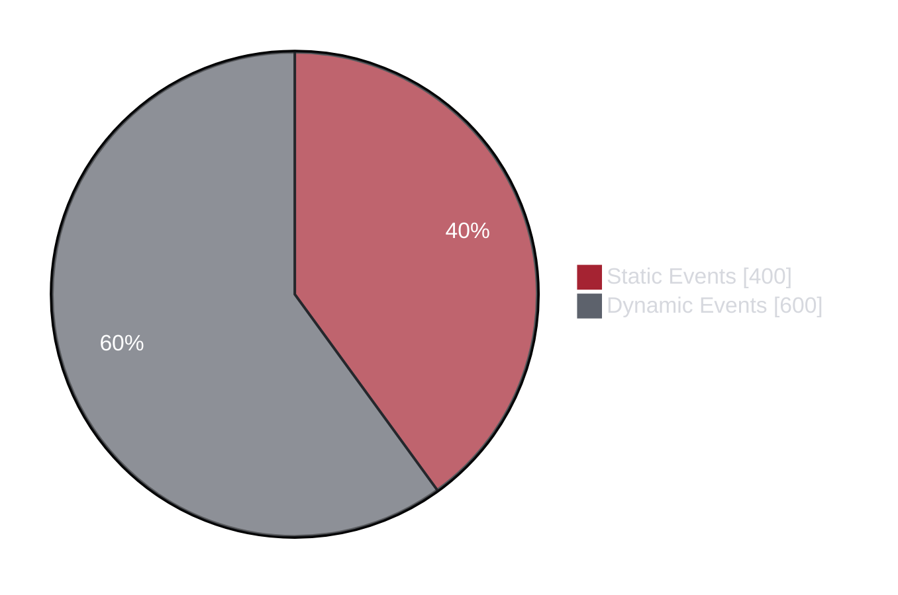
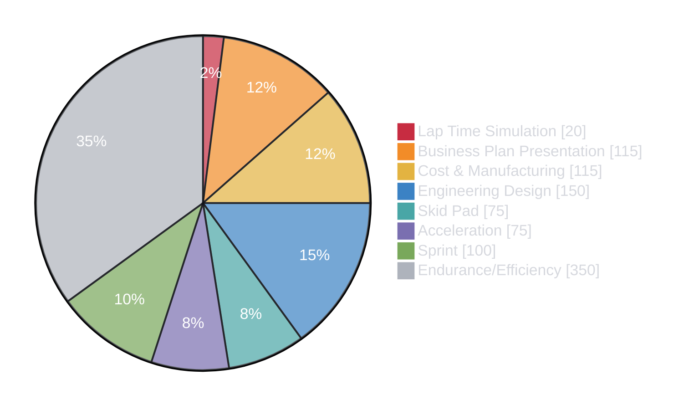

# Competition

Formula Trinity competes in [Formula Student UK](https://www.imeche.org/events/formula-student), teams are assessed across three main areas:

- [Static Events](statics/index.md) - Design Judging, Cost and Manufacturing, and Business Presentation
- [Scrutineering](scrut/index.md) - Technical inspections required before the car can compete on track
- [Dynamic Events](dynamics/index.md) - Acceleration, Skid Pad, Sprint, and Endurance

As you can see, FSUK is not just a racing competition, it is an engineering competition. A good chunk of points are awarded for the team’s technical knowledge, engineering decisions, design processes, cost awareness and ability to justify the car as a complete vehicle.

