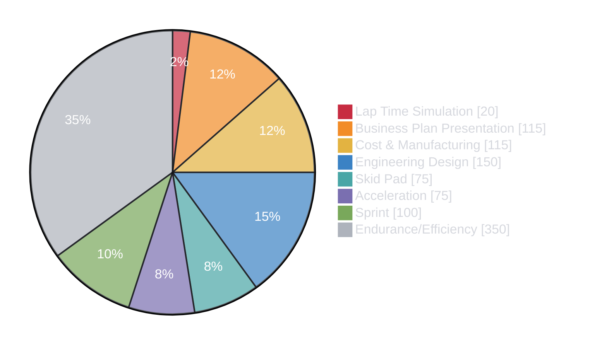

# Competition

Formula Trinity competes in [Formula Student UK](https://www.imeche.org/events/formula-student). It is an engineering competition as much as a racing competition: teams are assessed on the design, manufacture, cost and safety of the car as well as its on-track performance.

This section explains what happens at competition, how to prepare and what the team learned from FTX7. It is written primarily for the IC team and should be used alongside the current competition rules.

## What You Will Find

- [**Static Events**](statics/index.md) — Engineering understanding and justification of the car.
  - [Design Judging](statics/design/index.md) — Vehicle goals, design decisions, trade-offs and validation.
  - [Cost & Manufacturing](statics/cost/index.md) — Cost-report submissions and the in-person judging process.
- [**Scrutineering**](scrut/index.md) — Inspections the car must pass before going on track.
  - [Technical](scrut/tech/index.md) — Rule compliance and preparation for inspection.
  - [Safety](scrut/safety/index.md) — General hazards, component security and driver safety.
  - [Chassis](scrut/chassis/index.md) — SES compliance, templates, clearances and weigh-in.
- [**Dynamic Events**](dynamics/index.md) — Acceleration, Skid Pad, Sprint and Endurance/Efficiency.

## Points Breakdown

The 1,000 available points are split between:

- **Static events:** 400 points
- **Dynamic events:** 600 points

Static events account for 40% of the total score, so documentation, engineering understanding and the team's ability to justify its work are a major part of the competition.

*Business Presentation and Lap Time Simulation are included in the chart for context, although they are not currently covered in detail by this wiki section.*

---

