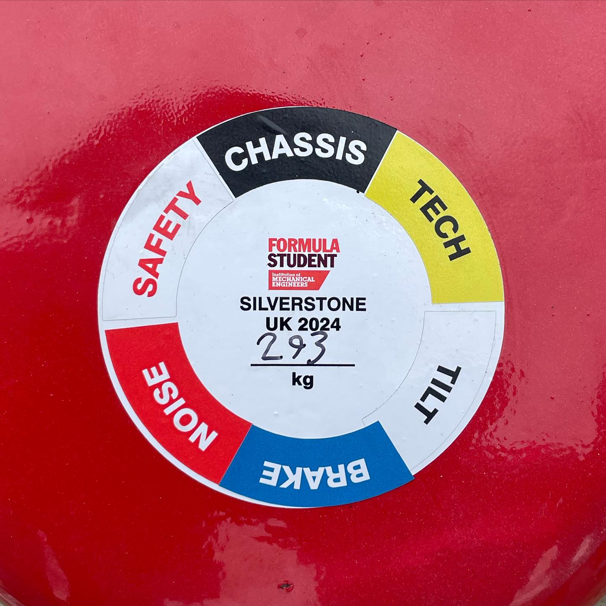

# Scrutineering

Before the car can compete on track in any dynamic event, it must pass a series of technical inspections and safety tests known as **scrutineering**.

The car must progress through six separate stages, earning a new sticker at each stage:

- [Tech](./tech/index.md)
- [Safety](./safety/index.md)
- [Chassis](./chassis/index.md)
- [Tilt](./tilt/index.md)
- [Noise](./noise/index.md)
- [Brakes](./brakes/index.md)

Only four team members are allowed in the scrutineering area with the car at a time. Team members can swap in and out, so bring the people most relevant to each stage.

If an issue is found, you return to the pits to try fix it, and return to scrutineering for reinspection.

At FSUK 2026, scrutineering was open from Wednesday morning until Sunday at noon. The pits were also open from 07:00 to 23:00 each day. This is when you should inspect, repair and prepare the car between scrutineering attempts.

The completeness of the pre-scrutineering form determines the team's position in the initial queue on the first day. Once that queue has cleared, access is generally first come, first served.

