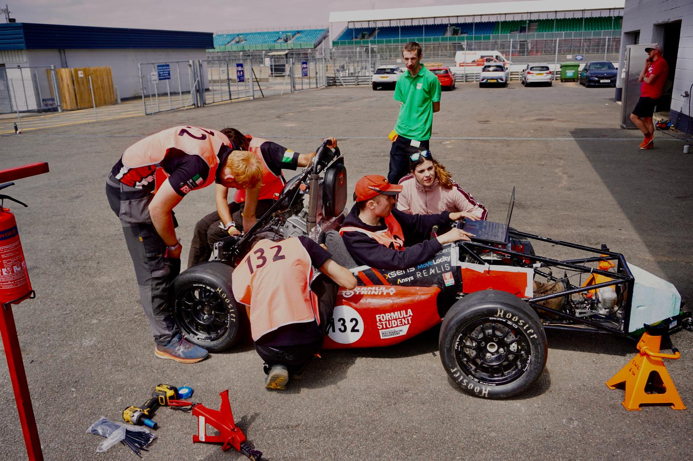

# Tech

**Note:** *Technical and [Safety](../safety/index.md) scrutineering are typically done at the same time, so line between the two is blurred*

Technical Scrutineering largely consists of checks against the rules. You should have a printed copy of the rules with you during scrutineering.

Highlight any rules you expect questions about and be prepared to explain how the car complies. Where a rule is open to interpretation, clearly justify your interpretation and why the design still satisfies its intent. Do not be afraid to argue your case respectfully.

Do not expect every check to involve a measuring tool. Scrutineers may move the suspension, shake mounted components or ask a driver to press a pedal firmly. Measure and test these items in the workshop rather than relying on them looking acceptable at competition.

## Checklist

- Bring a printed copy of the rules.
- Highlight rules that are likely to be questioned.
- Bring the relevant material certificates and specification sheets, including those for head-restraint padding, seat fabric and other safety-critical bought parts.
- Prepare short explanations for any rules requiring interpretation.
- Make sure relevant team members understand how the car complies.
- Test suspension travel and the pedal box against the current rule requirements before competition.
- Check that the steering has positive stops and that cable-operated pedals reach a positive stop before loading the cable.
- Record any issues raised and the rule numbers they relate to.

---

