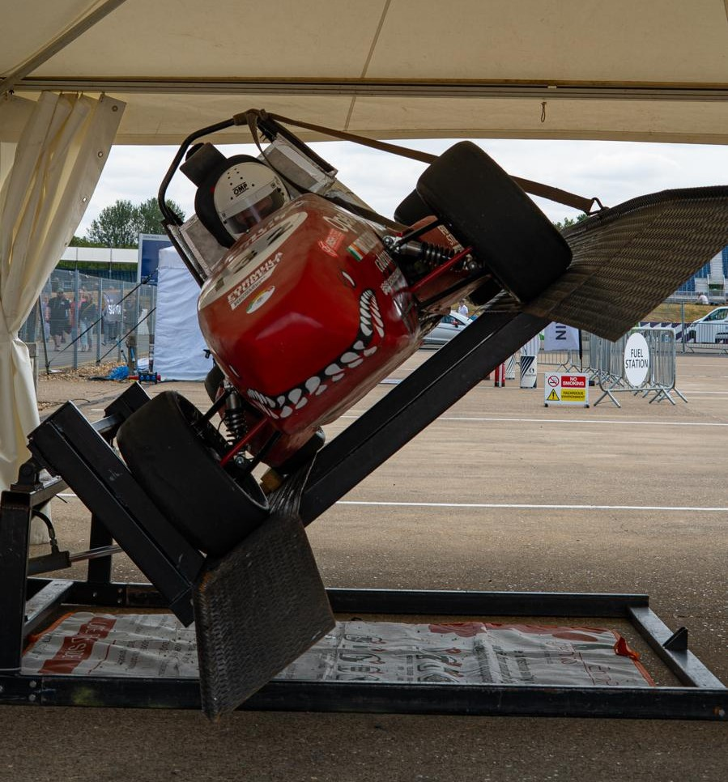

# Tilt Test

The tilt test involves the car being raised to a 60 degree angle.
FTX7 failed the tilt test. We were allowed try multiple times and make adjustments to the suspension in between attempts.
However, we ran out of time and could not make it pass.

---

