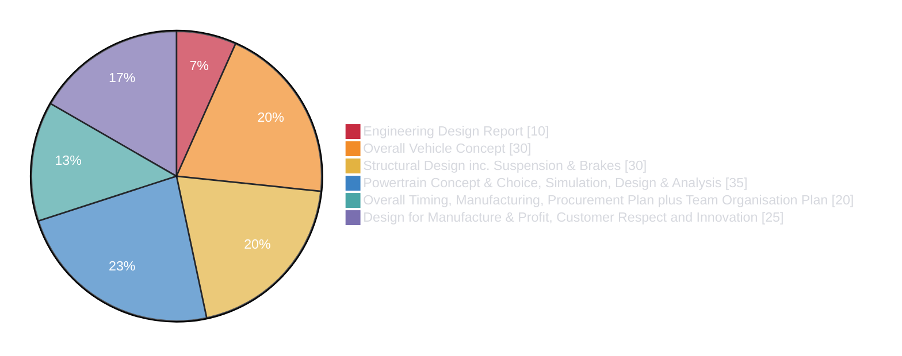
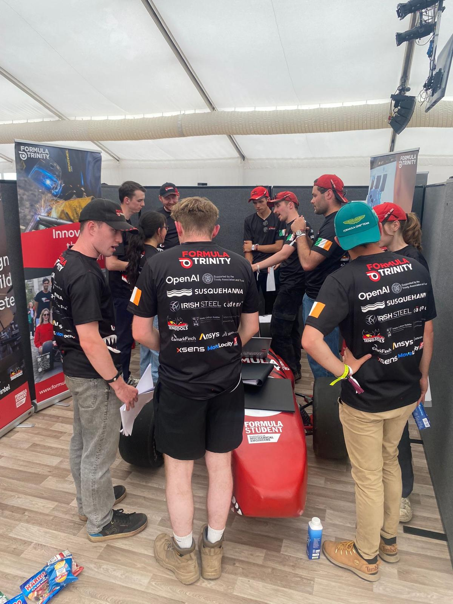

# Design Judging

Design Judging assesses the team’s understanding of the car, the engineering decisions behind it, and the processes used to develop and integrate each system.

The individual judging categories are covered in the following pages:

- [Engineering Design Report](./edr.md) (This document is submitted pre-event)
- [Overall Vehicle Concept](./overall_concept.md)
- [Structural Design inc. Suspension & Brakes](./struct_design.md)
- [Powertrain Concept & Choice, Simulation, Design & Analysis](./pt.md)
- [Overall Timing, Manufacturing, Procurement Plan plus Team Organisation Plan](./timing_planning.md)
- [Design for Manufacture & Profit, Customer Respect and Innovation](./design_for_manufacture.md)

The car is present throughout the session, allowing judges to inspect components and question team members directly. Its presentation therefore matters: the car should be clean, polished and as complete as possible. An unfinished car reflects weaknesses in project management and limits the team’s ability to demonstrate a fully developed design.

A maximum of ten team members may attend. We typically assign two people to each judging category, with each pair taking primary responsibility for its relevant area. However, strong performance requires more than detailed knowledge of one subsystem. All attendees should understand the overall vehicle concept, how the departments interact, and the major design decisions and trade-offs across the car.

Practice is essential. Team members should be comfortable explaining their work clearly, answering follow-up questions and supporting their decisions with calculations, testing or other evidence.

During FTX7 Design Judging, points were lost because the car was unfinished, some team members struggled when questioned in depth, and there was insufficient understanding of wider vehicle integration. Future preparation should therefore focus on:

- Completing and presenting the car to a high standard
- Practising likely questions and follow-up questions
- Developing a shared understanding of the full vehicle
- Clearly explaining design decisions, trade-offs and validation
- Ensuring answers are consistent across the team

---

