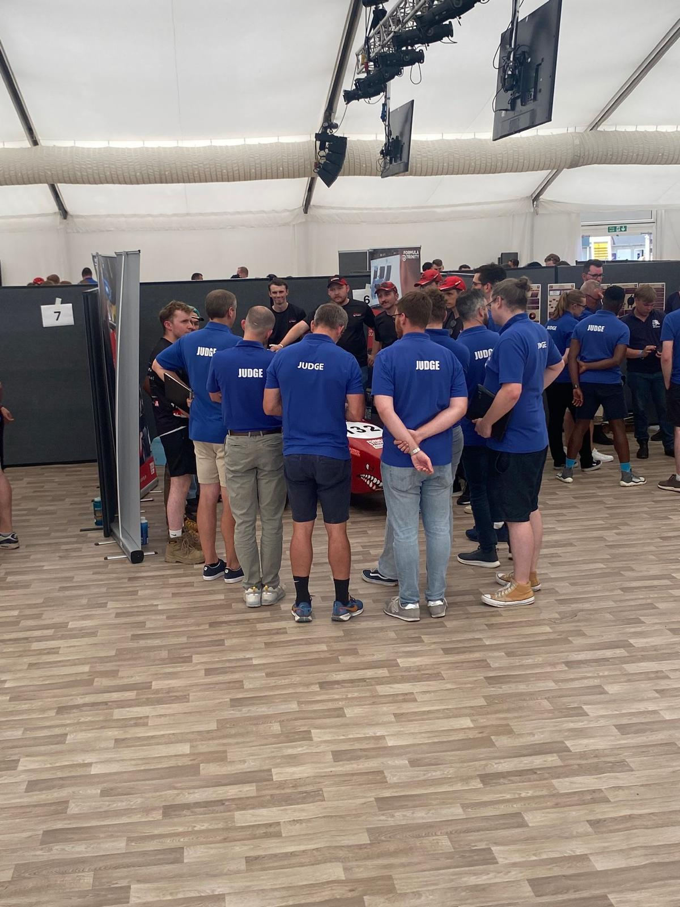

# Static Events

The static events assess the team’s understanding of the car, the engineering processes used to develop it, and the reasoning behind key design and manufacturing decisions.

Unlike the dynamic events, these sessions are not focused on how the car performs. Instead, judges assess how well the team can explain and justify their work.

Strong performance depends on:

- Presenting clearly and professionally
- Speaking confidently and demonstrating strong technical knowledge
- Giving consistent answers across the team
- Understanding the car beyond your own department
- Being able to explain the wider vehicle concept, design process and trade-offs

Every team member involved should have a shared baseline understanding of the full car, rather than only knowing their own subsystem.

The static events are covered in more detail in:

- [Design Judging](./design/index.md)
- [Cost & Manufacturing Judging](./cost/index.md)

---

A sneak peek at what static judging looks like:

