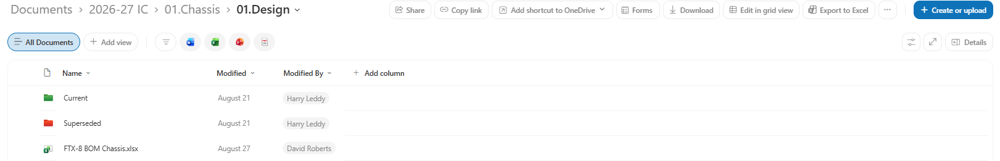
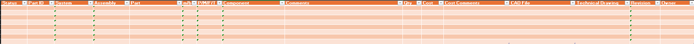
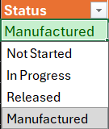

# BOM

Each department must create a Bill of Materials (BOM) for each subassembly within the department. Each department's BOM can be found within the "Design" folder of the OneDrive

*here is an example of where the Chassis BOM is located. The file path can be seen on the top of the image.*

## Why create a BOM?

Each department creates BOMs for several reasons;

* We are required to submit a BOM as part of the Formula Student competition
* BOMs make tracking design process easier. It's easy to see at a glance what parts haven't been designed, what is designed and what is manufactured already
* Makes ownership of parts more clear
* Good practice for engineering jobs/internships

## BOM Template

The BOM template can be seen below;

## Status (Dropdown)

This tab shows the current state that the part is in. The dropdown options are shown below:

* **Not Started** No design work has begun on the part
* **In Progress** Design work has begun on the part
* **Released** The design has been completed, reviewed and finalised
* **Manufactured** The part has been made

***Important Note:*** Parts may only be marked as **RELEASED** Following a design review by either IC Team Captain, IC Head of Engineering and/or IC Head of Manufacturing

