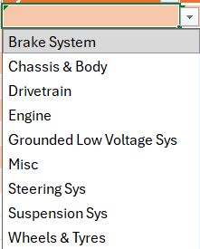
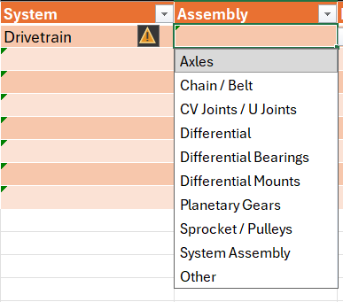
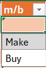

# BOM

Each department must create a Bill of Materials (BOM) for each subassembly within the department. Each department's BOM can be found within the "Design" folder of the OneDrive

*here is an example of where the Chassis BOM is located. The file path can be seen on the top of the image.*

## Why create a BOM?

Each department creates BOMs for several reasons;

* We are required to submit a BOM as part of the Formula Student competition
* BOMs make tracking design process easier. It's easy to see at a glance what parts haven't been designed, what is designed and what is manufactured already
* Makes ownership of parts more clear
* Good practice for engineering jobs/internships

## BOM Template

The BOM template can be seen below;

## Status (Dropdown)

This tab shows the current state that the part is in. The dropdown options are shown below:

* **Not Started** No design work has begun on the part
* **In Progress** Design work has begun on the part
* **Released** The design has been completed, reviewed and finalised
* **Manufactured** The part has been made

***Important Note:*** Parts may only be marked as **RELEASED** Following a design review by either IC Team Captain, IC Head of Engineering and/or IC Head of Manufacturing

## Part ID

The part ID should be written in this box, see [File Structure](../file_structure/)

## System (Dropdown)

This is the system the part belongs too. You'll notice the options do not align with the names of departments within Formula Trinity. This is so that our CBOM can be used for FSUK, as they have a custom tool for submitting them using these dropdowns. All parts will fall into one of the categories seen below.

## Assembly (Dropdown)

This is the assembly/subassembly that the part belongs too. It is also a dropdown menu to remain aligned with FSUK standards. The dropdown is made such that it will correspond to the system in the previous column (i.e. if the selected system in the **systems** column is drivetrain, the **assembly** column will only allow for selection of Drivetrain assemblies.)

Again, most parts should fall within one of the options. In the unlikely case they do not, there is an **other** option. Please do your best to avoid using this.

## Part

A plain English description of the part. This should match the name in the SolidWorks file (See [File Structure](../file_structure/)

## M/B (Dropdown)

This column states if the part is **Made** (M) or **Bought** (B)

## PMFT (Dropdown)
	
* **Process:**	Describes all the steps required for manufacturing
* **Material:**	The raw materials used
* **Fastner:**	The fastners used to assemble the part
* **Tooling:**	Any tooling required for manufacturing

