Aerodynamics Wiki

Aerodynamics Wiki 
1

<!-- page break -->

Pressure

What is Pressure 
Pressure is simply the force per unit area, normal to the area. 
The fluid is made up of lots of particles, bouncing and moving around. 
These particles interact with the surface, bouncing off it. Through this they 
apply a force to the surface.

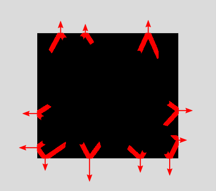

As a result of the fluid being isotropic (same in every direction), the 
pressure force on a surface is always normal/perpendicular to the surface. 
 
Pressure therefore has the units of Newtons per unit area (N/A) or Pascals 
(Pa). It is a scalar quantity. 
 
However if we take the N/A definition, and multiply above and below by 
metres (N/m^2 * m/m), we get newton metres per metre cubed. Newton 
metres is another word for work/energy. So here we are looking at joules 
per cubic metre - energy per unit volume. 
 
In this sense, pressure is the energy contained in the volume of fluid 
 
Relationship with Velocity 
 
The standard relationship between pressure and velocity is captured 
within the Bernoulli equation. This equation is simply a one dimensional 
representation of the Euler equation along a streamline, so neglects 
compressibility, viscosity, time dependence.  
 
The Bernoulli equation is below

𝑃1 + (0.5 ∗𝜌∗𝑣1

2) + (𝜌𝑔ℎ1) = 𝐶𝑜𝑛𝑠𝑡𝑎𝑛𝑡

● P1, called the static pressure, is the force per unit area type of

pressure

<!-- page break -->

● 0.5 rho v2 is the dynamic pressure, the pressure that arises from

velocity. If you were to bring the fluid to a complete stop (0 velocity), 
the pressure in the fluid would rise by an amount equal to the 
dynamic pressure. (also looks quite similar to the kinetic energy 
formula doesn’t it? That’s essentially what it is) 
● Rho g h is the pressure head - the pressure that comes from

gravitation, think of the potential energy when a ball is on top of a 
hill 
● All of this is constant, so we call the sum of these three terms the

total pressure. This is the indication of the total energy in the flow. 
This is also called the stagnation pressure, as it’s the static pressure 
that would hypothetically be gotten if you brought the fluid to a 
standstill (0 dynamic) and no potential.  
 
Air is faster - lower static pressure, higher dynamic pressure 
Air slows down - higher static pressure, lower dynamic pressure 
 
It is useful to think of the trade off between dynamic and static pressure, 
particularly over a wing. 
With a wing in downforce, on top the air slows, its dynamic pressure 
transferring to static pressure, and a high static pressure region is created 
on the top surface. 
On the bottom, the air speeds up, and causes a low pressure zone.  
 
Example: 
Within a vortex, the core spins really fast, and the fluid slows down as you 
slowly travel away from the core. Naturally then, the core of a vortex, going 
faster, is a lower pressure. This is the basis of vortex lift - using a vortex low 
pressure core on a surface 
 
Bernoullis equation presents total pressure as constant, always. But this is 
an idealisation along an inviscid streamline. In reality, due to viscous effects 
(boundary layers, separation etc.), total pressure is not always conserved.  
It is easy to see that in areas where total pressure is lower (lower energy), 
there is less space to create this tradeoff between static and dynamic 
pressure. Hence, we always try to place aerofoils and other aerodynamic 
elements in areas of high total pressure/energy. 
 
Surface pressure differential 
A static pressure differential across a surface is what creates aerodynamic 
forces.

<!-- page break -->

Imagine a plate, with high static pressure on top, and low static pressure 
beneath. The force per unit area (acting downwards) on top is larger due to 
the higher pressure. Conversely, it is lower underneath the plate. 
This creates a net downwards force 
Aerofoils are designed such that this pressure differential can be created 
 
Pressure Coefficient 
Ultimately, we can measure pressure as Newtons per square meter, 
pounds per square inch, elephant weights per brick area - nature doesn’t 
care what units we use to define.  
This is where dimensional analysis comes in.  
 
We can compare two flows with different conditions if a specific set of 
conditions are maintained - the non dimensional pi terms. This is a result 
of the buckingham pi theorem and dimensional analysis. 
 
The non-dimensionalised version of pressure is the Coefficient of Pressure.

𝐶𝑝=  𝑝/(0.5𝜌𝑣2) 
Where p - pfreestream, is the local static pressure (or for total pressure 
coefficient, the local total pressure), then this is divided by the dynamic 
pressure. It is a ratio between the static (or total) pressure and dynamic 
pressure.

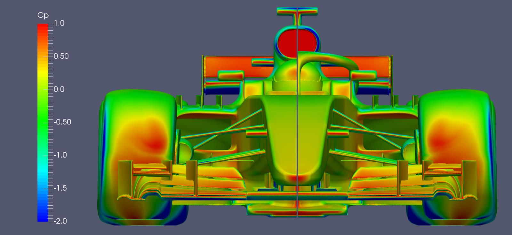

Static pressure coefficient. Look at the blue under the rear wing, and the 
red on top. This difference is what creates downforce

<!-- page break -->

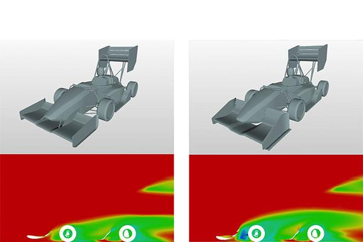

Total pressure coefficient shows the reduction in energy caused by the 
front wing and tires, along with a bit from the rear wing vortex 
 
Momentum Diffusion 
If you’re studying the Navier Stokes equations, you can identify diffusive 
and convective terms. The diffusion of momentum is often attributed to 
viscosity, as that is the fact that sets the Navier Stokes apart from the Euler 
equations.  
 
However, pressure also leads to momentum diffusion. Or more precisely, 
the pressure gradient. 
 
If you have a fluid in a pipe, stationary, and immediately apply a pressure 
gradient across it, it will begin to move from high pressure to low pressure. 
The pressure gradient creates (diffuses) momentum. 
 
Placement in the stress tensor 
Pressure is the isotropic, inwardly acting force from all directions on any 
material element. It is therefore the normal components of the cauchy 
stress tensor - ⅓ * tr(sigma).

<!-- page break -->

Multi Element Aerofoils

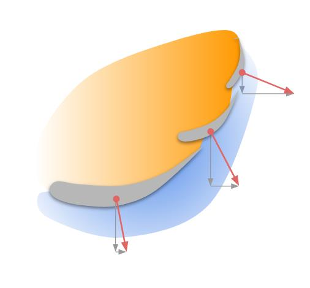

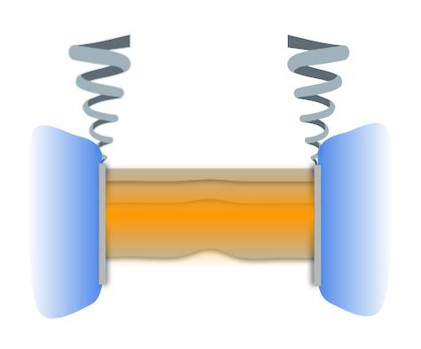

Fig. 1. The foundations of multi-element wing design slot effect (left) and

vortex management (right)

1. 
Multi Element Aerofoil Theory and Geometry 
Essentially multi-element aerofoils allow wings to operate at much 
higher angles of attack and therefore improve the baseline lift of the 
aerofoil. We will look at the theory behind them.

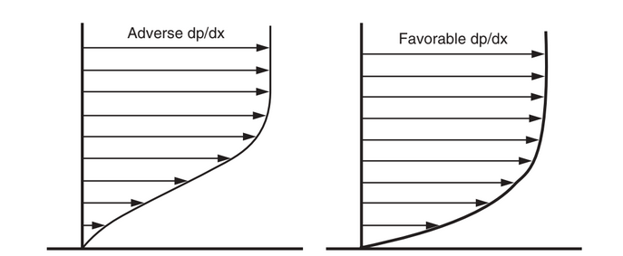

Fig. 2. Adverse pressure gradient reducing flow velocity

The angle of attack strongly affects the pressure distribution 
(coefficient of pressure (Cp) increases linearly with increasing angle of 
attack) . A higher angle of attack increases the lifting capability of the 
aerofoil due to a higher pressure difference but there is a limiting 
angle at which stall occurs and the flow over the wing separates 
(separation also depends on the Reynolds number and the location 
of laminar-to-turbulent transition). Lifting capabilities can be 
enhanced by pushing this “stall angle” further out thereby increasing 
the coefficient of lift (CL) of the wing.

<!-- page break -->

The “slot” effect of multi-element aerofoils is what aeronautical 
engineers in both aviation and motorsport have utilised to achieve 
high lift in compact wings. Most explanations of this effect rely on 
this “energy injection” theory, that the slots allow high velocity (high 
kinetic energy) air form the low pressure side of the wing to bleed 
through and re energise the boundary layer of the high pressure 
side, this is a concept known as a “wall-jet” which is a viscous flow 
phenomenon. While this is quite a reasonable theory it doesn’t fully 
explain how the slot effect prevents separation at high angles of 
attack.

The main limitation on maximum lift is imposed by how much 
pressure rise (or velocity drop) the boundary layer on the suction 
side can withstand. The boundary layer’s ability to withstand the 
pressure rise is increased if the boundary layer is thin when it starts 
into the pressure rise. 
 
The slot effect works on both of these things: the amount of 
pressure rise imposed on each element, and the thickness of the 
boundary layer starting into the pressure rise. So the slot has two 
functions:

1. Starting a fresh upper-surface boundary layer at the

leading edge of each element. For elements after the 
first, this means a thinner boundary layer at the start of 
the pressure rise than would be there if there were no 
slots.

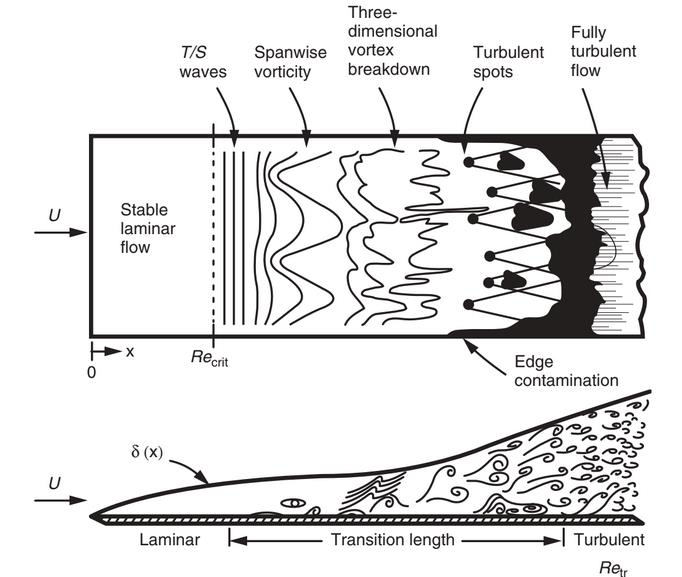

Fig. 3. Boundary layer thickness affects separation 
2. Reducing the pressure rise imposed on the suction-

side boundary layer of each element. Slots do this in

<!-- page break -->

either of two ways, or both simultaneously, depending 
on the situation of the given airfoil element.

● When there is an element ahead, it can provide

leading-edge suction-peak suppression, 
essentially by providing some flow turning ahead 
of the leading edge of the current element, so that 
the flow doesn’t rush around the leading edge as 
fast as it otherwise would.  
 
● When there is an element behind, it can provide

trailing-edge dumping-velocity elevation, 
effectively by placing the trailing edge of the 
current element in a high velocity region near the 
leading edge of the trailing element. 
 
Reducing the velocity at the leading edge of an element 
and elevating the velocity at the trailing edge both 
reduce the total velocity drop the boundary layer is 
subjected to.

For a slot to be effective in increasing the maximum lifting 
capability, the flow must smoothly pass from the lower surface 
to the upper surface of the wing.

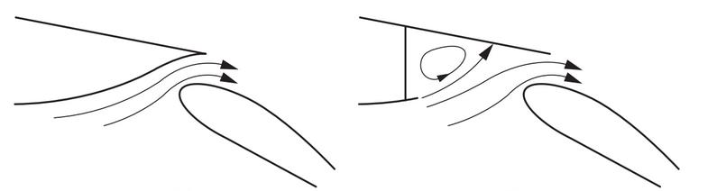

Fig. 4. Smoothly contoured slot (slot) and “cove” slot (right)

Unless the slot gap upstream is large, the wake will merge to 
some extent with the boundary layer of the element 
underneath. If too much of this boundary-layer mixing takes 
place, the separation resistance of the entire viscous layer will 
be reduced. Thus the choice of slot gap is a trade: Greater 
suction-peak suppression favors a smaller gap, but boundary-
layer confluence penalizes a smaller gap.

<!-- page break -->

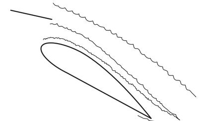

Fig. 5. Potential flow core between wake of forward element

and boundary layer of flap 
 
*Read Understanding Aerodynamics by Doug McLean for more 
information 
 
2. 
Multi Element Aerofoil Performance Enhancement 
 
2.1. 
High Lift Devices 
Devices which take advantage of flow properties to increase 
the CL of a wing are classed as high lift devices.

2.1.1. Flaps and Slats

Lift control is an import aspect for both motorsport and 
aircraft and is primarily controlled via flaps and slats. 
Flaps sit at the trailing edge of a wing and are 
themselves small aerofoil profiles. Changing the angle of 
a flap changes the overall angle of attack of the aerofoil 
and the camber of the aerofoil and can turn the flow 
more (increased lift) or less (decreased) lift.

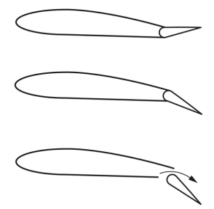

Fig. 6. Flaps set angles to decrease (top) and increase (middle)

lift, multi element flap system (bottom)

<!-- page break -->

Slats which aren’t as common for motorsport 
applications sit at the leading edge of a wing and 
function in exactly the same way as flaps.

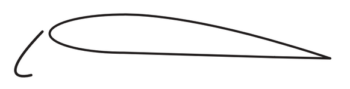

Fig. 7. Slat “drooped” to increase maximum lift 
 
2.1.2. Gurney Flaps

Invented by Dan Gurney in the 1970’s this flap sits on the 
trailing edge of a wing and is perpendicular to the main 
plane and sits on the high pressure side of the aerofoil. 
The Gurney can increase the lift of a wing greatly and it 
does it through two mechanisms:

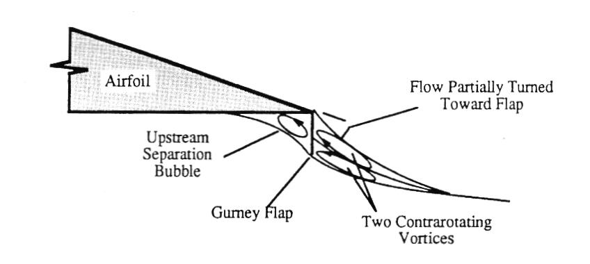

1. Modifies what is known as the Kutta condition of

the aerofoil which is the point where the 
streamlines on the upper and lower surfaces of the 
wing merge back together. The flap moves this 
point further back effectively making the wing 
longer. 
 
2. Gives a sharper exit angle to the airflow (increasing

flow turning).

<!-- page break -->

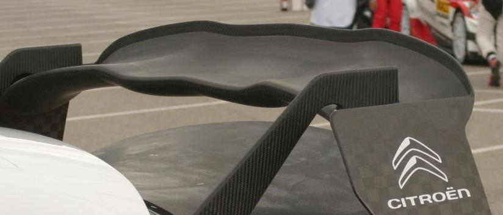

Fig. 8. Gurney flap on trailing edge of rallycross car

2.1.3. Blown Wings

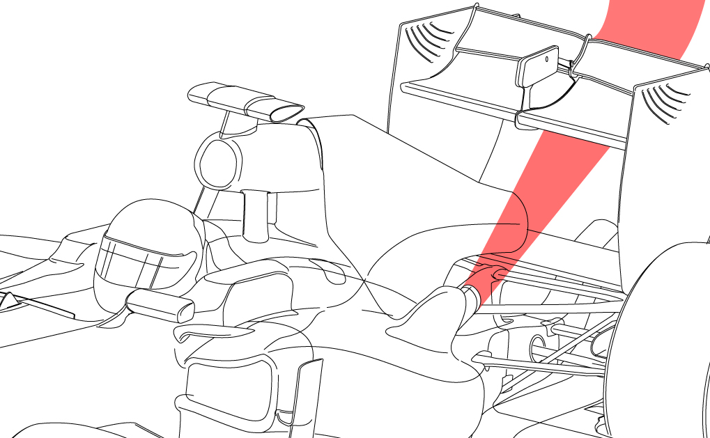

Fig. 9. Exhaust blown rear wing 
 
A brute force approach that’s worked quite well for 
diffusers in motorsport is to channel high speed airflow 
from another source (engine exhaust, fan etc.) and 
funnel it onto the surface of the wing to manually 
reattach the flow.  
 
2.2. 
End Plates 
Once you have a multi element wing it is rather difficult to get 
the low pressure side and high pressure side to stay separated 
at the wind ends as the high pressure air on top wants to 
“leak” down to the low pressure which not only reduces lift but 
also creates tip vortices which introduce nasty things like 
induced drag.

<!-- page break -->

Solution, putting a massive obstacle between the two aerofoil 
surfaces such as an endplate reduces the pressure loss and 
reduces the size of the tip vortices.

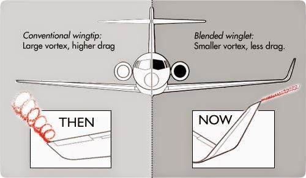

Fig. 10. Winglets, a more elegant endplate

2.2.1. Louvres

Louvres which are vents in the endplate, bleed high 
pressure off the top surface of the wing to further reduce 
tip vortices by bringing the air near the top of the plate 
closer to ambient pressure. 
 
Boundary Layers

A boundary layer is the layer of fluid in the immediately above a bounding surface where the effects 
of viscosity are significant. The fluid in the boundary layer tends to cling to the surface. The 
boundary layer is, for incompressible flow, usually the only place where viscous effects have any sort 
of significant effect so even though it is a very small region it is probably the most important region 
of the airflow. The boundary layer starts at the surface of the body, where the flow velocity is zero 
and extends up until the flow velocity is equal to the surrounding airflow. The boundary layer also 
gets larger the further along the body it travels. A boundary layer can be seen in figure 1.

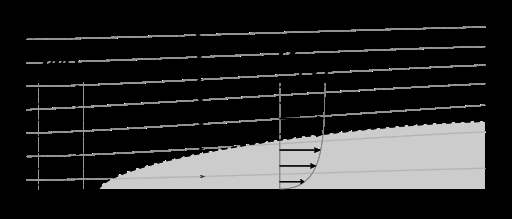

Figure 1: Simple Boundary Layer(Boundary Layer Ends at Dashed Line)

<!-- page break -->

Laminar Boundary Layers 
There are two types of boundary layers, laminar and turbulent. Laminar boundary layers have very 
smooth flow with little friction. Laminar boundary layers however, are not stable and will generally 
transition to turbulent at some point along a body. The boundary layer at the front of a body begins 
as laminar and as the flow travels along the body this boundary layer gets larger and larger until it 
transitions to turbulent. If complete laminar flow is assumed, there are exact analytical solutions. For 
incompressible laminar flow over a flat plate at zero angle of attack, the equation:

𝛿=
5𝑥

√𝑅𝑒𝑥

gives the size of the boundary layer where x is the distance along the plate and the Reynolds number 
is given by:

𝑅𝑒𝑥= 𝜌𝑒𝑉∞𝑥

𝜇∞

Where ρe is the density μ∞ is the dynamic viscosity of the fluid and V∞ is the freestream velocity. 
It can be seen from these two equations that the thickness of the boundary layer is directly 
proportional to the square root of the distance and therefore, the boundary layer thickness grows 
parabolically. 
 
Turbulent Boundary Layers 
At some distance back from the leading edge, the smooth laminar flow breaks down and transitions 
to a turbulent flow. From a drag point of view, it is best to have as small a turbulent boundary region 
as possible but laminar layers tend to break down more suddenly then turbulent boundary layers 
which is why they can be useful to help keep flows attached. There are no exact analytical solutions 
to a turbulent boundary layer but over a flat plane the thickness can be approximated by:

𝛿= 0.37𝑥

√𝑅𝑒𝑥
5

The turbulent boundary layer thickness is proportional to the fifth root of the distance. Comparing 
this to the laminar boundary layer, there is a more sudden increase in thickness followed by a much 
more gradual increase.

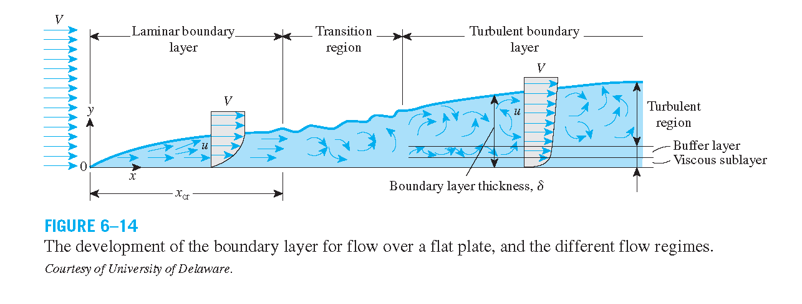

Figure 2: Turbulent and Laminar Boundary Layer 
Transition from Laminar to Turbulent

<!-- page break -->

A boundary layer will rarely be just turbulent or laminar. Boundary layers start as laminar at the 
leading edge, as the boundary moves along the body it will become less and less stable with small 
bursts of turbulence beginning to grow within the layer, until finally at a certain region known as the 
transition region the boundary layer becomes completely turbulent. In the transition region the 
boundary layer will grow much quicker and then will level out again. The start of the turbulent 
region is known as the transition point and the x value(distance along the body) where this transition 
point is located is called the critical value xcr. This also allows us to calculate the critical Reynolds 
number for transition by placing xcr into the Reynolds number formula.

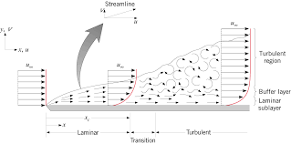

Figure 3: Transition from Laminar to Turbulent 
 
Wall Shear Stress 
Wall shear stress is the amount of friction force applied to a body by the fluid per unit area. Wall 
shear stress(τ) at a point is defined as:

𝜏= 𝜇(𝑑𝑉

𝑑𝑦)

For y = 0. Where μ is the viscosity V is the velocity and y is the height from above the body. As 
temperature rises the viscosity of the air goes up and therefore, produces more shear stress. 
Since wall shear stress is caused by friction and friction generates heat, this means that the wall 
shear stress increases the value of the viscosity and therefore, increases the wall shear stress as it 
travels along the body. Seeing this formula makes it clear why turbulent boundary layers produce 
more friction drag since the velocity above the surface increases much more rapidly than in the 
laminar layer. In order to calculate the drag produced by the wall shear stress, the wall shear stress 
in the x direction can be integrated over the entire top and bottom surface of the airfoil. 
Wall shear stress is also a useful tool for noticing separation. If there is wall shear stress at a point 
that is in the opposite x direction it means there is reversed flow in the region and therefore flow 
separation.

<!-- page break -->

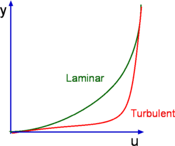

Figure 4: Laminar and Turbulent Boundary Layer Velocities above a Body 
 
Momentum Diffusion 
Boundary layers are a direct result of momentum diffusion. Momentum diffusion is the spread of 
momentum through a fluid. Initially, before any obstructions have hit the flow, the momentum will 
be uniformly spread throughout the flow and everywhere will have effectively the same momentum. 
However, when an airfoil or body is introduced to the flow, a boundary layer and a spread of 
momentum in the flow form. Momentum diffusion is this spread of momentum and points in the 
direction of decreasing velocity, since diffusion moves from an area of high concentration to low.  
 
Momentum thickness is an idea associated with momentum diffusion. Momentum thickness (δ**) is 
defined as the thickness of a layer of fluid velocity U for which the momentum flux is equal to the 
deficit of momentum flux through the boundary layer. It's essentially if you took all the momentum 
lost in the boundary layer and put it all into one thick piece of momentum loss, how thick would the 
piece be. See figure 5.

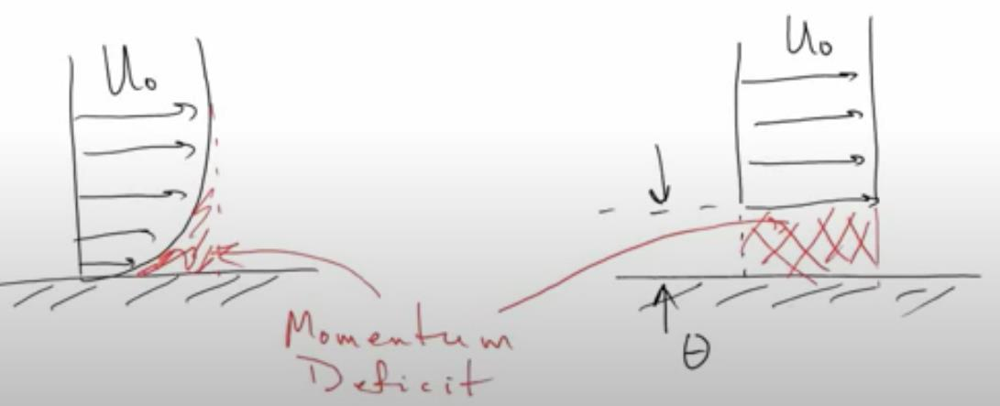

Figure 5: Momentum Thickness 
 
Displacement Thickness:

<!-- page break -->

Displacement thickness (δ*) follows the same lines as momentum thickness and is defined as the 
distance by which the solid boundary layer would have to be displaced in a frictionless flow to give 
the same mass deficit as the boundary layer. See figure 6.

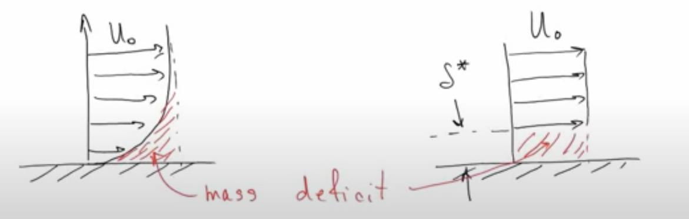

Figure 6: Displacement thickness

Flow Separation

Flow separation or boundary layer separation is the detachment of a boundary layer from a surface. 
This occurs in flow that is slowing down with an adverse pressure gradient after passing the thickest 
part of a streamline body or passing through a widening passage(e.g. diffuser).

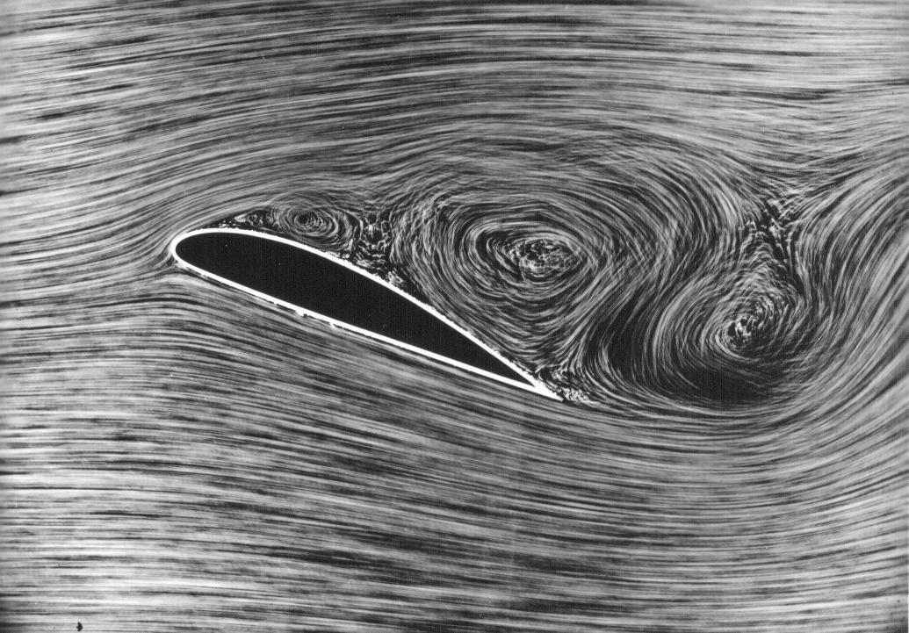

Figure 1: Flow Separation Example 
Adverse Pressure Gradients 
An adverse pressure gradient is when a flow is travelling from an area of low pressure to high 
pressure. An adverse pressure gradient will form anywhere that dp/ds > 0 and will form on every 
airfoil because the lowest pressure will always be near the front of the airfoil. Therefore, adverse 
pressure gradients aren’t that big a deal unless the gradient is a steep one. Steep pressure gradients 
quickly slow the flow going through the gradient. This loss of velocity then causes the boundary layer 
to reverse causing the flow to separate, see figure 2. Adverse pressure gradients generally cause 
trailing edge separation, this is where the flow at the back of the airfoil separates. Pressure gradients 
are usually analysed using pressure coefficient plots which is shown in figure 3. The best way to deal

<!-- page break -->

with adverse pressure gradients is to move the lowest pressure region further forward to have a 
more gradual transition.

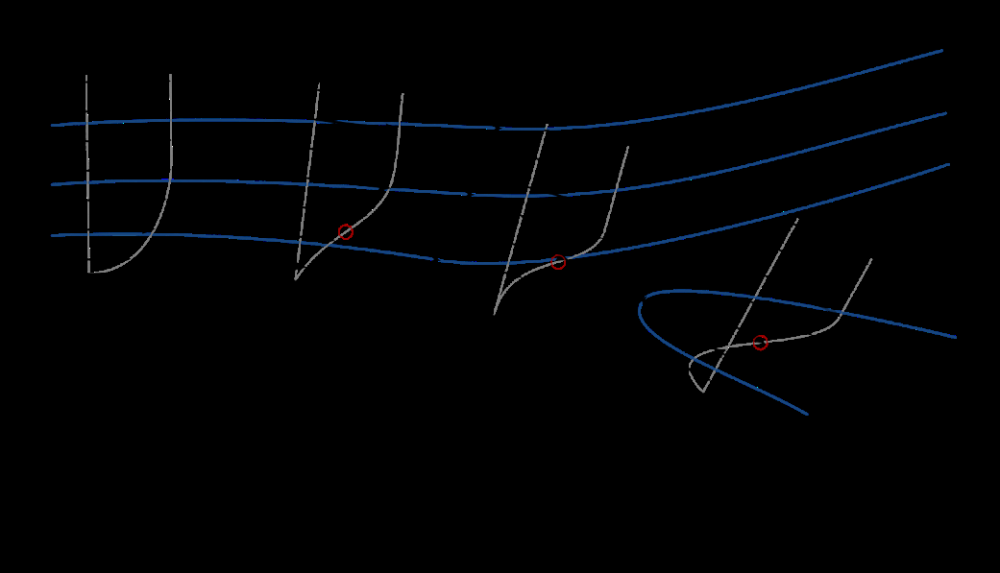

Figure 2: Boundary layer and flow separation

Adverse Pressure Gradient

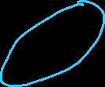

Low Pressure Region

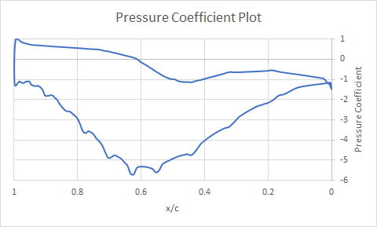

Figure 3: Pressure Coefficient vs chord Plot 
 
Laminar Separation Bubbles 
Laminar separation bubbles are caused by a strong adverse pressure gradient and large curvature of 
a body, which causes the laminar boundary layer to separate from the airfoil surface. 
The separated, but still laminar flow is highly sensitive to disturbances, which causes it to transition 
to the turbulent state. The transition takes place away from the airfoil at the outer boundary of the 
separated flow area. The thickness of the now turbulent boundary layer grows rapidly which may 
lead to it reaching the airfoil surface again. The region where the turbulent flow touches the surface 
again is called reattachment point. The volume enclosed by the regions of separated laminar flow 
and turbulent flow is called a laminar separation bubble. Inside these bubbles the flow generally 
circulates but has very little energy exchange with the outer air which leads to these bubbles being 
quite stable.

<!-- page break -->

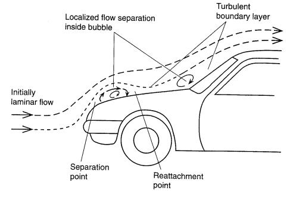

Figure 4: Laminar Bubble

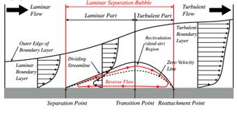

Figure 5: Laminar Bubble 
 
Leading Edge Separation 
Leading separation is a follow on from laminar separation bubbles. Leading edge separation is the 
appearance of a separation bubble on either side, often the suction side, of an airfoil in the nose 
region if the angle of attack exceeds a critical value. Due to the large curvature, at the front of 
certain airfoils or airfoils at a certain angle of attack, a separation bubble will form. This is called 
leading edge separation. The flow will often reattach with leading edge separation but depending on 
the circumstances, there could be a small bubble or a large bubble formed and if its bad enough 
there could even be a leading edge stall where there is no reattachment. Leading edge separations 
can be seen in figure 6 and 7.

<!-- page break -->

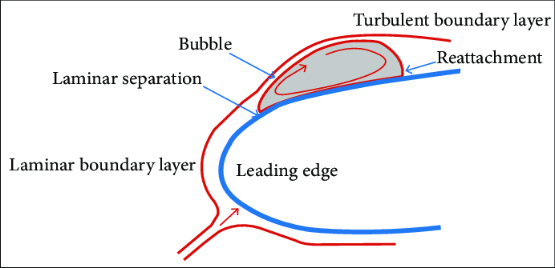

Figure 6: Leading Edge Separation

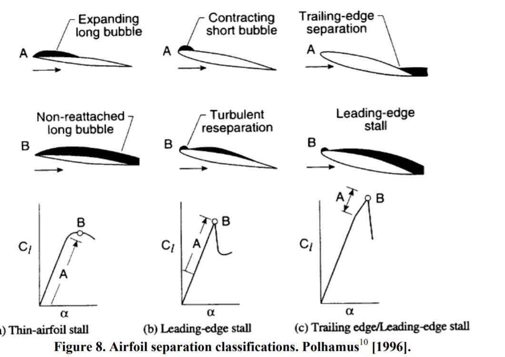

Figure 7: Different types of separation 
 
Effects of Separation 
The biggest effect of separation is generally the increase in drag. When the flow separates from the 
back of the airfoil, there is usually a large increase in pressure drag. Lift can be effected in a couple of 
ways, if the separation is large the lift will dramatically decrease and could even stall. However, 
sometimes if the angle of attack of an airfoil is increased, lift will go up but separation may also form. 
This leads to an increase in drag but also an increase in lift. It is best to have as little or no separation 
but sometimes it may be beneficial to have mild separation with an increase in lift. Separation can 
also lead to vortex shedding which can lead to vibrations within a structure.  
 
 
 
Vortices

<!-- page break -->

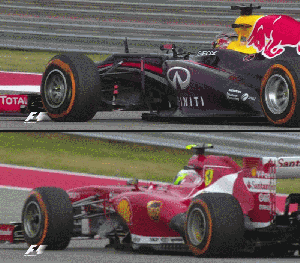

Fig. 1. Y250 Vortex

1. 
What are Vortices? 
Vorticity generally implies some form of fluid particle rotation. The 
typical intuitive vortex is a tornado. Vortices fall under the category 
of coherent structures (i.e. noticeable patterns in the flow). A moving 
vortex carries some angular momentum, linear momentum, energy, 
and mass, with it.

Vorticity is essentially a measure of the amount of rotation in a flow 
field as such we can have rotational flows and irrotational flows.  
 
2. 
Theory of Vortices 
 
 
2.1. 
Vorticity 
To formally state vorticity we must use the following vector 
calculus relation:

𝜔= 𝛻× 𝑼

𝜔= [ 𝜕

𝜕𝑥 𝜕

𝜕𝑦 𝜕

𝜕𝑧] × [𝒖 𝒗 𝒘] = (𝜕𝑤

𝜕𝑦−𝜕𝑣

𝜕𝑧  𝜕𝑢

𝜕𝑧−𝜕𝑤

𝜕𝑥 𝜕𝑣

𝜕𝑥−𝜕𝑢

𝜕𝑦)

A problem associated with this method is that vorticity cannot 
distinguish between swirling motions and shearing motions. 
 
 
2.2. 
Vortex Lines and Vortex Tubes 
In the same way that we can construct a geometric line that is 
everywhere tangent to the velocity vector in a velocity field and

<!-- page break -->

create a streamline, we can also create a line that is everywhere 
tangent to the vorticity vector calculated above and create a vortex 
line. 
 
In the same way that when we bundle streamlines together to 
create a streamtube we can bundle vortex lines together to create a 
vortex tube. 
 
If the cross-sectional area of a vortex tube decreases, either in time 
or along the length of the tube, the strength of the vorticity (the 
magnitude of the vorticity vector) must increase. 
 
A vortex filament is a vortex tube whose cross section has a 
maximum dimension that is infinitesimally small. The cross-sectional 
area of a vortex filament is thus also infinitesimally small, but it is still 
assumed to vary along the length of the filament, so that the 
filament can still satisfy the definition of a vortex tube. For a vortex 
filament, the flux of vorticity across a cross-section reduces to the 
product of the vorticity magnitude and the cross-sectional area, 
which is called the intensity of the filament.

2.3. 
Helmholtz’s Theorems 
Vortices are governed by four simple laws. 
 
 
2.3.1. First Theorem

In a constant-density flow, the deviations in velocity in 
the neighborhood of a point can be expressed as the 
sum of two parts: a deformation velocity field and a solid-
body rotation with angular velocity ω/2. 
 
 
 
2.3.2. Second Theorem (Vortex Intensity Conservation)

Intensity of a vortex filament is constant along its length. 
Vortex filament intensity is conserved and so a vortex 
filament can’t end within the fluid domain and so must 
either form a closed loop or end at fluid boundary (can’t 
be a no-slip boundary).

<!-- page break -->

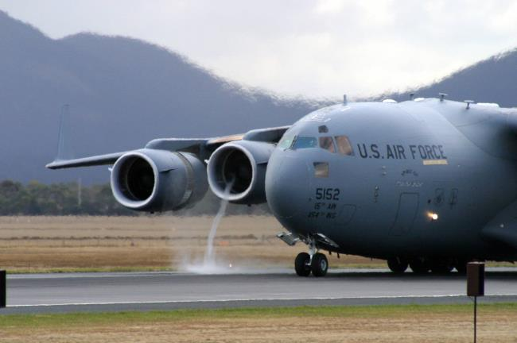

Fig. 2. Vortex doesn’t “end” at runway surface

2.3.3. Third Theorem

As a vortex tube evolves in time, fluid particles cannot 
cross the bounding surfaces of the tube, as such the 
vortex tube is always made up of the same fluid particles. 
This tells us that for small viscosity, the natural tendency 
of a vortex tube is to remain anchored to the same 
material tube, and that vorticity migrates into or out of 
that material tube only through viscous diffusion.

2.3.4. Fourth Theorem

The intensity of a vortex tube is constant regardless of 
how the tube moves around. 
 
 
2.4. 
Biot-Savart Law 
If we wanted to invert the velocity to vorticity relationship we 
would use the Biot-Savart Law.

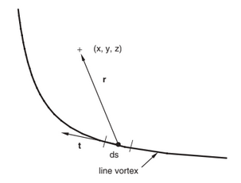

Fig. 3. Biot-Savart Law

<!-- page break -->

𝑈(𝑥, 𝑦, 𝑧) = 𝛤

𝑟3
𝑑𝑙

4𝜋∫ 𝑡 ×  𝑟

However we have to be careful and realise this does not imply 
a cause-effect relationship as this would mean some sort of 
action at a distance induced by the vortex. (Where Γ is the 
circulation of the vortex)

Only holds if the following assumptions are made:

1. The fluid fills all of space.

2. The fluid is at rest at infinity, with the velocity magnitude

1

at large distances dying off at least as

𝑟2.

3.  
Vortex Effects

3.1. 
Tip Vortices

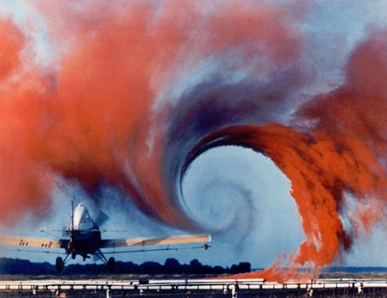

Fig. 4. Vortex roll-up at wing tip

Wing tip vortices form due to a pressure difference between 
the top and bottom surfaces of a wing inducing a flow from 
the high pressure side to the lower pressure side. These 
vortices which can form on wing elements without endplates 
create upwash and lead to induced drag.

<!-- page break -->

3.2. 
Vortex Lift

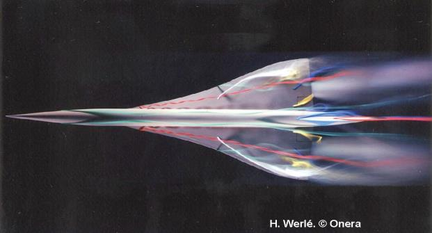

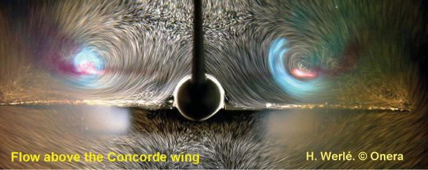

Fig. 5. Concorde primarily generated lift through vortices

Conventional unswept wings generate lift based on the 
concept of a “bound” vortex. Highly swept wings can continue 
to generate lift at high angles of attack via vortices generated 
by leading edge separation. The airspeed within the vortices 
on the upper surface of the wing is fast and so creates a low 
pressure region which generates lift.

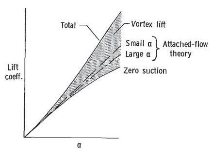

Fig. 6. A Concept of the Vortex Lift of Sharp-Edge Delta Wings 
based on a Leading-Edge suction Analogy, Edward C. Polhamus

Despite the loss of lift due to separated flow vortex lift 
enhances a wing's potential flow (baseline) lift value. Strakes 
operate via this exact same mechanism.

<!-- page break -->

* See Polhamus Theory for more information 
3.3. 
Vortex Sealing

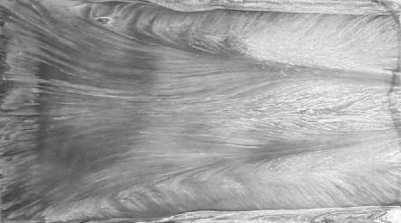

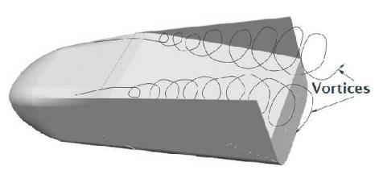

Fig. 7. Bluff body demonstrating vortex sealing on diffuser from

Willem Toet’s blog

When seeking downforce from underfloor devices it is 
beneficial to keep high pressure air from ingressing 
underneath the car. Vortices are generated anyway from the 
interaction of the low pressure air of the diffuser and the high 
pressure atmospheric air outside. Vortex generators on the 
barge board can be used to direct vortices to the edge of the 
diffuser sealing the low pressure expanded air from the 
outside air further.

3.4. 
Vortex Breakdown

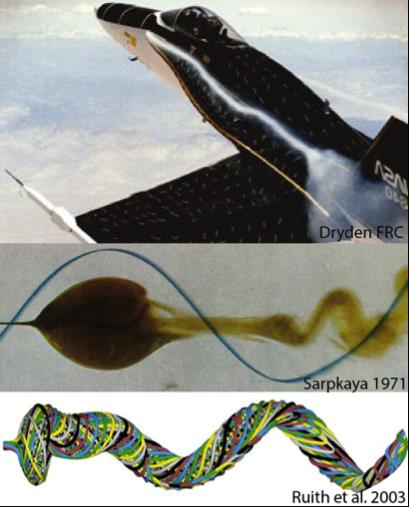

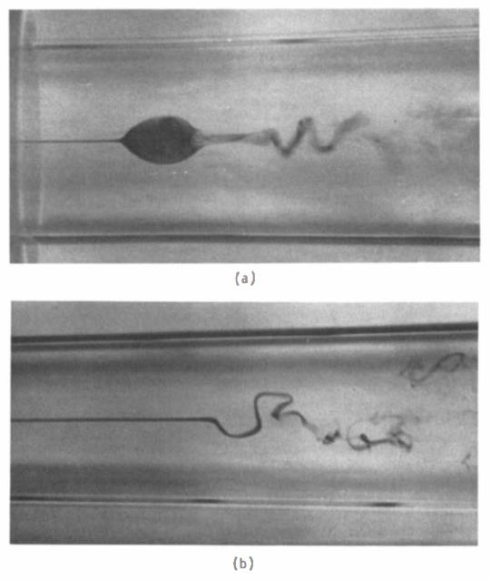

Fig. 8. Vortex breakdown on jet (left) and bubble vs. spiral

breakdown (right)

Vortex breakdown and loss of a coherent structure occur due 
to the formation of an internal stagnation point along the 
vortex axis which is triggered when the flow goes beyond a

<!-- page break -->

certain value of swirl (much like a critical Reynolds number 
signalling the onset of turbulence).

Direct cause of vortex breakdown is still a grey area with 
theories posited about flow instability upstream of the 
breakdown point causing an asymmetry in the vortex that 
leads it to spiral further and further from its axis, however this 
theory was refuted due to no noticeable instabilities in 
experimental tests. 
 
4. 
Vortex Identification Methods 
We know the definition of vorticity is not ideal for practical 
identification of vortical structures. Methods have been developed to 
improve upon this definition for practical vortex identification 
suitable for computation. Both Q-Criterion and Lambda 2 evaluate 
areas for low pressure cores, which leads to an improvement over 
the conventional vorticity definition. 
 
 
4.1. 
Velocity Gradient Tensor (Strain-Rate Tensor)

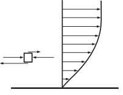

Fig. 9. Velocity Gradient at Point Near Solid Surface

Start with a velocity gradient which represents the velocity of a 
fluid layer at a certain distance from a surface.

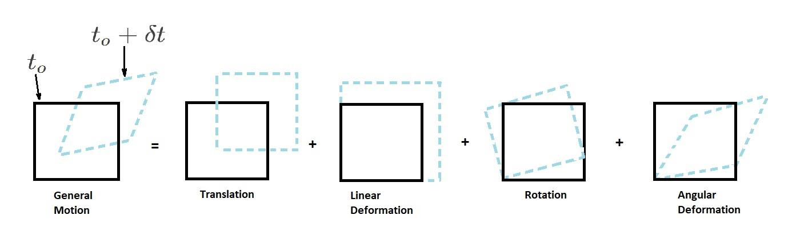

Fig. 10. Fluid Particle Movement is a Superposition of Motions

<!-- page break -->

Fluid particles experience strain rates (part of deformation) 
and rotational motions, these are the kinematic (not looking at 
forces which cause movement) motions of a fluid particle.

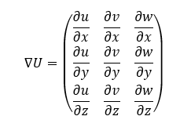

For 3D fluid motion we can create a velocity gradient tensor 
shown in the matrix above. This matrix can be split into 
symmetric and antisymmetric components which represent 
the deformation rate and rotation rate experienced by the 
fluid particle.

Symmetric Component (6 Independent Terms):

𝑆= 1

2 (𝛻𝑈+ (𝛻𝑈)𝑇) = 𝐷𝑒𝑓𝑜𝑟𝑚𝑎𝑡𝑖𝑜𝑛 𝑅𝑎𝑡𝑒

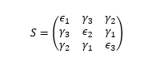

where:

𝜖= 𝑳𝒊𝒏𝒆𝒂𝒓 𝑺𝒕𝒓𝒂𝒊𝒏 𝑹𝒂𝒕𝒆 
𝛾= 𝑺𝒉𝒆𝒂𝒓 𝑺𝒕𝒓𝒂𝒊𝒏 𝑹𝒂𝒕𝒆 
 
 
 
 
Antisymmetric Component (3 Independent Terms):

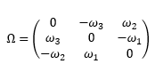

1

Ω=

2 (𝛻𝑈−(𝛻𝑈)𝑇) = 𝑅𝑜𝑡𝑎𝑡𝑖𝑜𝑛 𝑅𝑎𝑡𝑒

<!-- page break -->

4.2. 
Tensor Invariants 
As an aside, tensor invariants essentially  “eigenvalues” for 
tensors which means they are independent of a coordinate 
system.

𝑃= 𝑡𝑟(𝐴)

𝑄= 1

2 ((𝑡𝑟(𝐴))2 −𝑡𝑟(𝐴2))

𝑅= 𝑑𝑒𝑡(𝐴) 
 
4.3. 
Q-Criterion

Defined to be the positive (𝑄> 0) second principal invariant of

the velocity gradient tensor (i.e. where 𝑄 is positive, there are 
vortices).

𝑄= 1

2 (||Ω||2 −||𝑆||2)

Writing the equation out in it’s full form helps us to see the 
kinematic relations.

2) + 1

2)]

𝑄= (𝜔1

2 + 𝜔2

2 + 𝜔3

2) −[(𝛾1

2 + 𝛾2

2 + 𝛾3

2 + 𝜖2

2 + 𝜖3

2 (𝜖1

𝑄 represents a local balance between the rotation and 
deformation rates of a fluid element so a vortex is defined to 
be a region where the antisymmetric component 
predominates the symmetric one.

4.4. 
Lambda 2 
This method is based on searching for pressure minima across 
the vortex (but removes the effects from unsteady straining 
and viscosity by discarding these terms), by taking the 
gradient of the Navier-Stokes equations and decomposing it 
into symmetric and antisymmetric parts. Gradient of Navier-
Stokes equations yields:

<!-- page break -->

𝑎𝑖𝑗= −1

𝜌𝑝/𝑖𝑗+ 𝜐𝑢𝑖/𝑗𝑘𝑘

𝑎𝑖𝑗= [𝐷𝑆𝑖𝑗

𝐷𝑡+ 𝛺𝑖𝑘𝛺𝑘𝑗+ 𝑆𝑖𝑘𝑆𝑘𝑗] + [𝐷𝛺𝑖𝑗

𝐷𝑡+ 𝛺𝑖𝑘𝑆𝑘𝑗+ 𝑆𝑖𝑘𝛺𝑘𝑗]

where 𝑎𝑖𝑗is the acceleration gradient and 𝑝𝑖𝑗(the Hessian of

the pressure) is symmetric. Decomposing the acceleration 
gradient into symmetric and antisymmetric parts we get what 
is known as the vorticity transport equation as the 
antisymmetric part and the symmetric part:

𝐷𝑆𝑖𝑗

𝐷𝑡−𝜐𝑆𝑖𝑗/𝑘𝑘+ 𝛺𝑖𝑘𝛺𝑘𝑗+ 𝑆𝑖𝑘𝑆𝑘𝑗
= −1

𝜌𝑝𝑖𝑗

If 𝑝𝑖𝑗 has two negative eigenvalues, there is a local pressure

minimum on the plane of the two eigenvectors associated 
with those eigenvalues.

The first term on the left-hand side of the equation above 
represents unsteady irrotational straining and the second

term represents viscous effects so by considering only 𝑆2 +
𝛺2 allows one to determine the existence of a local pressure 
minimum due to vortical motion.

Since the tensor 𝑆2 + 𝛺2 is symmetric, it has only real 
eigenvalues. We assume the the eigenvalues are ordered as 
such:

𝜆1 ≥𝜆2 ≥𝜆3

As such we can say that if 𝜆2 < 0 we can conclude that a 
vortex is present. Essentially this method locally compares

strain and rotation, requiring 𝜆2 < 0 is equivalent to requiring 
that some measure of rotation rate prevails over some 
measure of deformation rate.

<!-- page break -->

5. 
Vortex Devices 
Vortices are very useful for flow control and are realised in a variety of 
devices.

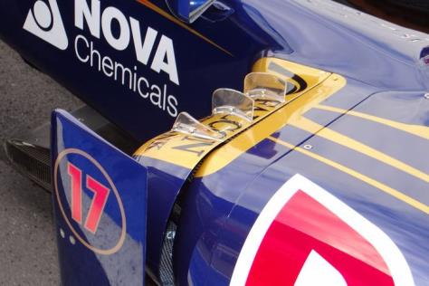

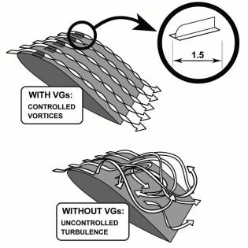

Fig. 12. Vortex generators for flow attachment on sidepod (left) and

flow attachment on wing device (right)

Vortex generators are most commonly used for flow 
reattachment either on steeply curving surfaces (such as 
sidepods) or wings at high angles of attack. They do this by 
drawing in high energy air from the freestream. Vortex 
generators come in many types such as vanes, doublets, 
wheelers, ramps etc.

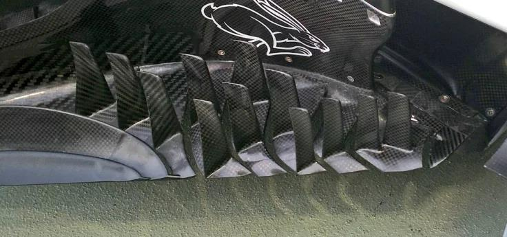

Fig. 13. Bargeboards serve to direct “condition” flow and generate

vortices

Vortices also serve to direct air such as with bargeboards 
which generate a curtain of air for sealing of a diffuser.

<!-- page break -->

Tire Squirt

What is tire squirt?

Tire squirt is the unwanted runoff of air from the contact area at the front of a 
wheel into aerodynamic devices, and it is most prevalent at the rear of the car, 
with unwanted air entering and disrupting the diffuser. The result of this air 
entering the diffuser is that it reduces the efficacy of the device, disturbing the 
air flowing through the diffuser and reducing the overall downforce produced.

How is tire squirt created?

Tire squirt is created by air hitting the front of a moving wheel. This stagnation 
region (force hitting against an immovable wall effectively) forces the air to 
shoot off either side of the tire and form vortices. It is defined in traditional 
aerodynamics as a jetting phenomenon, which is ‘the process of air being 
squeezed out of the frontal contact patch and is responsible for an area of low 
pressure’ [1] (figure 1)

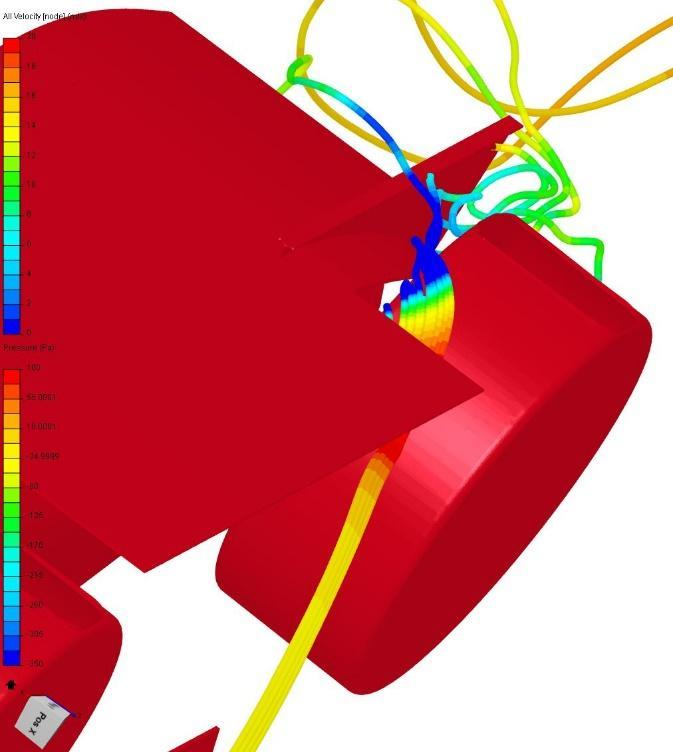

Figure 1: This image shows a particle trace hitting the rear wheel of a FSAE car and being pushed into the 
diffuser area as a vortex, in a phenomenon known as tire squirt.

As can be seen in figure 1, when the air hits the rear wheel it is forced to go 
around the wheel, being pushed into the diffuser area as a vortex. The 
streamlines in the image show the path of this vortex and the effect it can have

<!-- page break -->

on a diffuser, something that is made clearer in figure 2.

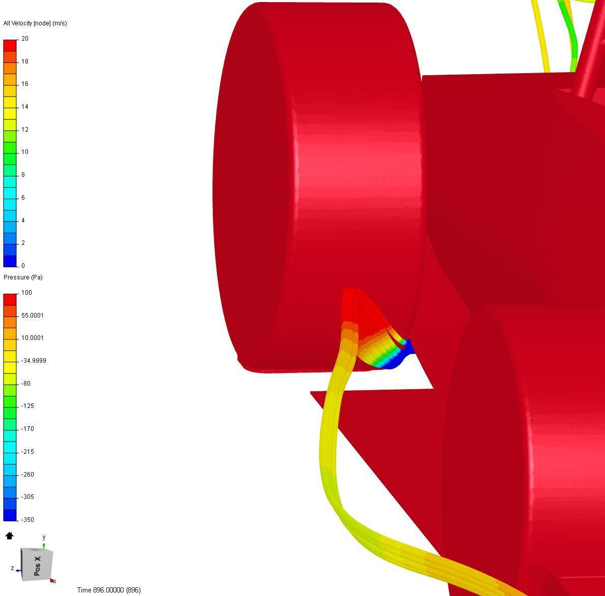

Figure 2: This image shows the affect of inwards bound tire squirt. This air moving under the car and into the 
diffuser region is something that we want to minimise so that the diffuser can work more effectively.

This image clearly shows the magnitude of the problem that tire squirt can 
cause. This air entering the diffuser will disrupt the flow under the car and cause 
a reduction in downforce.

So you have tire squirt? Can it be avoided?

In an open wheel car like a FSAE car, the short answer is no. Air will always be 
hitting the rear wheel so tire squirt will always be an issue in some form, but it 
can be minimized.

How do I minimise the effects of tire squirt?

The effects of tire squirt can be minimised very successfully by adding various 
small aerodynamic devices called vortex generators. The purpose of these 
devices, as the name suggests, is to create a vortex. F1 teams use slots built in 
to the floor of the car (figure 3) to purposefully create a vortex that runs 
counter to the vortex created by tire squirt. This counter vortex works to 
effectively ‘cancel out’ the vortex caused by the air hitting the tire. It also works

<!-- page break -->

to seal the diffuser so that the tire squirt vortex cannot be dragged under the car 
and into the diffuser area. These slots, as can be seen in figure 3, are also used 
to direct air around the back of the rear wheel in an attempt to minimise the 
amount of air hitting the wheel directly. This two-phase solution works to 
maximise the diffuser potential by keeping it as interference free as possible.

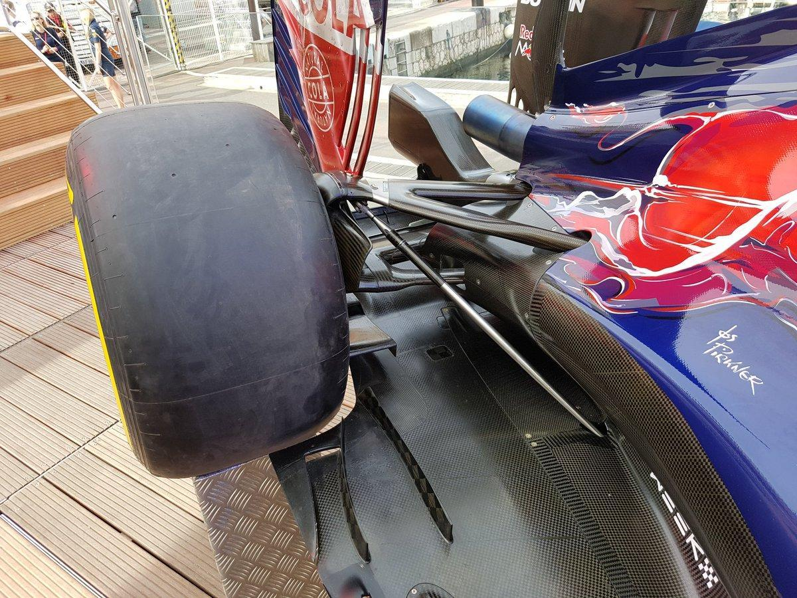

Figure 3: This image shows the Toro Rosso solution to tire squirt, with slots on the floor of the car trying to 
both deflect air around the back of the rear wheel to minimise the contact area, and also the straighter slot 
which serves to create a vortex to seal the diffuser and prevent the vortex created by the tire from entering 
the diffuser.

The effect of using slots in the floor to counteract tire squirt can also be applied 
in the diffuser region or on the sides of the diffuser. This is the strategy most 
commonly used by FSAE teams as it is the easiest way to separate the high 
pressure air from the sides of the car from the low pressure air under it. [2]

Teams in FSAE use vertical diffuser sides to create vortices in the region 
between the tire and diffuser. This helps to create a seal on the air passing 
through the diffuser and reduce the chance of separation. [3]

Our solution:

For our car, our current solution can be seen in figure 4. The idea of having an 
extended strake with an ‘inverted T-bar’ inside the diffuser is to create a sealing 
vortex as close to the ground as possible. The theoretical benefit of this is that 
the inner region of the diffuser is sealed completely from the vortices caused by 
tire squirt, which allows it to be undisturbed by the tire squirt, and remain 
effective.

<!-- page break -->

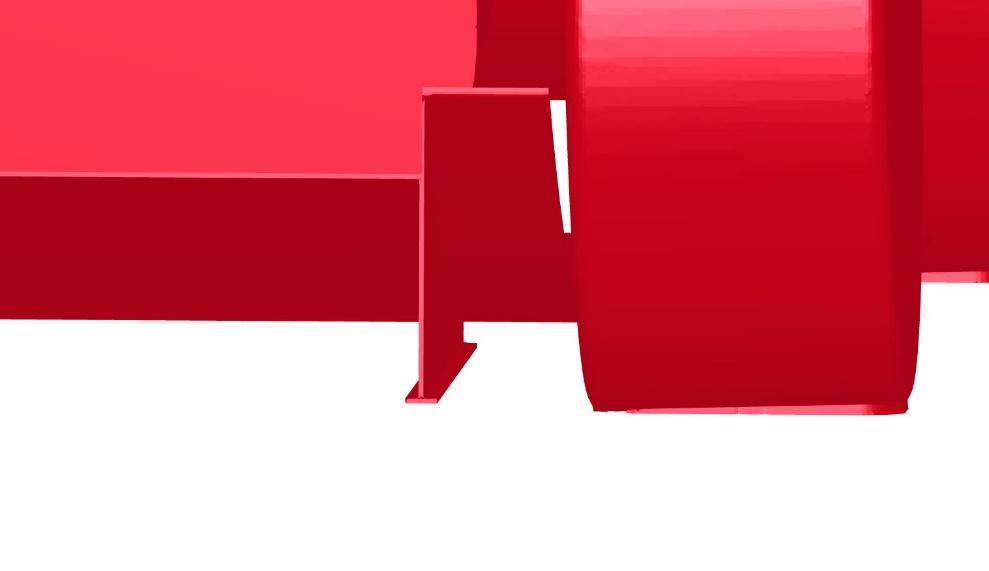

Figure 4: This image shows our current diffuser strategy. Note the ‘inverted T-bar’ added to the strake, which 
is intended to create the sealing vortex to protect the integrity of the flow of the inside of the diffuser.

References:

[1]-Sprot, A.J. and Sims-Williams, D.B. and Dominy, R.G. (2012) 'The 
aerodynamic characteristics of a fully deformable Formula One wind tunnel 
tyre.', SAE International journal of passenger cars. Mechanical systems., 5 (2). 
pp. 1026-1041.

[2]-Gupta, S. and Kishal Saxena. “Aerodynamics analysis of a formula sae car.” 
(2017).

[3]-Ehirim, O., "Optimal Diffuser Design for Formula SAE Race Car Using an 
Innovative Geometry Buildup and CFD Simulation Setup with On-Track Testing 
Correlation," SAE Technical Paper 2012-01-1169, 2012, 
https://doi.org/10.4271/2012-01-1169.
