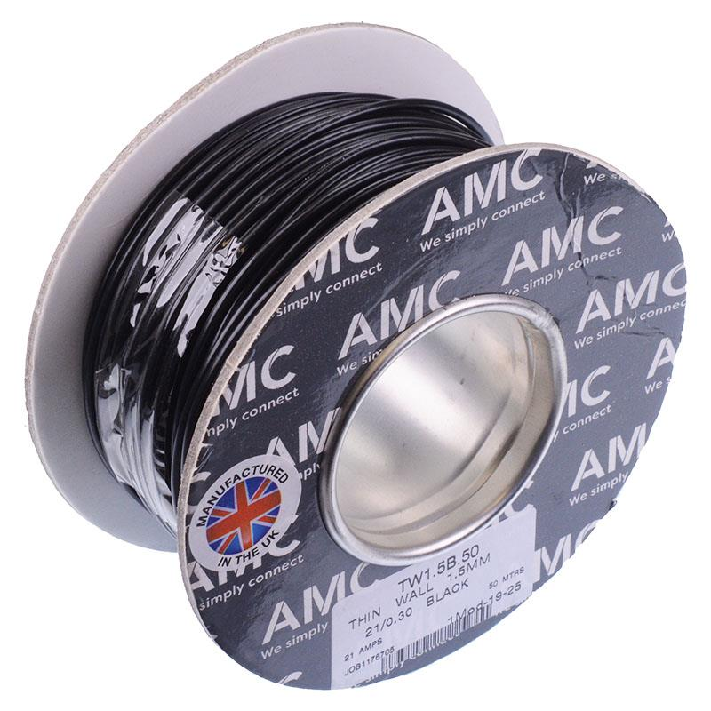

# 1.5 mm² Wire

{ width="300" }

[Black 1.5mm² Thin Wall Cable 21/0.3mm 50M](https://www.switchelectronics.co.uk/products/black-1-5mm-thin-wall-cable-21-0-3mm-50m)

## Why do we need it?

A wire is a copper conductor covered in plastic insulation. The 1.5 mm² refers to the cross-sectional area of the copper. The larger the area, the more current the wire can carry without overheating. Like all wires, it carries electrical power and signals between components.

The 1.5 mm² wire is the smallest of the three standard wire sizes used in FTX7 and is used for circuits that do not require 2.5 mm² or 25 mm² connections.

## FTX7

For FTX7, the 1.5 mm² wire was used for everything from low current sensor wires to individual component connections, including:

- low current sensor wiring
- individual fuel injector connections
- individual ignition coil connections
- fuel pump connections

The 2.5 mm² wire forms the main 12 V supply, which is fused and then distributed to these components.

The wire used is a black thin wall cable made from 21 strands of 0.3 mm plain copper (21/0.3 mm). Thin wall cable has a thinner layer of PVC insulation than standard cable, which saves weight. The seller lists it with a maximum current of 21 A and an operating temperature of -40 °C to 105 °C. This matches the 21 A rating recorded in the FTX7 design report.

The design report notes that thinner wire such as 0.5 mm² or 0.75 mm² would have been better for some sensor circuits. However, standardising around a smaller number of wire sizes reduced the number of different wire reels that had to be purchased.

