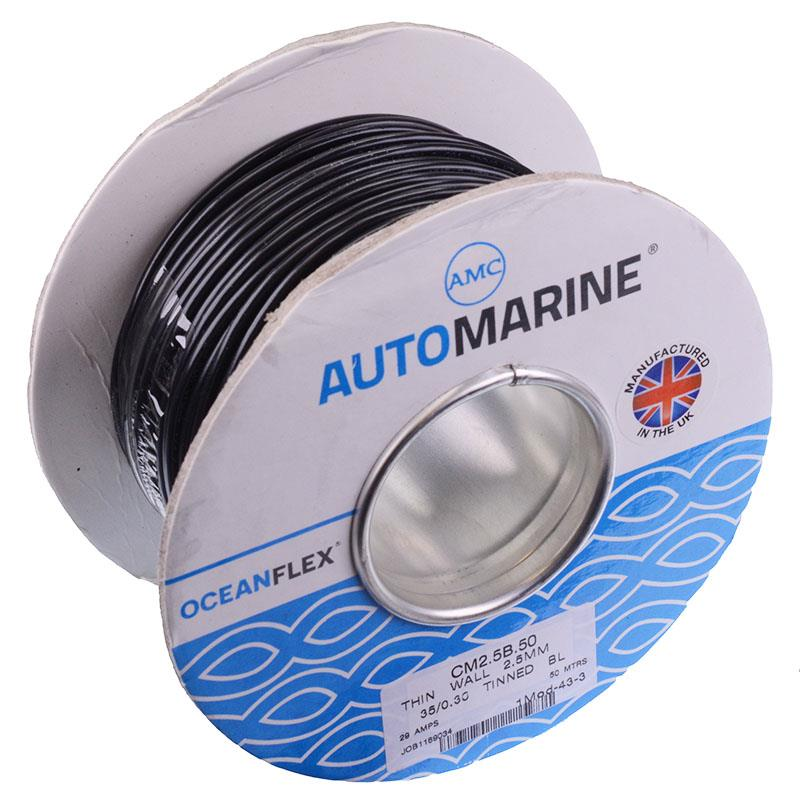

# 2.5 mm² Wire

{ width="300" }

[Black 2.5mm² Oceanflex Tinned Copper Cable 35/0.3mm 50M](https://www.switchelectronics.co.uk/products/black-2-5mm-oceanflex-tinned-copper-cable-35-0-3mm-50m) from Switch Electronics.

## Why do we need it?

The 2.5 mm² wire carries the main 12 V supply to the car's electronics. It is larger than the 1.5 mm² wire because it carries the combined current of several electrical systems before the supply is divided into individual branches.

Using a larger wire reduces resistance, voltage drop and the risk of the wire overheating.

## FTX7

For FTX7, the 2.5 mm² wire is used as the main 12 V supply to the electronics. The design report states that this feed is fused and then distributed to components including the:

- ECU
- sensors
- fuel injectors
- ignition coils
- fuel pump

The wire used is a black Oceanflex cable made from 35 strands of 0.3 mm tinned copper (35/0.3 mm). Tinned copper has a thin coating of tin on each strand, which gives better protection against corrosion. The seller lists it with a maximum current of 29 A and an operating temperature of -40 °C to 105 °C.

The FTX7 design report also records the 2.5 mm² wire as rated for 29 A. The main line is protected by a 25 A fuse, which leaves a 4 A gap between the fuse and the wire rating. The report describes this as a good safety margin. The original motorcycle was fused at 30 A, but removing loads such as the headlights means a lower current draw can be assumed.

#### Note: Fuse time-current curve

How quickly a fuse blows when the current goes above its rating depends on how far the current is over the rating. A small overload may take a few minuted to blow the fuse, whereas a short circuit could blow it instantly. This relationship is shown on a time-current curve, which is the graph in the fuse manufacturer's datasheet that plots current against the time the fuse takes to blow.

The curve can be used to check that the fuse will blow before the wire it protects overheats, at every level of overload and not just at the fuse's rated current. It can also be used to check that the fuse will not blow during normal short current spikes, such as when a motor or pump first switches on. For the 2.5 mm² wire, this would mean comparing the curve for the 25 A main fuse against the 29 A rating of the wire.
