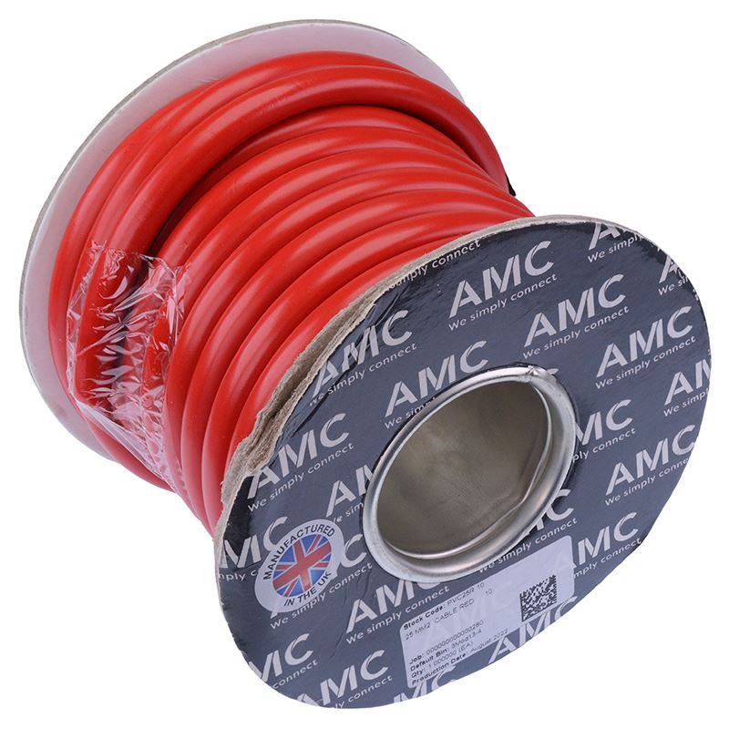

# 25 mm² Wire

{ width="300" }

[Red 25mm² Flexible Battery Cable 170A 10M](https://www.switchelectronics.co.uk/products/red-25mm-flexible-battery-cable-170a-10m) from Switch Electronics.

## Why do we need it?

The 25 mm² wire is a large battery cable used for the highest current parts of the electrical system. It is much larger than the 1.5 mm² and 2.5 mm² wires because the starter motor draws much more current than the ECU, sensors and other normal electrical loads.

The large conductor reduces resistance and voltage drop during engine starting. This ensures that enough voltage reaches the starter motor and also prevents the cable from overheating.

## FTX7

The FTX7 design report lists 25 mm² as one of the three wire sizes used on the car, but does not state exactly which circuits it was used for.

The highest currents on FTX7 are in the battery and starting circuit. The design report records approximately 60-70 A flowing through the Low Voltage Master Switch during engine starting, and the 100 A battery fuse was chosen based on the measured starter motor current. On the wiring schematic, the starting circuit runs from the battery, through the 100 A fuse and the LVMS, to the [starter solenoid](../engine/starter-solenoid.md), which then switches battery current to the starter motor.

The cable used is a red flexible battery cable made from 322 strands of 0.3 mm plain copper. The seller lists it as rated for 170 A, with an overall diameter of 10.1 mm and an operating temperature of -30 °C to 70 °C.
