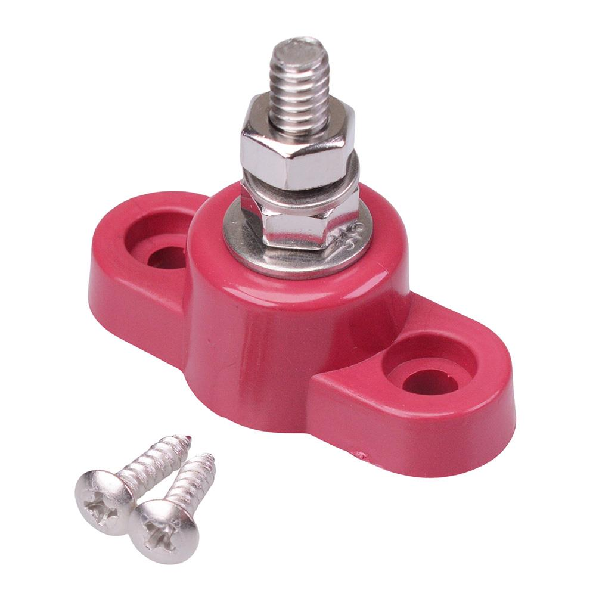

# Distribution Post

{ width="300" }

[Red Positive 6mm Power Distribution Post 150A](https://www.switchelectronics.co.uk/products/red-positive-6mm-power-distribution-post-150a) 

## Why do we need it?

A distribution post is an insulated stud used to join several electrical cables at a common point. It allows power or ground to be divided between multiple circuits without stacking all the terminals directly on the battery, LVMS or another electrical component.

A distribution post normally has one connection point, whereas a busbar usually provides several connection positions along a conductive metal bar.

## FTX7

For FTX7, the distribution post used was a red single pole post with an M6 stainless steel stud and a polycarbonate base. It is rated for 150 A and 48 V DC.
