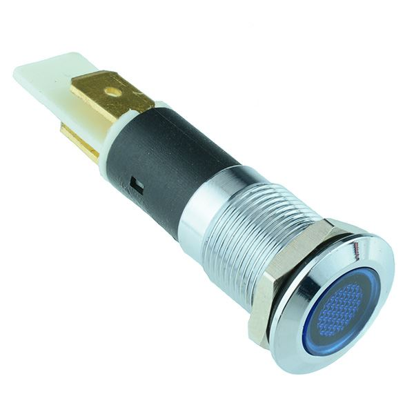

# Indicator LED 12mm

{ width="300" }

[Blue LED 12mm Flat Metal Panel Indicator 12V](https://www.switchelectronics.co.uk/products/blue-led-12mm-flat-metal-panel-indicator-12v)

## Why do we need it?

An indicator LED is a small light mounted in the dashboard that shows the driver/engineers the state of a system at a glance.

An LED on its own needs a resistor to limit its current. This indicator has the resistor built in, so it can be connected straight to the car's 12 V supply.

## FTX7

The design report states that the FTX7 dashboard has six safety LEDs, a neutral light and a power light. The six safety LEDs are driven by the [Safety Circuit Monitor](../safety/SCM.md) and show which part of the shutdown circuit has been triggered. The wiring schematic shows all of these LEDs supplied from 12 V.

The LED used is a blue 12 V indicator that fits a 12 mm hole in the panel. 
