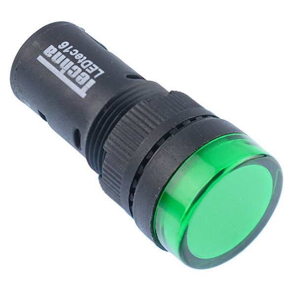

# Indicator LED 16mm

{ width="300" }

[Green 16mm LED Pilot Indicator Light 12V](https://www.switchelectronics.co.uk/products/green-16mm-led-pilot-indicator-light-12v)

## Why do we need it?

An indicator LED is a small light mounted in the dashboard that shows the driver/engineers the state of a system at a glance.

## FTX7

The LED used is a green 12 V indicator that fits a 16 mm hole in the panel. It is held in with a fixing nut, has screw terminals and is rated IP44.
