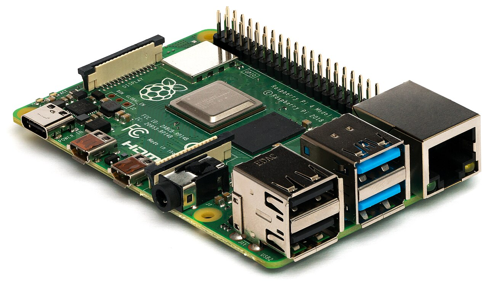
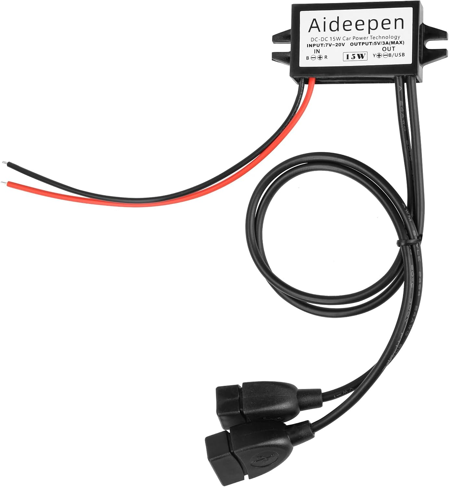

# Raspberry Pi

{ width="300" }

## Why do we need it?

A Raspberry Pi is a small, low-cost computer built on a single circuit board. It acts as the dashboard computer. It receives information from the ECU, processes the data and controls what is shown on the five-inch display.

Using a Raspberry Pi allows the dashboard software and screen layout to be changed without redesigning the ECU or the main vehicle wiring.

## FTX7

For FTX7, the Raspberry Pi forms the connection between the MS3 ECU and dashboard display.

The ECU sends vehicle and engine information to the Raspberry Pi. The Raspberry Pi processes this information and displays it to the driver.

The wiring schematic shows the ECU connected to the Raspberry Pi with a USB-B to USB-A cable, and the Raspberry Pi connected to the display with a ribbon cable.

The [Electronics Overview](../../index.md) lists the Raspberry Pi as a Raspberry Pi 4B running a custom installation of Raspberry Pi OS Lite with TSDash Pro as the dashboard software. It powers on automatically once the LVMS is switched on, takes around 20-30 s to start up and shuts down when power is removed.

### Power supply

{ width="300" }

[Aideepen DC 12V to 5V Converter](https://www.amazon.co.uk/dp/B0CLP7BK1Z) 

The Raspberry Pi needs 5 V, but the car runs on 12 V. A step-down converter is used to reduce the 12 V supply to 5 V, and the wiring schematic shows it powering the Raspberry Pi through a USB-A to USB-C cable.

