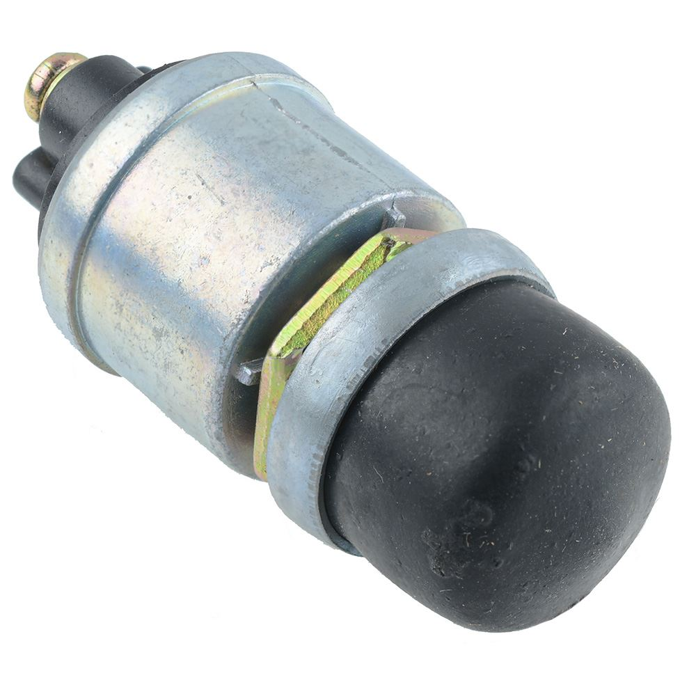

# Starter Switch

{ width="300" }

[Starter Push Button Switch](https://www.switchelectronics.co.uk/products/starter-push-button-switch) 

## Why do we need it?

The starter switch allows the driver to start the engine. It sends a low-current electrical signal to the starter solenoid, which then connects the battery to the starter motor.

Using a starter solenoid means that the high starter-motor current does not have to pass through the dashboard switch.

## FTX7

For FTX7, actuating the starter switch energises the [starter solenoid](../engine/starter-solenoid.md) coil. The solenoid's main contacts then close and supply battery current to the starter motor.

When the driver releases the switch, the solenoid coil is de-energised, its main contacts open and the starter motor is disconnected.

It is fed from the 12 V supply after the LVMS and connects to pin 86 of the starter solenoid, with pin 85 going to ground. The design report says that a 4 pin heavy duty starter solenoid was chosen as it is able to handle the current that the starter pulls.

The switch used is a momentary push button, meaning it only makes contact while it is held down. The seller lists it as rated for 10 A at 12 V DC, with screw terminals, a waterproof rubber button and a 16 mm mounting hole.
