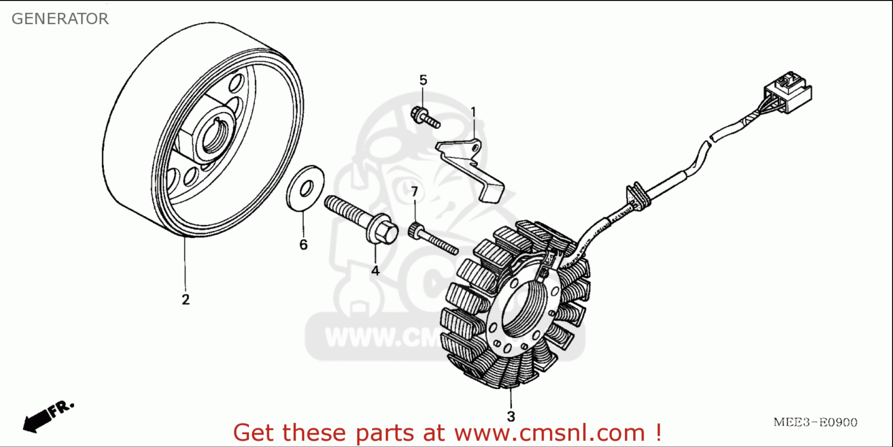

# Alternator

*Figure 1: 1.Clamp, ACG (Alternating Current Generator) Cord, 2. Flywheel Assembly, 3. Stator Assembly, 4. Bolt, Flange, 10mm, 5. Bolt, Flange, 6x16, 6. Washer, 10.5x27, 7. Bolt, Socket, 6x32*

>Part Number: MEE3-E0900

An alternator (or synchronous generator) is an electrical generator that converts mechanical energy (from the crankshaft) to electrical energy in the form of alternating current (AC).

The 2003 Honda CBR600RR uses a three-phase permanent-magnet alternator.

Its operation is:

 - **Rotor:** permanent magnets rotate with the engine's crankshaft
 - **Stator:** stationary copper windings generate AC as the rotor's magnetic field sweeps past them.
  - **Separate regulator/rectifier:** converts that AC into DC and regulates the voltage for charging the battery and powering the electrical system.

Because it uses permanent magnets, it doesn’t need an electrically powered rotor field winding or brushes. Regulation happens through the regulator/rectifier rather than by adjusting the rotor’s magnetic field.