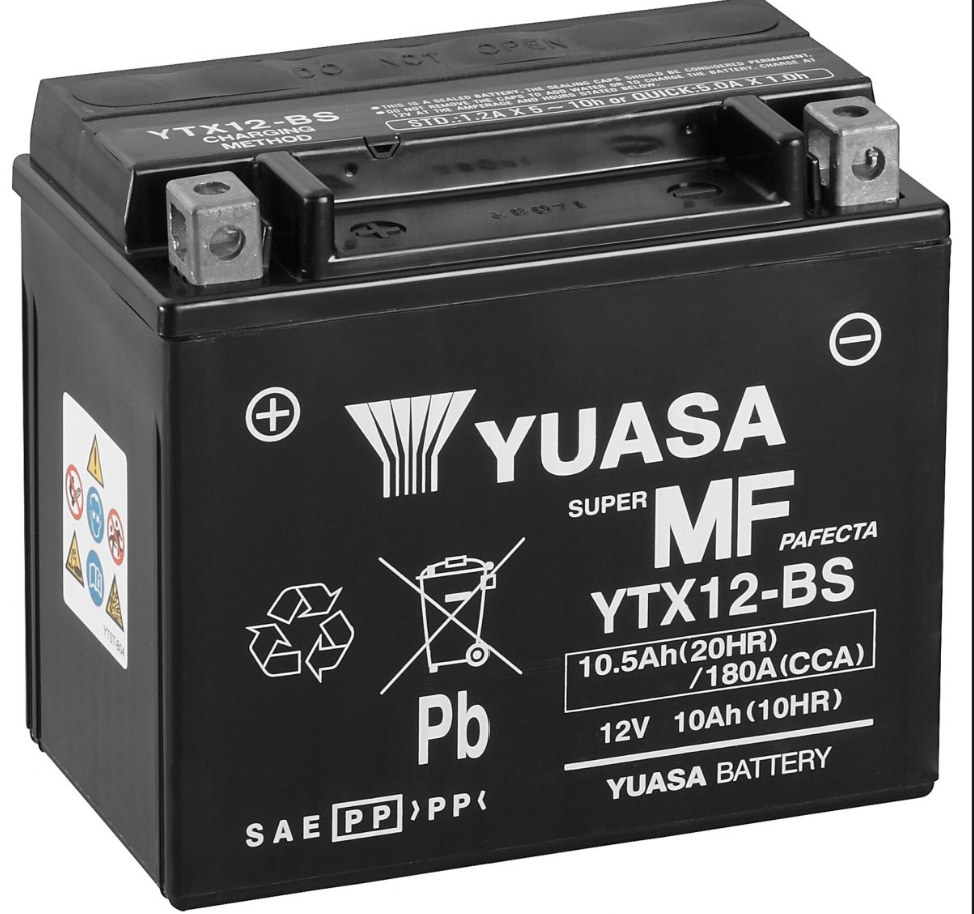

# Battery

*Figure 1: YTX12-BS (Yuasa) Battery*

>Model: YTX12-BS (Yuasa)  
>Nominal Voltage: 12V  
>Capacity: (10hr) 10Ah, (20hr) 10.5Ah  
>Dimensions: 150 x 87 x 130 mm  
>Cold Cranking Current (CCA): 180A  
>Battery Type: AGM, valve-regulated lead-acid (VRLA)  

The YTX12-BS is a rechargeable 12 V AGM lead-acid battery used to supply electrical power to the vehicle. It provides the high current required by the starter motor during engine starting and powers electrical systems when the engine is stopped.

AGM stands for Absorbent Glass Mat. The electrolyte is absorbed into fibreglass separators between the lead plates. This construction provides resistance to vibration and leakage, making it suitable for vehicle applications.

Once activated and sealed, the battery requires no water top-ups, although periodic charging may be needed when the vehicle is not in use.

The positive terminal connects to the starter circuit and the vehicle’s electrical supply. The negative terminal connects to the vehicle’s ground return. While the engine is running, the charging system replenishes the battery.
