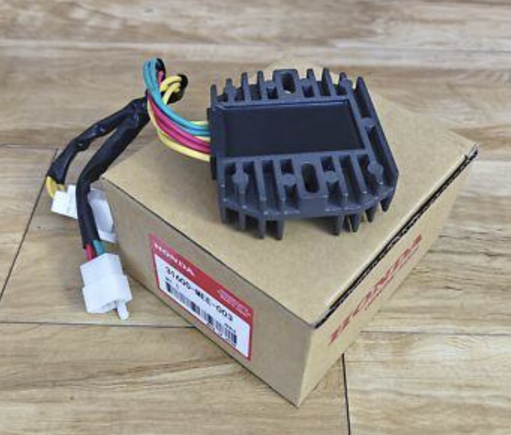

# Regulator

*Figure 1: The voltage regulator/rectifier*

>Part Number: 31600-MEE-003  
>Alternator input: Three-phase AC  
>Rectification: Three-phase, full-wave  
>Regulation: SCR shunt regulation

The voltage regulator converts the alternator’s AC output into DC to supply the vehicle’s electrical systems and charge the battery. It also controls the charging voltage to prevent overcharging.

The alternator produces three-phase AC, which the rectifier converts into DC by directing current through the circuit so that the output maintains a consistent polarity. The output still varies with time, known as pulsating DC. The battery helps smooth this output.

The regulator monitors the system voltage. When it exceeds the regulation threshold, silicon-controlled rectifiers (SCRs) shunt current through the alternator windings, limiting the energy delivered to the battery. Heat generated within the unit is dissipated through its finned metal casing, which acts as a heat sink.