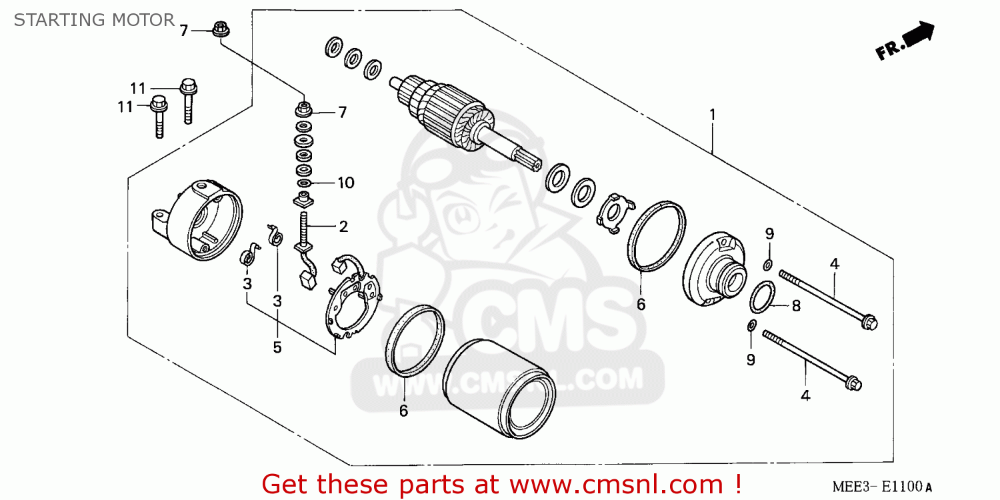

# Starter Motor

*Figure 1: 1. Starter Motor Assembly, 2. Brush Terminal SE, 
3. Spring, Carbon Bus, 4. Bolt Set, 5. Brush Holder Set, 6. Ring, 7. Nut-Washer 6mm, 8. O-Ring, 24.4X3.1, 9. O Ring, 10. O-Ring, 11. Bolt, Flange, 6X25*

>Part Number: 31200MEE003

A starter motor (also self-starter, cranking motor, or starter) is an apparatus installed in motor vehicles to rotate the crankshaft of an internal combustion engine so as to initiate the engine's combustion cycle. 

Internal combustion engines are feedback systems, which, once started, rely on the inertia from each cycle to initiate the next cycle. In a four-stroke engine, the third stroke releases energy from the fuel, powering the fourth (exhaust) stroke and also the first two (intake, compression) strokes of the next cycle, as well as powering the engine's external load. To start the first cycle at the beginning of any particular session, the first two strokes must be powered in some other way than from the engine itself. The starter motor is used for this purpose and it is not required once the engine starts running and its feedback loop becomes self-sustaining.

The electric starter motor or cranking motor is the most common type used on gasoline engines. The modern starter motor is either a permanent-magnet or a series-parallel wound direct current electric motor with a starter solenoid (similar to a relay) mounted on it. When DC power from the starting battery is applied to the solenoid, usually through a key-operated switch (the "ignition switch"), the solenoid engages a lever that pushes out the drive pinion on the starter driveshaft and meshes the pinion with the starter ring gear on the flywheel of the engine.

The starter motor uses a one-way starter clutch. This clutch is designed to transfer torque during the cranking of self-start motors while preventing reverse drive on the starter when the engine is running.