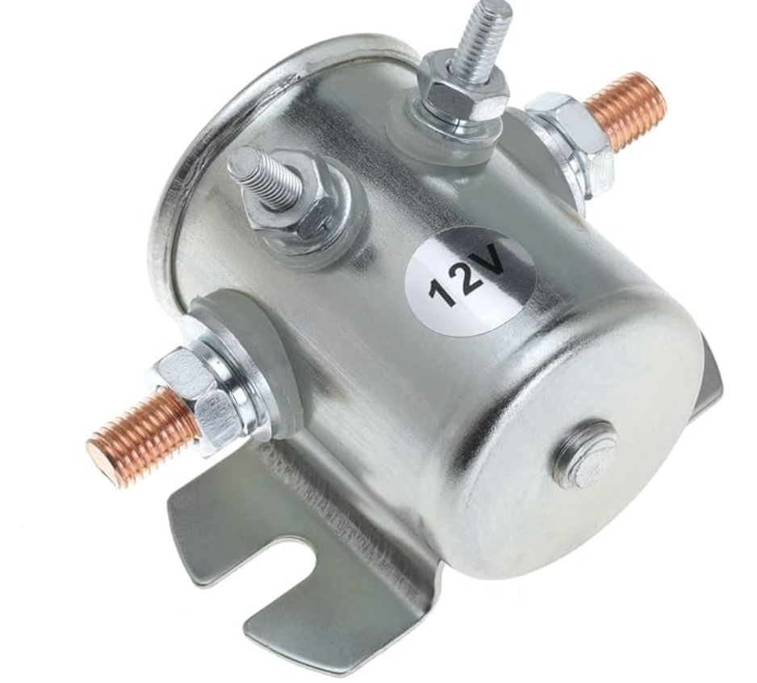

# Starter Solenoid

*Figure 1: The starter solenoid*

> Gebildet 12VDC Continuous Duty Solenoid Relay, 4 Terminal.  
> Voltage: 12 V  
>Resistance: 12 Ω  
>Capacity: 10.2W  
>Current: Max 200A, Recommended < 100A

A starter solenoid is an electromagnetic switch used to connect a vehicle’s battery to its starter motor. It allows a relatively small control current to switch the much larger current required to crank the engine.

When the ignition switch is turned to the start position, current flows through the solenoid’s coil, creating a magnetic field. This moves an internal plunger and closes a set of heavy-duty electrical contacts.

The closed contacts complete the circuit between the battery and the starter motor, allowing the motor to crank the engine. When the start signal is removed, the solenoid is de-energised and the contacts open, disconnecting the motor.

A standalone starter solenoid operates as a high-current relay. A solenoid mounted directly on a starter motor can also move the starter pinion into engagement with the engine’s ring gear.

Insufficient battery power can prevent the solenoid from operating correctly and may cause repeated clicking. Common causes include a discharged battery, loose or corroded connections, and damaged battery cables.