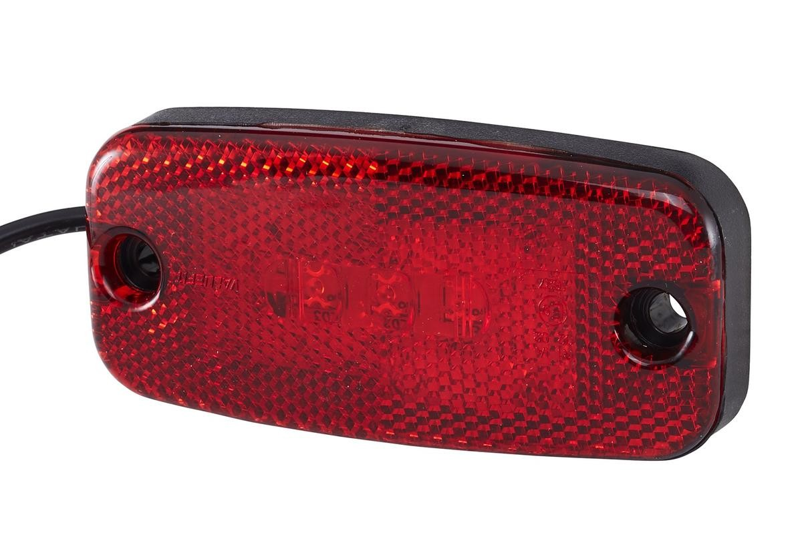

# Brake Light

{ width="300" }

[HELLA 2TM 357 008-021](https://www.auto-doc.ie/hella/7616169)

## Why do we need it?

The brake light is a red light at the back of the car that turns on whenever the driver presses the brake pedal.

The rules require one brake light that is lit if (and only if) the brakes are applied. It must be red and clearly visible from the rear.

## FTX7

For FTX7, the brake light is a HELLA LED light, link is above. The seller describes it as an LED tail light with a reflector for 12 V or 24 V systems, measuring 111 mm wide by 51 mm high.

On the wiring schematic, the brake light is switched by the [brake light switch](../sensors/Brake.md). 12 V is supplied to the switch, and when the brake pedal is pressed the switch connects this to the brake light. The other side of the brake light is connected to ground.
