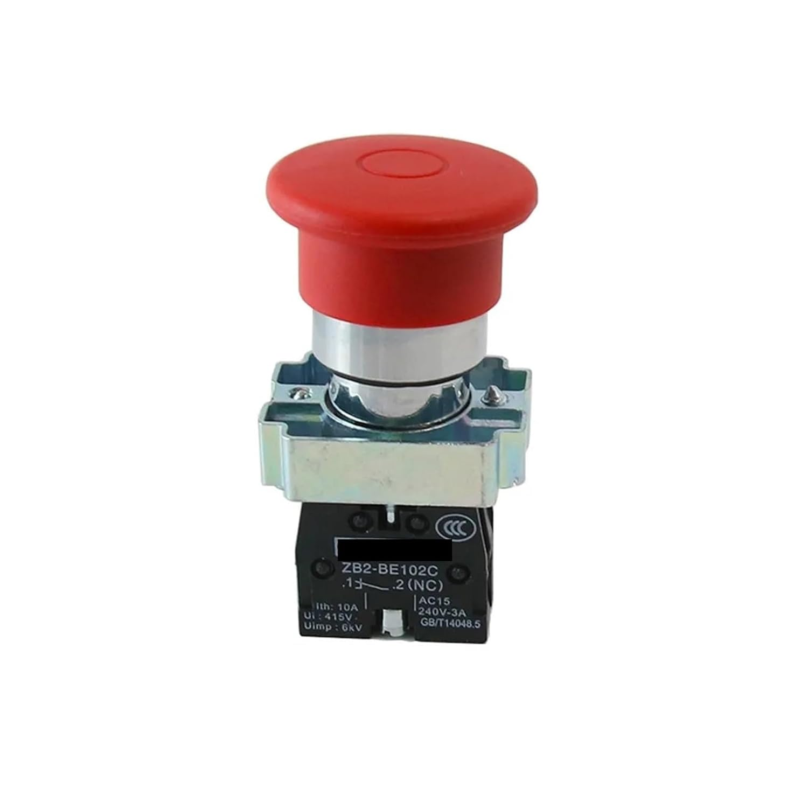

# Emergency Shutdown Switch

{ width="300" }

[XB2BT42C 40mm Mushroom Head Emergency Stop Push Pull NC Switch](https://www.amazon.ie/dp/B0F9WFYB7L)

## Why do we need it?

An emergency shutdown switch is a large push button that lets the driver or someone outside the car stop the engine immediately. The buttons are wired in series in the shutdown circuit, so pressing any one of them cuts power to the fuel pump, injectors and ignition.

The rules require three shutdown buttons: one on each side of the car behind the driver at around head height, and one in the cockpit within easy reach of the driver.

## FTX7

For FTX7, the XB2BT42C was chosen as it satisfies all the requirements of the rules while being an industry standard emergency shutdown switch. It is a 40 mm push-pull, normally closed (NC), single pole switch. Normally closed means the contacts are connected while the button is out. Pushing the button opens the contacts, and it stays pushed in until it is pulled back out.

The design report says that it satisfies the rules for the cockpit button, the external roll hoop buttons and the BOTS, and that an industry standard switch was chosen because the buttons must be reliable and consistent.

On the wiring schematic there are three shutdown buttons in the shutdown circuit, labelled cockpit, left and right. Each one has its own LED on the [Safety Circuit Monitor](./SCM.md).

