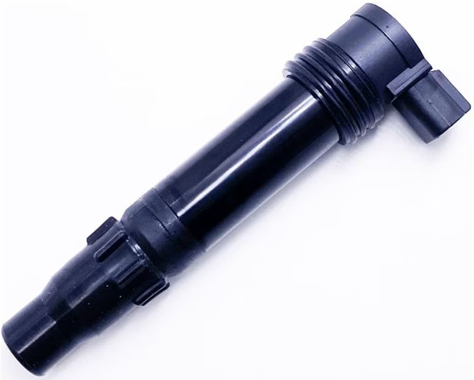
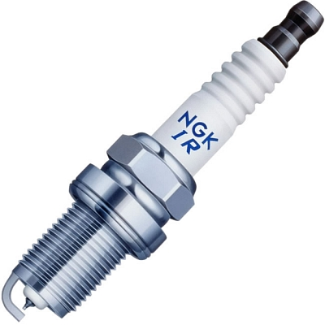

# Ignition

**Owner:**  Lemie Abiodun-Idowu
**Status:** Draft
**Last reviewed:**  22/09/2026
**Related rules:**  
**Related drawings / repositories:**  

## Basic Blurb

The ignition system is responsible for creating a spark inside each engine cylinder at the correct point in the combustion cycle.

The vehicle uses a low-voltage electrical system, but a (spark plug) requires a much higher voltage to create an electrical discharge across its electrode gap. The ignition system therefore uses (ignition coils) to store electrical energy and generate the high voltage required for a spark.

The ECU controls when each ignition event occurs using engine position information from the crankshaft and, where applicable, camshaft position sensors.


|  |   |
|:----:|:----:|
|{style = "width: 180px; height: 180px; object-fit: contain;"}|{style = "width: 180px; height: 180px; object-fit: contain;"}|
|**Ignition Coil**|**Spark Plug**|

## Architecture

The ignition system is controlled by the (MegaSquirt ECU). Bruce uses an external ignition driver and a dumb-coil arrangement. exact coil part numbers, driver part numbers and cylinder pairing should be verified against the vehicle wiring and ECU configuration.

A simplified architecture is shown below:j

```text
Crankshaft position sensor ──┐
                             │
Camshaft position sensor ────┤
                             v
                        +-----------+
                        | MegaSquirt|
                        |    ECU    |
                        +-----+-----+
                              |
                              | ignition control signal
                              v
                     +-----------------+
                     | External        |
                     | ignition driver |
                     +--------+--------+
                              |
                              | switched primary current
                              v
+12 V -----------------> Ignition coil
                              |
                              | high-voltage secondary
                              v
                          Spark plug
                              |
                              v
                           Cylinder
```


## Normal operating process/sequence idfk bro

1. The engine will begin to rotate when cranking.
2. The crankshaft position sensor will detect the moving teeth of the crank trigger wheel.
3. The ECU uses the pulses from the crankshaft sensor to determine engine speed and crankshaft position.
4. Using a camshaft position sensor, the ECU can also determine which phase of the (four-stroke cycle) the engine is currently in.
5. The ECU calculates the required ignition timing from its calibration.
6. The ECU commands the ignition driver to allow current to flow through the primary winding of the ignition coil.
7. Current flows through the coil for a period called the **dwell time**, storing energy in the coil's magnetic field.
8. The ignition driver switches the primary current off rapidly.
9. The collapsing magnetic field generates a high voltage in the secondary winding of the ignition coil.
10. The secondary voltage rises until it is sufficient to ionise the spark plug gap.
11. A spark crosses the plug gap and ignites the compressed air-fuel mixture.
12. The sequence repeats for every ignition event it is required.


## Electrical components/ in depth theory


### Sparkplugs


### Ignition Coil

The ignition coil converts energy from the vehicle's low-voltage supply into the high voltage required by the spark plug.

A simplified primary-side circuit is:

```text
+12 V
  |
  v
Ignition coil primary
  |
  v
Ignition driver
  |
  v
 GND
```

When the ignition driver is switched on, current builds through the primary winding and energy is stored in the coil's magnetic field.

When this driver switches off, the magnetic field collapses rapidly. This induces a much higher voltage in the secondary winding. The voltage rises until it is high enough to break down the gas across the spark plug gap and create a spark.

The spark voltage is not a fixed value. It depends on factors including:

- spark plug gap;
- cylinder pressure;
- air-fuel mixture;
- spark plug condition;
- ignition coil design.

Typical ignition systems can require voltages in the tens of kilovolts.

The ceramic body of the spark plug acts as an electrical insulator so that the high voltage is directed to the intended spark gap rather than finding an unintended path to the engine.

### Dwell time

**Dwell time** is the amount of time that current is allowed to build in the ignition coil primary before the spark event.

Too little dwell time may result in insufficient stored energy and a weak spark.

Too much dwell time may cause excessive coil current, heating and possible damage to the coil or ignition driver.

Current team notes indicate that Bruce uses a dwell time of approximately **5 ms**, but this value must be verified against the current MegaSquirt / TunerStudio calibration.

Dwell may also be compensated based on battery voltage. During engine cranking, the starter motor can cause the battery voltage to fall, so a different dwell value may be required to achieve the desired coil energy.

### Ignition driver

The MegaSquirt ECU should not directly carry the full primary current of a dumb ignition coil. Instead, the ECU provides a low-power control signal to an external ignition driver.

The ignition driver contains a high-current switching device, commonly an IGBT or suitable MOSFET depending on the design.

A MOSFET does not generate current; it acts as an electronically controlled switch that allows a low-power control signal to control a higher-current load.

Because an ignition coil is an inductive load, switching it produces large voltage transients. The ignition driver therefore requires suitable voltage clamping and protection circuitry. The exact protection method should be documented from the existing ignition-driver schematic and component datasheets.

### Wasted-spark arrangement

Current team notes indicate that Bruce uses two ignition coils for its four-cylinder engine, suggesting a **wasted-spark** ignition arrangement.

In a wasted-spark system, one coil fires two spark plugs simultaneously:

- one spark occurs in a cylinder on its compression stroke and ignites the mixture;
- the second spark occurs in the paired cylinder during its exhaust stroke and is therefore "wasted".

For a conventional inline-four engine, common cylinder pairings are:

- cylinders 1 and 4;
- cylinders 2 and 3.

The exact Bruce cylinder pairing must be verified against the engine and wiring.

### Crankshaft position sensing

The crankshaft position sensor is essential to ignition timing.

A toothed trigger wheel rotates with the crankshaft. As each tooth passes the sensor, an electrical signal is generated.

The ECU uses the frequency of these pulses to calculate engine RPM and uses their position to determine crankshaft angle.

For example, if a trigger wheel had 12 equally spaced teeth:

```text
360 degrees / 12 teeth = 30 degrees per tooth
```

The actual Bruce trigger-wheel arrangement, tooth count and reference feature must be verified.

Many trigger wheels include a missing tooth or another reference feature so that the ECU can identify an absolute crank position rather than only measuring rotational speed.

### Camshaft position sensing

A four-stroke engine requires two full crankshaft revolutions, or 720 degrees of crank rotation, to complete one full combustion cycle.

The camshaft rotates once for every two crankshaft rotations.

A crankshaft signal can determine piston position, but a camshaft position signal can additionally identify which part of the four-stroke cycle the engine is in.

This can allow the ECU to distinguish, for example, between a piston at top dead centre on the compression stroke and the same piston position on the exhaust stroke.

### Four-stroke cycle

The four strokes are:

1. **Intake** - the intake valve opens and the piston moves down, drawing the fresh charge into the cylinder.
2. **Compression** - the valves are closed and the piston moves upward, compressing the charge.
3. **Power** - the spark ignites the compressed mixture and combustion forces the piston downward.
4. **Exhaust** - the exhaust valve opens and the piston moves upward, pushing exhaust gases out of the cylinder.

The camshafts mechanically control the opening and closing of the intake and exhaust valves. The engine is mechanically timed so that camshaft and crankshaft position remain correctly related.

Supply, protection, sensing, outputs, loads, schematics and design calculations.
