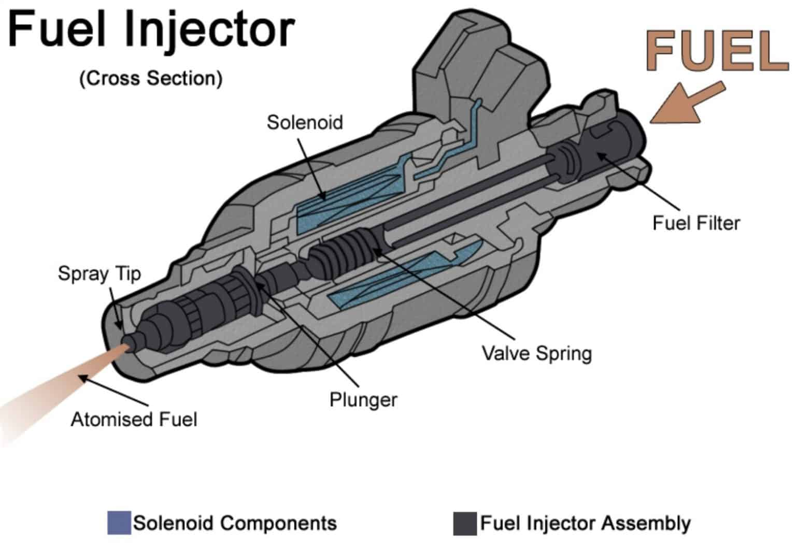
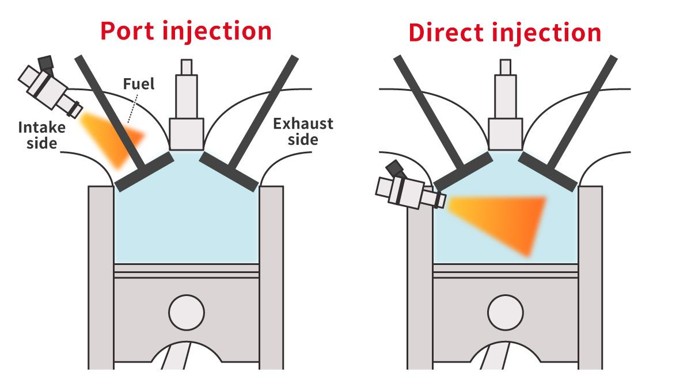

<h1>Fuel Injection</h1>

  

  <em>Figure 1: A cutaway model of a petrol direct-injected engine.</em>

<h2>General Information</h2>

  Fuel injection is the process of introducing fuel into an internal combustion
  engine using one or more fuel injectors.

  All compression-ignition engines, such as diesel engines, and many
  spark-ignition engines, such as petrol engines, use some form of fuel
  injection. Fuel injection largely replaced carburettors by the early 1990s.

  The primary difference between carburetion and fuel injection is how the fuel
  enters the airflow:

<ul>
  <li>
    <strong>Fuel injection</strong> atomises fuel by forcing it through a small
    nozzle under pressure.
  </li>
  <li>
    <strong>Carburetion</strong> uses suction created by air flowing through a
    Venturi tube to draw fuel into the airstream.
  </li>
</ul>

  Mixture-formation systems can be divided into two main categories:

<ul>
  <li>
    <strong>External mixture formation:</strong> Air and fuel are mixed outside
    the combustion chamber. This is generally known as manifold injection.
  </li>
  <li>
    <strong>Internal mixture formation:</strong> Fuel is injected directly into
    the combustion chamber.
  </li>
</ul>

  Manifold injection can be further divided into multi-point injection, also
  known as port injection, and single-point injection, also known as
  throttle-body injection.

  The term <strong>electronic fuel injection (EFI)</strong> refers to any
  fuel-injection system controlled electronically by an engine control unit
  (ECU).

<h2>Fuel-Injection Process</h2>

  A fuel-injection system must perform three main functions:

<ol>
  <li>Pressurise the fuel</li>
  <li>Meter the required quantity of fuel</li>
  <li>Inject the fuel into the engine</li>
</ol>

<h3>Pressurising the Fuel</h3>

  Fuel injection requires pressurised fuel. A fuel pump supplies the pressure
  needed to force the fuel through the injectors and atomise it into small
  droplets.

<h3>Metering the Fuel</h3>

  The system must determine the appropriate quantity of fuel to supply and
  control its delivery.

  Early mechanical injection systems used injection pumps that both pressurised
  and metered the fuel. Since the 1980s, electronic systems have increasingly
  been used to control fuel metering.

  In a modern system, the ECU calculates the required fuel quantity and controls
  functions such as:

<ul>
  <li>Injector timing</li>
  <li>Injection duration</li>
  <li>Ignition timing</li>
  <li>Air–fuel ratio</li>
  <li>Other engine-management functions</li>
</ul>

<h3>Injecting the Fuel</h3>

  A fuel injector is an electronically or mechanically controlled spray nozzle
  that represents the final stage of the fuel-delivery system.

  Depending on the injection system, the injector may be located:

<ul>
  <li>Inside the combustion chamber</li>
  <li>In the intake port or inlet manifold</li>
  <li>In the throttle body</li>
</ul>

<h4>How a Fuel Injector Works</h4>

  

  <em>Figure 2: Example of an electronic fuel injector.</em>

  A fuel injector is an electrically controlled valve. Pressurised fuel is
  supplied to the injector by the fuel pump and held behind a small nozzle.
  When the ECU sends an electrical signal to the injector, current flows
  through an electromagnetic coil called a solenoid.

  The magnetic field produced by the solenoid lifts an internal needle or
  pintle away from its seat. This opens the nozzle and allows pressurised fuel
  to spray into the intake port or combustion chamber.

  When the ECU removes the electrical signal, the magnetic field collapses and
  a spring pushes the needle back against its seat. This closes the nozzle and
  stops the fuel flow.

  The ECU controls the amount of fuel injected primarily by changing the length
  of time for which the injector remains open. This is known as the
  <strong>injector pulse width</strong>. A longer pulse width supplies more
  fuel, while a shorter pulse width supplies less fuel.

  The small openings in the injector nozzle break the fuel into fine droplets.
  This process is known as <strong>atomisation</strong>. Good atomisation allows
  the fuel to mix more effectively with the air, improving combustion.

<h2>Injection-System Types</h2>

<h3>Direct Injection</h3>

  In a direct-injection system, fuel is injected directly into the main
  combustion chamber of each cylinder.

  Only air enters the cylinder during the intake stroke. The air and fuel are
  mixed inside the combustion chamber after the fuel is injected.

  Injection is intermittent and may be controlled sequentially or individually
  for each cylinder.

<h3>Indirect Injection</h3>

  In an indirect-injection system, fuel is injected outside the main combustion
  chamber. The resulting air–fuel mixture is then drawn into the cylinder.

<h4>Manifold Injection</h4>

  Manifold-injection systems are commonly used in petrol-powered engines,
  including Otto-cycle and Wankel engines.

  In a manifold-injection system, air and fuel are mixed outside the combustion
  chamber before being drawn into the engine.

  The two main types of manifold injection are:

<ul>
  <li>Multi-point injection</li>
  <li>Single-point injection</li>
</ul>

<h4>Multi-Point Injection</h4>

  Multi-point injection, also known as <strong>port injection</strong>, uses a
  separate injection point for each cylinder.

  Fuel is injected into the intake port immediately upstream of each cylinder's
  intake valve. Most multi-point systems use one injector per cylinder.

  This provides more precise control over fuel distribution than a single-point
  system.

  

  <em>Figure 3: Diagram displaying the difference between Port Injection and Direct Injection.</em>

<h4>Single-Point Injection</h4>

  Single-point injection, also known as
  <strong>throttle-body injection</strong>, uses a single injector located in
  the throttle body.

  The throttle body is mounted on the intake manifold in a position similar to
  that of a carburettor. Fuel is mixed with the incoming air before the mixture
  enters the intake manifold.

<h2>FTX-7 "Bruce"</h2>

<h3>Fuel-Injection Configuration</h3>

  FTX-7 uses an engine from a 2003 Honda CBR600RR. The engine originally used
  Honda's dual-stage programmed fuel-injection system, which is commonly found
  in high-performance motorcycles.

  For FTX-7, the original system was modified to use port injection with one
  injector per cylinder.

<h3>Engine-Position Sensing</h3>

  To determine the correct injection timing, the ECU must know:

<ul>
  <li>The engine speed</li>
  <li>The crankshaft position</li>
  <li>The current stage of the four-stroke cycle</li>
</ul>

<h4>Crankshaft Sensor</h4>

  

  <em>Figure 4: Crankshaft.</em>

  The ECU uses a variable-reluctance (VR) sensor positioned near the crankshaft.
  This sensor detects the teeth of a rotating trigger wheel, allowing the ECU
  to calculate the crankshaft angle and engine speed.

<h4>Camshaft Sensor</h4>

  The crankshaft completes two revolutions during each four-stroke engine
  cycle. Crankshaft position alone therefore does not identify which stroke a
  cylinder is currently completing.

  A second VR sensor positioned near the camshaft provides a cylinder-phase
  reference. This allows the ECU to determine the current stroke of cylinder 1
  and operate the injectors at the correct point in the engine cycle.

  <em>
    Further information about the crankshaft and camshaft sensors is available
    on the relevant sensor pages of this wiki.
  </em>

