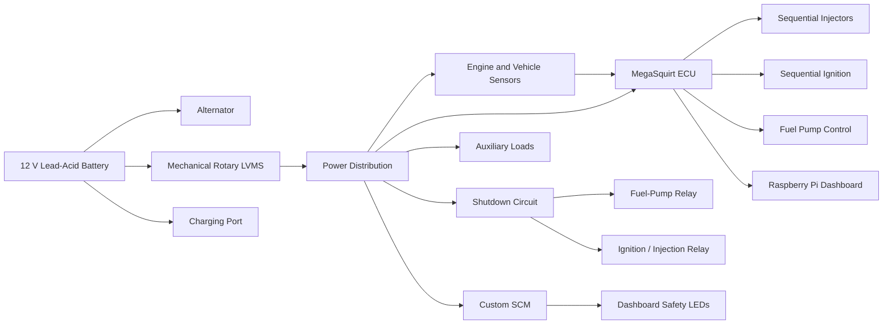

# Electronics Overview

> **Vehicle:** FTX7 \
> **Electronics Lead:** Michał Otrębski \
> **Engine:** Honda CBR600RR 2003-4 \
> **Electrical system:** 12 V Low-Voltage System \
> **Document status:** Draft \
> **Last reviewed:**  30/07/2026 

---

## Navigation

- [Rules and Compliance](./01-rules-compliance/index.md)
- [Electrical Architecture](./02-electrical-architecture/index.md)
- [Low-Voltage Power Distribution](./03-lv-power-distribution/index.md)
- [Shutdown and Safety](./04-shutdown-safety/index.md)
- [Engine Management](./05-engine-management/index.md)
- [Tuning](./06-tuning/index.md)
- [Sensors and Data Acquisition](./07-sensors-data-acquisition/index.md)
- [Communications and Telemetry](./08-communications-telemetry/index.md)
- [Wiring Harness](./09-wiring-harness/index.md)
- [PCBs and Embedded Software](./10-pcbs-embedded-software/index.md)
- [Auxiliary Electrical Systems](./11-auxiliaries/index.md)
- [Testing and Validation](./12-testing-validation/index.md)
- [Scrutineering and Evidence](./13-scrutineering-evidence/index.md)
- [Operations and Maintenance](./14-operations-maintenance/index.md)
- [BOM and Change Control](./15-bom-change-control/index.md)
  
---

## At a glance

| Item | Current design |
|---|---|
| Battery | YTX12-BS 12 V Lead-Acid |
| LV master switch | Mechanical rotary LVMS |
| Shutdown buttons | 4 × 40 mm, Schneider Electric XB2BT42C |
| Engine control | MegaSquirt ECU |
| Injection strategy | Fully sequential fuel and ignition |
| BSPD | Custom team-designed unit |
| SCM | Custom team-designed safety circuit monitor |
| Dashboard | SCM status LEDs + Raspberry Pi display |
| Vehicle network | No CAN bus |
| Engine | Honda CBR600RR 2003-4 |

This page explains the complete electrical system at a high level. Detailed design, calculations, wiring, tests and evidence are stored in the linked subsystem pages.

---

## 1. What the electrical system does

The electrical system has four main jobs:

1. **Power the car**  
   The 12 V battery supplies the ECU, fuel system, dashboard, sensors and auxiliary devices.

2. **Run the engine**  
   The MegaSquirt ECU controls fuel injection, ignition, fuel pump, and radiator fan on the car.

3. **Stop the engine safely**  
   The shutdown circuit removes power from the fuel pump, ignition and injectors when any safety device is triggered.

4. **Inform the driver and team**  
   SCM LEDs show safety-system status, while the Raspberry Pi dashboard displays vehicle information.

---

## 2. System map



The exact wiring order, fuse ratings, connector numbers and wire identifiers are in the detailed wiring section.

---

## 3. Electrical architecture

### Power path

```text
12 V battery
   ↓
Mechanical rotary LVMS
   ↓
Main protection and distribution
   ├── MegaSquirt ECU
   ├── Fuel-pump circuit
   ├── Ignition and injection circuit
   ├── BSPD
   ├── SCM
   ├── Raspberry Pi dashboard
   └── Auxiliary electrical loads
```

### Main power sections

| Section | Purpose | Detail page |
|---|---|---|
| Battery and charging | Stores and restores electrical energy | [LV Battery](../03-lv-power-distribution/lv-battery/index.md) |
| LVMS | Manually isolates the low-voltage system | [LVMS](../04-shutdown-safety/lv-master-switch-lvms/index.md) |
| Protection | Fuses and relays protect wires and loads | [Fuse and Relay Box](../03-lv-power-distribution/fuse-relay-box/index.md) |
| Grounding | Provides safe and stable current return paths | [Grounding and Bonding](../03-lv-power-distribution/grounding-and-bonding/index.md) |
| Wiring | Connects all components and carries power/signals | [Wiring Harness](../09-wiring-harness/index.md) |

---

## 4. Shutdown and safety system

The shutdown circuit is a hardwired safety chain. When any required device opens the chain, the engine must stop.

### Shutdown devices

| Device | Purpose | Current implementation |
|---|---|---|
| LVMS | Isolates the 12 V system | Mechanical rotary switch |
| Shutdown buttons | Allow driver or marshal shutdown | 3 × 40 mm, brand/model TBD |
| BSPD | Detects simultaneous hard braking and excessive throttle | Custom team-designed circuit |
| BOTS | Detects excessive brake-pedal travel | 40mm,  |
| Inertia switch | Opens the circuit during a severe impact | Sensata Crash Sensor |
| SCM | Monitors shutdown-circuit condition and reports status | Custom team-designed unit |

### Safe result

When the shutdown circuit opens:

- The fuel pump loses power;
- Ignition power is removed;
- Injector power is removed;
- The engine can no longer continue producing torque.

### Shutdown path

```text
12 V supply
   ↓
LVMS
   ↓
BSPD
   ↓
Inertia Crash Sensor
   ↓
BOTS
   ↓
Cockpit Shutdown Button
   ↓
Left Shutdown Button
   ↓
Right Shutdown Button
   ↓
Fuel-pump and ignition/injection relay coils
```

Detailed pages:

- [Shutdown Circuit](../04-shutdown-safety/shutdown-circuit-sdc/index.md)
- [BSPD](../04-shutdown-safety/bspd/index.md)
- [SCM](../04-shutdown-safety/safety-circuit-monitor-scm/index.md)
- [BOTS](../04-shutdown-safety/brake-over-travel-switch-bots/index.md)
- [Inertia Switch](../04-shutdown-safety/inertia-switch/index.md)
- [Shutdown Buttons](../04-shutdown-safety/shutdown-buttons/index.md)

---

## 5. Custom BSPD

The BSPD is a standalone safety device.

Its role is to open the shutdown circuit when:

- Brake pressure is outside realistic range;
- Throttle position is outside realistic range;
- The throttle and brake are both actuated simultaneously up to some threshold;
- Both conditions remain present for longer than the allowed delay of 500ms.

It can only self reset after 10s of the condition being remmoved

### BSPD overview

| Item | Current status |
|---|---|
| Design | Custom |
| Logic type | Non-programmable safety circuit |
| Brake input | Brake Pressure Sensor |
| Throttle input | Throttle Position Sensor |
| Trip thresholds | 25% throttle & Hard braking with no locked wheels <30 Bar |
| Trip delay | 500ms* |
| Reset behaviour | 10s* after conditions have been removed |

[Open BSPD documentation](../04-shutdown-safety/bspd/index.md)

---

## 6. Custom Safety Circuit Monitor

The SCM monitors the shutdown system and reports its state to the driver.

### Intended functions

- Monitor selected points in the shutdown circuit;
- Identify which section has opened;
- Drive dashboard safety LEDs;
- assist testing and fault finding.

### Safety boundary

The SCM must not be able to hold the shutdown circuit closed when a safety device has opened.

The main safety concern is the connecting point on the PCB, wires are so close together a short is possible and could potentially bypass the shutdown circuit, moving the power supply on the PCB further away from the SDC monitoring points could prevent this by having atleast one system - the BSPD - still have the possability of shutdown even with a short downstream.

A foolproof solution is to use a proper PCB connector like a molex to connect to the PCB rather than a screw terminal.

| Question | Required answer |
|---|---|
| Can the SCM bypass a shutdown button? | No |
| Can the SCM bypass the BSPD? | No |
| Can the car remain safe with the SCM unplugged? | Yes |
| Can SCM failure prevent engine shutdown? | No |
| Can the SCM open the shutdown circuit? | No |
| Does the SCM contain programmable logic? | No |

[Open SCM documentation](../04-shutdown-safety/safety-circuit-monitor-scm/index.md)

---

## 7. Engine management

The Honda CBR600RR engine is controlled by a MegaSquirt ECU using a fully sequential setup.

### ECU functions

- Sequential fuel injection;
- Sequential ignition;
- Fuel-pump command;
- Engine-speed measurement;
- Throttle-position measurement;
- Pressure and temperature sensing;
- Engine protection and calibration;
- Data output to the dashboard.
- Radiator Fan Control

### Engine-control summary

| Item | Current implementation |
|---|---|
| Engine | Honda CBR600RR |
| ECU | MegaSquirt |
| Injection | Fully sequential |
| Ignition | Fully sequential |
| Throttle control | Mechanical |
| Crank sensing | VR sensor - 12 teeth no gaps |
| Cam sensing | VR sensor - 3 tooth wheel |
| Fuel-pump control | ECU command through shutdown-controlled relay |
| Radiator Fan control | ECU command through relay
| ECU calibration | Internal Sensor Calibration |
| ECU firmware version | MS3 1.5.2 |

Detailed pages:

- [ECU](../05-engine-management/ecu/index.md)
- [Ignition](../05-engine-management/ignition/index.md)
- [Fuel Injection](../05-engine-management/fuel-injection/index.md)
- [Fuel-Pump Control](../05-engine-management/fuel-pump-control/index.md)
- [Engine Sensors](../05-engine-management/engine-sensors/index.md)
- [Calibration](../05-engine-management/calibration/index.md)

---

## 8. Dashboard and driver information

The dashboard is split into two parts.

### SCM status LEDs

Dedicated LEDs provide clear safety-system information.

| LED | Colour | Trigger source |
|---|---|---|
| BSPD fault | Blue | BSPD |
| Inertia fault | Blue | Inertia |
| BOTS fault | Blue | BOTS Shutdown Button |
| Top of triangle | Red | Cockpit Shutdown Button|
| Left triangle | Red | Left Shutdown Button |
| Right triangle | Red | Right Shutdown Button |

### Raspberry Pi dashboard

The Raspberry Pi provides the main driver display.

There are many possible display values to be shown but the main ones are:

- Engine Speed;
- Vehicle Speed
- Coolant Temperature;
- Throttle Position;
- Warning Messages;
- Lambda Target, Actual, Error

| Item | Current status |
|---|---|
| Raspberry Pi model | Raspberri Pi 4b |
| Display model | Raspberry pi Touch 2 5" |
| Operating system | Custom installation of Raspberry Pi OS Lite |
| Dashboard software | TSDash Pro |
| Data input method | Wired USB-B to USB-A |
| Startup time | 20-30s |
| Shutdown method | Loss of power |
| Power conditioning | Automatically powers on after LVMS |

Detailed pages:

- [Dashboard](../06-driver-controls-hmi/dashboard/index.md)
- [Indicators and Warnings](../06-driver-controls-hmi/indicators-and-warnings/index.md)
- [Driver Controls](../06-driver-controls-hmi/driver-controls/index.md)

---


## 9. Sensors and inputs

| Sensor / input | Used by | Purpose | Status |
|---|---|---|---|
| Crank position | MegaSquirt | Engine speed and timing | TBD |
| Cam position | MegaSquirt | Fully sequential operation | TBD |
| Throttle position | MegaSquirt / BSPD | Engine control and safety | TBD |
| Brake pressure | BSPD | Brake-throttle plausibility | TBD |
| Coolant temperature | MegaSquirt | Engine monitoring | TBD |
| Intake-air temperature | MegaSquirt | Fuel calculation | TBD |
| Manifold pressure | MegaSquirt | Load measurement | TBD |
| Battery voltage | MegaSquirt | Electrical monitoring | TBD |
| BOTS | Shutdown circuit / SCM | Brake-system safety | TBD |
| Inertia Switch | Shutdown circuit / SCM | Impact shutdown | TBD |
| Neutral Switch | Dashboard | Indicate Neutral | TBD |
| Brake Light Switch | Brake Light | Indicate Braking | TBD |
[Open sensor documentation](../07-sensors-data-acquisition/index.md)

---

## 10. Wiring and harnesses

This section is intentionally left open until the vehicle wiring architecture is frozen.

### Harness sections

| Harness | Purpose | Status |
|---|---|---|
| Main Chassis Harness | Main connections around the entire car | Completed |
| Ignition Harness | Connects COPs to the Main Harness | Completed |
| Injector Harness | Connects Injectors to the Main Harness | Completed |
| Dashboard Harness | Connects Dashboard to the Main Harness | Completed |
| Brake Pressure Sensor Harness | Connected the BPS to the BSPD & Main Harness | Completed |
| BOTS Harness | Connects BOTS to the Main Harness | Completed |

### Wiring information to add

- connector families;
- connector references;
- pin numbers;
- wire colours;
- wire sizes;
- fuse ratings;
- relay ratings;
- splice locations;
- ground points;
- shielding;
- routing;
- service loops;
- labels;
- test points.

Detailed pages:

- [Harness Architecture](../09-wiring-harness/harness-architecture/index.md)
- [Connector Catalogue](../09-wiring-harness/connector-catalogue/index.md)
- [Pinouts](../09-wiring-harness/pinouts/index.md)
- [Wire Sizing and Protection](../09-wiring-harness/wire-sizing-and-protection/index.md)
- [Routing and Separation](../09-wiring-harness/routing-and-separation/index.md)
- [Grounding and EMC](../09-wiring-harness/shielding-and-emc/index.md)

---

## 11. Main operating states

| State | Battery / LVMS | Engine system | Safety system | Dashboard |
|---|---|---|---|---|
| Vehicle off | LVMS off | ECU off | SDC unpowered | Off |
| LV on | LVMS on | ECU powered | SDC checked | LEDs and Pi starting |
| Ready to start | LVMS on | ECU ready | SDC healthy | Ready indication |
| Engine running | LVMS on | Fuel and ignition active | SDC continuously monitored | Live data |
| Safety trip | LVMS may remain on | Fuel, ignition and injection removed | SDC open | Stays Powered |
| Manual shutdown | LVMS off or shutdown button pressed | Engine stopped | SDC open | Powers down if LVMS otherwise stays on |

---

## 12. Testing and evidence

Every subsystem must have a repeatable test.

### Minimum system tests

| Test | Expected result | Evidence location |
|---|---|---|
| LVMS off | Complete low-voltage shutdown |  |
| Each shutdown button pressed | Engine stops / cannot start |  |
| BSPD trip | SDC opens |  |
| BOTS trip | SDC opens and remains open until reset |  |
| Inertia-switch trip | SDC opens |  |
| SCM unplugged | Required shutdown functions still work |  |
| ECU power loss | Fuel and ignition stop |  |
| Fuel-pump relay de-energized | Fuel pump stops |  |
| Ignition/injection relay de-energized | Engine torque stops |  |
| Low battery voltage | System fails safely |  |

Detailed test planning in [Testing and Validation](../12-testing-validation/index.md).

---