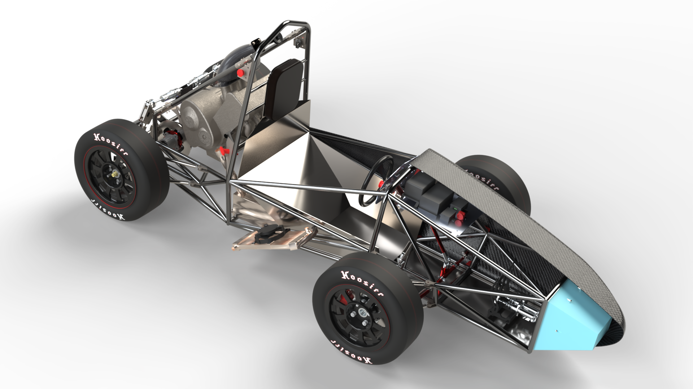

# FTX7

FTX7 was Formula Trinity’s Concept Class entry for Formula Student UK 2025.

The car is being developed into Formula Trinity’s FS Class entry for Formula Student UK 2026.

## Departments

- [Powertrain](powertrain/index.md)
- [Drivetrain](drivetrain/index.md)
- [Chassis](chassis/index.md)
- [Suspension](suspension/index.md)
- [Aerodynamics](aero/index.md)
- [Electronics](electronics/index.md)

