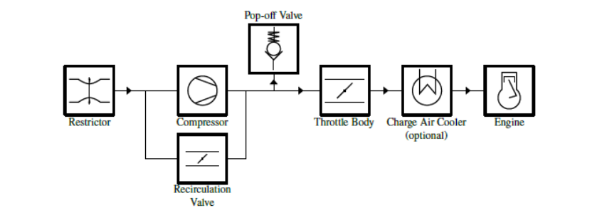

# Internal Combustion Engine Powertrains

### CV1.1 Engine Limitation

##### CV1.1.1

> The engine(s) used to power the vehicle must be piston engine(s) using a four-stroke
> primary heat cycle with a displacement not exceeding 710 cm3 per cycle. LV hybrid
> powertrains must use electrical energy storage. HV hybrid powertrains are permitted as an
> AFV.

### CV1.2 Starter

##### CV1.2.1

> Each vehicle must be equipped with an on-board starter, which must be used to start the
> vehicle.

##### CV1.2.2

> **[DV ONLY]** For autonomous operation the vehicle must be equipped with an additional
> engine start button next to the LVMS, see [T11.3](../section-t/11-electrical-components.md/#t113-low-voltage-master-switch), which can be easily actuated from outside
> the vehicle. Using the external engine start button, the engine may only start if
> 
> - The ASMS (see [T14.6](../section-t/14-autonomous-system.md/#t146-autonomous-system-master-switch)) is switched on and,
> - The gearbox is in neutral.

##### CV1.2.3

> **[DV ONLY]** There must be a green light next to the engine start button, which indicates that
> the gearbox is in neutral. It must be marked with the letter “N”. This letter must have a
> minimum height of 25mm.

##### CV1.2.4

> **[DV ONLY]** The AS must not be able to (re-)start the engine.

### CV1.3 Air Intake System

##### CV1.3.1

> All parts of the engine air and fuel control systems (including the throttle and the complete
> air intake system, including the air filter and any air boxes), must lie within the surface
> envelope, see [T1.1.18](../section-t/1-definitions.md/#t1118).

##### CV1.3.2

> Any portion of the air intake system that is less than 350mm above the ground must be
> protected from impacts, see [T3.15.2](../section-t/3-general-chassis-design.md/#t3152).

##### CV1.3.3

> The intake manifold must be securely attached to the engine block or cylinder head with
> brackets and mechanical fasteners. The threaded fasteners used to secure the intake
> manifold are considered critical fasteners and must comply with [T10](../section-t/10-fasteners.md). Rubber bushings or
> hoses are not considered as securely attached.

##### CV1.3.4

> Intake systems with significant mass or cantilever from the cylinder head must be
> supported to prevent stress to the intake system. Supports to the engine must be rigid.
> Supports to the chassis must incorporate isolation to allow for engine movement and
> chassis torsion.

##### CV1.3.5

> An air filter that will protect the powertrain from the ingress of dirt and debris must be
> installed at the entry of the Intake System.

### CV1.4 Throttle

##### CV1.4.1

> The vehicle must be equipped with a throttle body. The throttle body may be of any size or
> design.

##### CV1.4.2

> The throttle must be actuated mechanically by a foot pedal, i.e. via a cable or a rod system,
> see [CV1.5](#cv15-mechanical-throttle-actuation), or by an ETC system, see [CV1.6](#cv16-electronic-throttle-control).

##### CV1.4.3

> Throttle position is defined as percentage of travel from fully closed to fully open where 0%
> is fully closed and 100% is fully open. The idle position is the average position of the
> throttle body while the engine is idling.

##### CV1.4.4

> The throttle system mechanism must be protected from debris ingress to prevent jamming.

### CV1.5 Mechanical Throttle Actuation

##### CV1.5.1

> [CV1.5](#cv15-mechanical-throttle-actuation) can only be used if no ETC system is used.

##### CV1.5.2

> The throttle actuation system must use at least two return springs located at the throttle
> body, so that the failure of any one of the two springs will not prevent the throttle
> returning to the idle position.

##### CV1.5.3

> Each return spring must be capable of returning the throttle to the idle position with the
> other disconnected.

##### CV1.5.4

> Springs in the Throttle Position Sensor (TPS) are not acceptable as return springs.

##### CV1.5.5

> Throttle cables must be located at least 50mm from any exhaust system component and
> out of the exhaust stream.

##### CV1.5.6

> Throttle cables or rods must have smooth operation and must not have the possibility of
> binding or sticking. They must be protected from being bent or kinked by the driver’s foot
> during operation or when entering the vehicle.

##### CV1.5.7

> A positive pedal stop must be incorporated on the accelerator pedal to prevent over-
> stressing the throttle cable or actuation system.

### CV1.6 Electronic Throttle Control

##### CV1.6.1

> [CV1.6](#cv16-electronic-throttle-control) only applies if ETC is used.

##### CV1.6.2

> The team must be able to demonstrate the functionality of all safety features and error
> detections of the ETC system at technical inspection.

##### CV1.6.3

> The ETC system must be equipped with at least the following sensors:
> 
> - Accelerator Pedal Position Sensors (APPSs) as defined in [T11.8](../section-t/11-electrical-components.md/#t118-accelerator-pedal-position-sensor-apps).
> - Two Throttle Position Sensors (TPSs) to measure the throttle position.
> - One Brake System Encoder (BSE) to measure brake system pressure to check for
> plausibility.

##### CV1.6.4

> All ETC signals are System Critical Signals (SCSs), see [T11.9](../section-t/11-electrical-components.md/#t119-system-critical-signal).

##### CV1.6.5

> When power is removed, the electronic throttle must immediately close at least to idle
> position ±5%. An interval of one second is allowed for the throttle to close to idle, failure to
> achieve this within the required interval must result in immediate disabling of power to
> ignition, fuel injectors and fuel pump. This action must remain active until the TPS signals
> indicate the throttle has returned to idle position ±5% for at least one second.

##### CV1.6.6

> If plausibility does not occur between the values of at least two TPSs and this persists for
> more than 100ms, the power to the electronic throttle must be immediately shut down.
> Plausibility is defined as a deviation of less than ten percentage points between the sensor
> values as defined in [CV1.4.3](#cv143) and no detected failures as defined in [T11.9](../section-t/11-electrical-components.md/#t119-system-critical-signal).
>
> **[DV Only]** AS must check this signal consistency on a low level itself.

##### CV1.6.7

> The electronic throttle must use at least two sources of energy capable of returning the
> throttle to the closed position. One of the sources may be the device that normally
> actuates the throttle, e.g. a DC motor, but the other device(s) must be a return spring that
> can return the throttle to the idle position in the event of a loss of actuator power.

##### CV1.6.8

> Springs in the TPSs are not acceptable as return springs.

##### CV1.6.9

> The power to the electronic throttle must be immediately shut down, as defined in [CV1.6.5](#cv165),
> if the throttle position differs by more than 10 % from the expected target TPS position for
> more than 500ms.

##### CV1.6.10

> An ETC system that is commercially available, but does not comply with [CV1.6](#cv16-electronic-throttle-control), may be
> used, only if it does comply with the intent of the rules and is approved by the officials. To
> obtain approval, the team must:
> 
> - Submit a rules question to ask the event organizers if that ETC system may be used.
> - Include the specific ETC rule(s) that the commercial system deviates from.
> - Include sufficient technical details of these deviations to allow the acceptability of the
> commercial system to be determined.

### CV1.7 Intake System Restrictor

##### CV1.7.1

> In order to limit the power capability from the engine(s), a single circular restrictor must be
> placed in the intake system and all engine(s) airflow must pass through this restrictor. The
> only allowed sequence of components are the following:
> 
> - For naturally aspirated engines, the sequence must be: throttle body, restrictor, and
> engine, see Figure 23,
> - For turbocharged or supercharged engines, the sequence must be: restrictor,
> compressor, throttle body, engine, see Figure 24.

##### CV1.7.2

> The maximum restrictor diameters which must be respected at all times during the
> competition are:
> 
> - Gasoline fuelled vehicles - 20mm,
> - E 85 fuelled vehicles - 19mm.

##### CV1.7.3

> The restrictor must be located to facilitate measurement during the inspection process.

##### CV1.7.4

> The circular restricting cross section may not be movable or flexible in any way, e.g. the
> restrictor must not be part of the movable portion of a barrel throttle body.

<small><em>Figure 23: Intake configuration for naturally aspirated engines.</em></small>

<small><em>Figure 24: Intake configuration for turbocharged or supercharged engines.</em></small>

### CV1.8 Turbochargers and Superchargers

##### CV1.8.1

> The intake air may be cooled with an intercooler. Only ambient air may be used to remove
> heat from the intercooler system. Air-to-air and water-to air intercoolers are permitted. The
> coolant of a water-to-air intercooler system must be plain water without any additives.

##### CV1.8.2

> If pop-off valves, recirculation valves, or heat exchangers (intercoolers) are used, they may
> only be positioned in the intake system as shown in Figure 24.

##### CV1.8.3

> Plenums anywhere upstream of the throttle body are prohibited. A “plenum” is any tank or
> volume that is a significant enlargement of the normal intake runner system.

##### CV1.8.4

> The maximum allowable internal diameter of the intake runner system between the
> restrictor and throttle body is 60mm diameter, or the equivalent area of 2827mm2 if non-
> circular.

### CV1.9 Crankcase / Engine Lubrication Venting

##### CV1.9.1

> Any crankcase or engine lubrication vent lines routed to the intake system must be
> connected upstream of the intake system restrictor.

##### CV1.9.2

> Crankcase breathers that pass through the oil catch tank(s) to exhaust systems, or vacuum
> devices that connect directly to the exhaust system, are prohibited.
