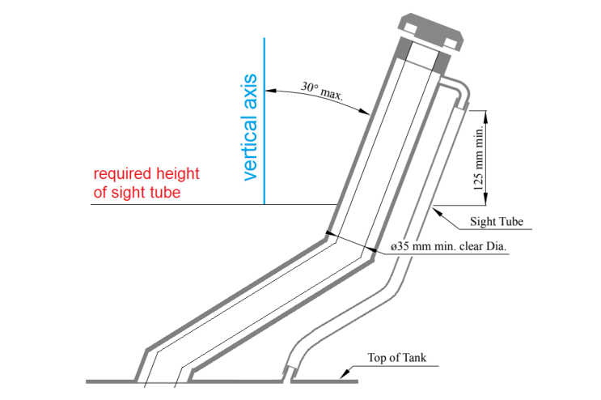

# Fuel and Fuel System

### CV2.1 Fuel

##### CV2.1.1

> The basic fuels available at Formula Student are unleaded gasoline (Sustainable 95RON E10
> and 99RON E5) and E85.
> 
> - Information on these fuels can be viewed at:
> [General Information](https://www.imeche.org/events/formula-student/team-information/general-information)
> - The basic fuel types may be changed at the discretion of the event organisers. Other
> fuels may be available at the discretion of the organising body.

##### CV2.1.2

> The vehicles must be operated with the fuel provided at the competition.

##### CV2.1.3

> No agents other than fuel and air may be induced into the combustion chamber.

##### CV2.1.4

> The temperature of fuel introduced into the fuel system may not be changed with the
> intent to improve calculated efficiency.

### CV2.2 Fuel System Location Requirements

##### CV2.2.1

> All parts of the fuel storage and supply system must lie within the surface envelope, see
> [T1.1.18](../section-t/1-definitions.md/#t1118). In side view no portion of the fuel system can project below the lower surface of
> the chassis.

##### CV2.2.2

> Any portion of the Fuel System, except for the fuel tank filler neck and sight tube (as
> defined in [CV2.6](#cv26-fuel-tank-filler-neck-and-sight-tube)), must be located within the Rollover Protection Envelope.

##### CV2.2.3

> All parts of the fuel storage and supply system must be adequately protected against any
> heat sources and located at least 50mm from any exhaust system component.

##### CV2.2.4

> All parts of the fuel system which can come in contact with the fuel must be rated for
> permanent contact with fuel.

##### CV2.2.5

> Any portion of the Fuel System that is less than 350mm above the ground must be shielded
> from front, side and rear impact collisions, by a fully triangulated structure meeting [T3.2](../section-t/3-general-chassis-design.md/#t32-minimum-material-requirements) or
> equivalent.

### CV2.3 Fuel Tank

##### CV2.3.1

> The fuel tank is defined as the part of the fuel containment device that is in contact with
> the fuel. It may be made of a rigid material or a flexible material.

##### CV2.3.2

> The fuel tank must be securely attached to the vehicle structure with mountings that allow
> some flexibility such that chassis flex cannot unintentionally load the fuel tank.

##### CV2.3.3

> The fuel tank must not touch any part of the vehicle other than its mounting and parts of
> the fuel system at any time.

##### CV2.3.4

> Any fuel tank that is made from a flexible material, for example a bladder fuel cell or a bag
> tank, must be enclosed within a rigid fuel tank container which is securely attached to the
> vehicle structure. Fuel tank containers (containing a bladder fuel cell or bag tank) may be
> load carrying.

##### CV2.3.5

> The fuel system must have a provision for emptying the fuel tank if required.

##### CV2.3.6

> The fuel tank, by design, must not have a variable capacity.

### CV2.4 Fuel Lines for Low Pressure Systems

##### CV2.4.1

> Fuel lines between fuel tank and fuel rail and return lines must:
> 
> - Have reinforced rubber fuel lines with an abrasion protection with a fuel hose clamp
> which has a full 360° wrap, a nut and bolt system for tightening and rolled edges to
> prevent the clamp cutting into the hose, or,
> - Have metal braided hoses with crimped-on or reusable, threaded fittings,
> - Have a barbed fitting or a beaded fitting conforming to SAE J1231 if a hose and clamp
> connection is used.
> - Be rated for temperatures of at least 120 °C.

##### CV2.4.2

> The use of unmodified OEM fuel lines and connectors, including those manufactured from
> plastic, is permitted.

##### CV2.4.3

> Fuel lines must be securely attached to the vehicle and/or engine.

##### CV2.4.4

> All fuel lines must be shielded from possible rotating equipment failure or collision damage.

##### CV2.4.5

> All fuel lines must be installed in such a way that any leaks cannot result in the
> accumulation of fuel in the cockpit.

### CV2.5 Fuel Injection System Requirements

##### CV2.5.1

> Low Pressure Injection (LPI) fuel systems are those functioning at a pressure below 10bar
> and High-Pressure Injection (HPI) fuel systems are those functioning at 10bar pressure or
> above. Direct Injection (DI) fuel systems are those where the injection occurs directly into
> the combustion chamber.

##### CV2.5.2

> The following requirements apply to LPI fuel systems:
> 
> - The fuel lines must comply with [CV2.4](#cv24-fuel-lines-for-low-pressure-systems),
> - The fuel rail must be securely attached to the engine cylinder block, cylinder head, or
> intake manifold with mechanical fasteners. The threaded fasteners used to secure the
> fuel rail are considered critical fasteners and must comply with [T10](../section-t/10-fasteners.md),
> - The use of fuel rails made from plastic, carbon fibre or rapid prototyping flammable
> materials is prohibited. However, the use of unmodified OEM Fuel Rails manufactured
> from these materials is acceptable.

##### CV2.5.3

> The following requirements apply to HPI and DI fuel systems:
> 
> - All high-pressure fuel lines must be stainless steel rigid line or Aeroquip FC807 smooth
> bore PTFE hose with stainless steel reinforcement and visible Nomex tracer yarn. Use of
> elastomeric seals is prohibited. Lines must be rigidly connected every 100mm by
> mechanical fasteners to structural engine components,
> - The fuel rail must be securely attached to the engine cylinder head with mechanical
> fasteners. The fastening method must be sufficient to hold the fuel rail in place with the
> maximum regulated pressure acting on the injector internals and neglecting any
> assistance from in-cylinder pressure acting on the injector tip. The threaded fasteners
> used to secure the fuel rail are considered critical fasteners and must comply with T10,
> - The fuel pump must be rigidly mounted to structural engine components,
> - A fuel pressure regulator must be fitted between the high and low pressure sides of the
> fuel system in parallel with the DI boost pump. The external regulator must be used
> even if the DI boost pump comes equipped with an internal regulator,
> - Prior to the tilt test specified in IN7, engines fitted with mechanically actuated fuel
> pumps must be run to fill and pressure the system downstream of the high-pressure
> pump.

### CV2.6 Fuel Tank Filler Neck and Sight Tube

##### CV2.6.1

> The fuel tank must have a filler neck which:
> 
> - Has at least an inner diameter of 35mm at any point between the fuel tank and the top
> of the fuel filler cap.
> - Is accompanied by a clear fuel resistant sight tube above the top of the fuel tank with a
> length of at least 125mm vertical height for reading the fuel level, see Figure 25.
> - Is made of material that is permanently rated for temperatures of at least 120 °C.

<small><em>Figure 25: Minimum requirements fuel tank filler neck</em></small>

##### CV2.6.2

> A clear filler neck tube may be used as a sight tube.

##### CV2.6.3

> Above the lowest point of the sight tube, the filler neck must not be angles more than 30°
> from the vertical.

##### CV2.6.4

> A permanent, non-moveable, clear and easily visible fuel level line must be located
> between 12mm and 25mm below the top of the visible portion of the sight tube. This line
> will be used as the fill line for the tilt test ([IN7.1](../section-in/7-tilt-test.md/#in71-tilt-test-procedure)), and before and after the endurance test
> to measure the amount of fuel used during the endurance event.

##### CV2.6.5

> The filler neck opening must be directly accessible without removing any parts of the
> vehicle except for the fuel filler cap.

##### CV2.6.6

> The filler neck must have a fuel filler cap that can withstand severe vibrations or high
> pressures such as could occur during a vehicle rollover event.

### CV2.7 Tank Filling Requirement

##### CV2.7.1

> The fuel tank must be capable of being filled to capacity without manipulating the tank or
> the vehicle in any manner. The fuel system must be designed in a way that during refuelling
> of the vehicle on a level surface, the formation of air cavities or other effects that cause the
> fuel level observed at the sight tube to drop after movement or operation of the vehicle
> (other than due to consumption) is prevented.

##### CV2.7.2

> The fuel system must be designed such that the spillage during refuelling cannot contact
> the driver position, exhaust system, hot engine parts, or the ignition system.

### CV2.8 Venting Systems

##### CV2.8.1

> The fuel tank venting systems must be designed such that fuel cannot spill during hard
> cornering or acceleration.

##### CV2.8.2

> All fuel vent lines must be equipped with a check valve to prevent fuel leakage when the
> tank is inverted. All fuel vent lines must exit outside the bodywork.
