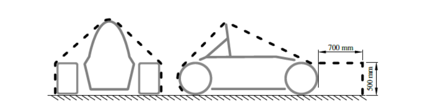

# Electrical Components

### T11.1 Low Voltage System

##### T11.1.1

> The Low Voltage System (LVS) is defined as
> - **[CV ONLY]** all electrical circuits of the vehicle,
> - **[EV ONLY]** every electrical part that is not part of the TS, see [EV1.1.1](../section-ev/1-definitions.md/#ev111).

##### T11.1.2

> The maximum permitted voltage that may occur between any two electrical connections in
> the LVS is 60 V DC or 25 V AC RMS.

##### T11.1.3

> All LVS parts must be adequately insulated.

##### T11.1.4

> **[CV ONLY]** The following systems are excluded from the LVS voltage limit, see [T11.1.2](#t1112):
> 
> - High voltage systems for ignition,
> - High voltage systems for injectors,
> - Voltages internal to OEM charging systems designed for <60 VDC output.

##### T11.1.5

> **[CV ONLY]** The maximum permitted voltage for motor controller/inverter low power control
> signals is 75 V DC

##### T11.1.6

> **[EV ONLY]** The LVS must not use orange wiring or conduit.

##### T11.1.7

> **[EV ONLY]** The LVS must be grounded to the chassis.

### T11.2 Master Switches

##### T11.2.1

> Master switches, see [T11.3](#t113-low-voltage-master-switch), [EV6.2](../section-ev/6-ev-shutdown-circuit-and-systems.md/#ev62-tractive-system-master-switch) and [T14.6](./14-autonomous-system.md/#t146-autonomous-system-master-switch), must be a mechanical switch of the rotary
> type, with a red, removable handle. The handle must have a width of at least 50mm and
> must only be removable in electrically open position. They must be direct acting, i.e. they
> must not act through a relay or logic.

##### T11.2.2

> Master switches must be located on the right side of the vehicle, in proximity to the main
> hoop, at the 95th percentile male driver’s shoulder height, as defined in [T4.3](./4-cockpit.md/#t43-percy-95th-percentile-male), and be easily
> actuated from outside the vehicle. The centre of any master switch must not be mounted
> lower than the vertical distance of the template’s (see [T4.3](./4-cockpit.md/#t43-percy-95th-percentile-male)) middle circle centre to the
> ground surface multiplied by 0.8.

##### T11.2.3

> The “ON” position of the switch must be in the horizontal position and must be marked
> accordingly. The “OFF” position of the master switch must also be clearly marked.

##### T11.2.4

> Master switches must be rigidly mounted to the vehicle and must not be removed during
> maintenance.

##### T11.2.5

> Master switches must be mounted next to each other.

### T11.3 Low Voltage Master Switch

##### T11.3.1

> An LVMS according to [T11.2](#t112-master-switches) must completely disable
> 
> - **[EV ONLY]** power to the LVS,
> - **[CV ONLY]** power from the Low Voltage (LV) battery and the alternator to the LVS.

##### T11.3.2

> The LVMS must be mounted in the middle of a completely red circular area of ≥50 mm
> diameter placed on a high contrast background.

##### T11.3.3

> The LVMS must be marked with “LV” and a symbol showing a red spark in a white edged
> blue triangle.

### T11.4 Shutdown Buttons

##### T11.4.1

> A system of three shutdown buttons must be installed on the vehicle.

##### T11.4.2

> Each shutdown button must be a push-pull or push-rotate mechanical emergency switch
> where pushing the button opens the shutdown circuit, see [EV6.1](../section-ev/6-ev-shutdown-circuit-and-systems.md/#ev61-shutdown-circuit) and [CV4.1](../section-cv/4-shutdown-system.md/#cv41-shutdown-circuit).

##### T11.4.3

> One button must be located on each side of the vehicle behind the driver’s compartment at
> approximately the level of the driver’s head. The minimum allowed diameter of the
> shutdown buttons on both sides of the vehicle is 40mm. The buttons must be easy
> reachable from outside the vehicle.

##### T11.4.4

> One shutdown button serves as a cockpit-mounted shutdown button and must

> - Have a minimum diameter of 24mm,
> - Be located in easy reach of a belted-in driver,
> - Be alongside of the steering wheel and unobstructed by the steering wheel or any other
> part of the vehicle.

##### T11.4.5

> The international electrical symbol consisting of a red spark on a white-edged blue triangle
> must be affixed in close proximity to each shutdown button.

##### T11.4.6

> Shutdown buttons must be rigidly mounted to the vehicle and must not be removed during
> maintenance.

##### T11.4.7

> Shutdown buttons must be coloured red.

### T11.5 Inertia Switch

##### T11.5.1

> An inertia switch must be part of the shutdown circuit, see [EV6.1](../section-ev/6-ev-shutdown-circuit-and-systems.md/#ev61-shutdown-circuit) and [CV4.1](../section-cv/4-shutdown-system.md/#cv41-shutdown-circuit), such that an
> impact will result in the shutdown circuit being opened. The inertia switch must latch until
> manually reset.

##### T11.5.2

> The device must trigger due to an omnidirectional peak acceleration of ≤8 g for a half sine
> test pulse of ≥50ms length and ≤13g for a half sine test pulse of ≥20ms length. The “Sensata
> Resettable Crash Sensor” should meet those requirements.

##### T11.5.3

> The device must not include any semiconductor components.

##### T11.5.4

> The device must be rigidly attached to the vehicle and installed according to manufacturer
> specification to the vehicle. It must be possible to demount the device so that its
> functionality may be tested by shaking it.

### T11.6 Brake System Plausibility Device

##### T11.6.1

> A standalone non-programmable circuit, the BSPD, must open the shutdown circuit, see
> [EV6.1](../section-ev/6-ev-shutdown-circuit-and-systems.md/#ev61-shutdown-circuit) and [CV4.1](../section-cv/4-shutdown-system.md/#cv41-shutdown-circuit), when hard braking occurs, whilst
> 
> - **[EV ONLY]** ≥5 kW power is delivered to the motors,
> - **[CV ONLY]** The throttle position is more than 25% over idle position.
>
> The shutdown circuit must remain open until power cycling the LVMS or the BSPD may
> reset itself if the opening condition is no longer present for more than 10s.

##### T11.6.2

> The action of opening the shutdown circuit must occur if the implausibility is persistent for
> more than 500ms.

##### T11.6.3

> The BSPD must be directly supplied, see [T1.3.1](./1-definitions.md/#t131), from the LVMS, see [T11.3](#t113-low-voltage-master-switch).

##### T11.6.4

> Standalone is defined as there is no additional functionality implemented on all required
> Printed Circuit Boards (PCBs). The interfaces must be reduced to the minimum necessary
> signals, i.e. power supply, required sensors and the shutdown circuit. Supply and sensor-
> signals must not be routed through any other devices before entering the BSPD.

##### T11.6.5

> To detect hard braking, a brake system pressure sensor must be used. The threshold must
> be chosen such that there are no locked wheels, and the brake pressure is <= 30bar.

##### T11.6.6

> **[EV ONLY]** To measure power delivery, a DC circuit current sensor only must be used. The
> threshold must be chosen to an equivalent of 5kW for maximum TS voltage.

##### T11.6.7

> It must be possible to separately disconnect each sensor signal wire for technical
> inspection.

##### T11.6.8

> All necessary signals are System Critical Signal (SCS), see [T11.9](#t119-system-critical-signal).

##### T11.6.9

> **[EV ONLY]** The team must prove the function of the BSPD during technical inspection by
> sending an appropriate signal that represents the current, in order to achieve 5 kW whilst
> pressing the brake pedal. This test must prove the functionality of the complete BSPD
> except for any commercially available current sensors.

##### T11.6.10

> **[EV ONLY]** The BSPD including all required sensors must not be installed inside the TSAC.

### T11.7 Low Voltage Batteries

##### T11.7.1

> LV batteries are all batteries connected to the LVS.

##### T11.7.2

> LV batteries must be securely attached to the chassis and located within the rollover
> protection envelope, see [T1.1.16](./1-definitions.md/#t1116).

##### T11.7.3

> Any wet-cell battery located in the driver compartment must be enclosed in a non-
> conductive, waterproof (according to IPX7 or higher, IEC 60529) and acid resistant
> container.

##### T11.7.4

> LV batteries must have a rigid and sturdy casing.

##### T11.7.5

> Ungrounded terminals must be insulated.

##### T11.7.6

> LV batteries must have overcurrent protection, not more than 100mm from ungrounded
> terminals, that trips at or below the maximum specified discharge current of the cells
> within the time periods specified on the datasheet for the battery.
>
> For example, if the datasheet specifies a continuous discharge current of 70A, a 10 second
> discharge pulse current of 120A and a 1 second discharge pulse current of 150A, the
> overcurrent protection must not allow any of these requirements to be exceeded.

##### T11.7.7

> All LV batteries using chemistries other than lead acid must be:
> 
> - Presented at technical inspection with markings identifying it for comparison to a
> datasheet and/or other documentation proving the pack and supporting electronics
> meet all rules requirements.
> - Directly accessible with a fire extinguisher nozzle of 35mm diameter x 150mm long,
> without removing body panels and with the driver seated normally in the vehicle.
> Covers which can be easily "punched through" are acceptable.
>
> Any such cover or access location must be identified using the appropriate symbol
> below and be clearly visible to marshals approaching the car.

<small><em>Figure 19: Fire Port location markings</em></small>

> If the LV battery is positioned greater than 50mm inboard of the access location, then a
> tube of at least 35mm diameter must be present to direct the discharge from the
> extinguisher towards the LV battery. The tube must be no more than 750mm in length.
> Any access tube must be separated from the driver by a firewall as specified in T4.8.
>
> NOTE: A tube routed from an engine bay opening to the battery packs could be
> acceptable if compliant with the rules.
> 
> - Identified with the symbol below (minimum height 75mm and showing the appropriate
> battery chemistry) on each side of the car AND adjacent to any labels required by
> [T11.7.7](#t1177).

<small><em>Figure 20: Battery Chemistry marking</em></small>

##### T11.7.8

> Battery packs based on lithium chemistry other than lithium iron phosphate (LiFePO4) and
> all LV hybrid system energy stores, regardless of chemistry type:
> 
> - Must include overcurrent protection that trips at or below the maximum specified
> discharge current of the cells,
> - Must have a fire-retardant casing, see [T1.2.1](./1-definitions.md/#t121).
> - Must include overtemperature protection of at least 30 % of the cells, meeting [EV5.8.4](../section-ev/5-tractive-system-energy-storage.md/#ev584),
> that trips when any cell leaves the allowed temperature range according to the
> manufacturer’s datasheet, but not more than 60°C, for more than 1s and disconnects
> the battery,
> - Must include voltage protection of all cells that trips when any cell leaves the allowed
> voltage range according to the manufacturer’s datasheet for more than 500ms and
> disconnects the battery,
> - It must be possible to display all cell voltages and measured temperatures, e.g. by
> connecting a laptop,
> - Signals needed to fulfil these requirements are SCS, see [T11.9](#t119-system-critical-signal).

##### T11.7.9

> All batteries must be separated from the driver and sources of heat by a firewall as
> specified in [T4.8](./4-cockpit.md/#t48-firewall).

##### T11.7.10

> All batteries that are less than 350mm above the ground must be shielded from front, side
> and rear impact collisions, by a fully triangulated structure meeting [T3.2](./3-general-chassis-design.md/#t32-minimum-material-requirements) or equivalent.

### T11.8 Accelerator Pedal Position Sensor (APPS)

##### T11.8.1

> T11.8 only applies for electric vehicles, see chapter EV, or internal combustion vehicles
> using Electronic Throttle Control (ETC), see [CV1.6](../section-cv/1-internal-combustion-engine-powertrains.md/#cv16-electronic-throttle-control).

##### T11.8.2

> The APPS must be actuated by a foot pedal.

##### T11.8.3

> Pedal travel is defined as percentage of travel from fully released position to a fully applied
> position where 0% is fully released and 100% is fully applied.

##### T11.8.4

> The foot pedal must return to the 0% position when not actuated. The foot pedal must
> have a positive stop preventing the mounted sensors from being damaged or overstressed.
> Two springs must be used to return the foot pedal to the 0% position and each spring must
> work when the other is disconnected. Springs in the APPS are not accepted as return
> springs.

##### T11.8.5

> At least two separate sensors must be used as APPSs. Separate is defined as not sharing
> supply or signal lines. They may share a common housing if the use of independent supply
> and signal lines is easily determined.

##### T11.8.6

> If analogue sensors are used, they must have different, non-intersecting transfer functions.
> A short circuit between the signal lines must always result in an implausibility according to
> [T11.8.9](#t1189).

##### T11.8.7

> The APPS signals are SCSs, see [T11.9](#t119-system-critical-signal).

##### T11.8.8

> If an implausibility occurs between the values of the APPSs and persists for more than
> 100ms
> 
> - **[EV ONLY]** The power to the motor(s) must be immediately shut down completely. It is
> not necessary to completely deactivate the tractive system, the motor controller(s)
> shutting down the power to the motor(s) is sufficient,
> - **[CV ONLY]** The power to the electronic throttle must be immediately shut down.

##### T11.8.9

> Implausibility is defined as a deviation of more than ten percentage points pedal travel
> between any of the used APPSs or any failure according to [T11.9](#t119-system-critical-signal).

##### T11.8.10

> If three sensors are used, then in the case of an APPS implausibility, any two sensors that
> are plausible may be used to define the torque target and the 3rd APPS may be ignored.

##### T11.8.11

> It must be possible to separately disconnect each APPS signal and power wires to check all
> functionalities.

##### T11.8.12

> A fully released accelerator pedal in manual mode must result in:
> 
> - **[EV ONLY]** A wheel torque of ≤0 Nm,
> - **[CV ONLY]** An idle position or lower throttle set-point. This may only be exceeded during
> a gearshift for a maximum of 500ms.

##### T11.8.13

> When any kind of digital data transmission is used to transmit the APPS signal, the ESF must
> contain a detailed description of all the potential failure modes that can occur, the strategy
> that is used to detect these failures and the tests that have been conducted to prove that
> the detection strategy works. The failures to be considered must include but are not limited
> to the failure of the APPS, APPS signals being out of range, corruption of the message and
> loss of messages and the associated time outs.

##### T11.8.14

> Any algorithm or electronic control unit that can manipulate the APPS signal, for example
> for vehicle dynamic functions such as traction control, may only lower the total driver
> requested torque and must never increase torque unless it is exceeded during a gearshift.
> Thus, the drive torque which is requested by the driver may never be exceeded.

### T11.9 System Critical Signal

##### T11.9.1

> SCS are defined as all electrical signals which
> 
> - Influence actions on the shutdown circuit, see [EV6.1](../section-ev/6-ev-shutdown-circuit-and-systems.md/#ev61-shutdown-circuit) and CV4.1,
> - Influence the wheel torque,
> - **[EV ONLY]** Influence indicators according to [EV5.8.9](../section-ev/5-tractive-system-energy-storage.md/#ev589), [EV4.10](../section-ev/4-tractive-system.md/#ev410-tractive-system-active-light) or [EV6.3.8](../section-ev/6-ev-shutdown-circuit-and-systems.md/#ev638),
> - **[DV ONLY]** Influence indicator according to [T15.3.3](./15-autonomous-system-brake.md/#t1533).

##### T11.9.2

> Any of the following SCS signal failures must result in a safe or error state of all connected
> systems:
> 
> - Failures of signals transmitted by cable:
> 
>       **i.** Open circuit,
> 
>       **ii.** Short circuit to ground.
> 
> - Failures of analogue sensor signals transmitted by cable:
> 
>       **i.** Short circuit to supply voltage.
> 
> - Failures of sensor signals used in programmable devices:
> 
>       **i.** Implausibility due to out of range signals, e.g. mechanically impossible angle of an
>   angle sensor.
> 
> - Failures of digitally transmitted signals by cable or wireless:
> 
>       **i.** Data corruption (e.g. checked by a checksum),
> 
>       **ii.** Loss and delay of messages (e.g. checked by transmission time outs).
>
> Signals might be a member of multiple signal classes, e.g. analogue signals transmitted by
> cable might be a member of the first three classes.

##### T11.9.3

> If a signal failure is correctable, e.g. due to redundancy or worst-case values, the safe or
> error state must be entered as soon as an additional non correctable failure occurs.

##### T11.9.4

> The maximum allowed delay of messages according to [T11.9.2](#t1192) must be chosen
> depending on the impact of delayed messages to the connected system but must not
> exceed 500ms.

##### T11.9.5

> Safe and error states are defined depending on the signals as follows:
> 
> - Error State
> i. signals only influencing indicators – indicator(s) not illuminated which indicate a
>   failure of its own function or of the connected system,
>
> Note:  In this case it is not possible to identify from the indicator(s) whether a safe
> state has been entered and further action by the team is required to confirm this
> or what additional action is required to enter a safe state.
> 
> - Safe State
> - Signals only influencing indicators – Indicating a failure of its own function or of the
> connected system,
> - Low voltage battery signals – At least one pole is electrically disconnected from the rest
> of the vehicle,
> - **[AUTONOMOUS ONLY]** – the ASSI must be showing AS OFF,
> - **[EV ONLY]** For all others signals – opened shutdown circuit and opened AIRs,
> - **[CV ONLY]** For all others signals – opened shutdown circuit and stopped engine.

##### T11.9.6

> Indicators according to [T11.9.1](#t1191) with safe state “illuminated” (e.g. absence of failures is not
> actively indicated) must be illuminated for 1s to 3s for visible check after power cycling the
> LVMS.

##### T11.9.7

> The ESF must contain a detailed description of all the potential failure modes that can occur
> for each SCS, the strategy that is used to detect these failures and the tests that have been
> conducted to prove that the detection strategy works. The failures to be considered must
> include but are not limited to the failure of sensors and actuators, signals being out of
> range, corruption of the message and loss of messages and the associated time outs.

### T11.10 System Status Light

##### T11.10.1

> Any system status light(s), see [T6.3](./6-brake-system.md/#t63-brake-light) and [T14.10](./14-autonomous-system.md/#t1410-autonomous-system-status-indicators), must meet the following requirements:
> 
> - Black background,
> - Rectangular, triangular, or near-round shape,
> - Minimum illuminated surface of 15cm2 with even luminous intensity,
> - Clearly visible in very bright sunlight,
> - If LED lights are used without a diffuser, they must not be more than 20mm apart,
> - If a single line of LED lights is used, the minimum length is 150mm.

### T11.11 Sensors & Electrical Components Mounting

##### T11.11.1

> All sensors and components must be securely mounted. For all mounts, [T2.2.4](./2-general-design-requirements.md/#t224) applies.

##### T11.11.2

> Sensors and components may not come into contact with the driver’s helmet under any
> circumstances.

##### T11.11.3

> All sensors and components must be positioned within the surface envelope, see [T1.1.18](./1-definitions.md/#t1118).
> Actors for aerodynamic devices must be within the box defined in [T8.2](./8-aerodynamic-devices.md/#t82-restrictions-for-aerodynamic-devices).

##### T11.11.4

> Passive antennas, but not their mounts, that are exclusively acting as such with the longest
> side <100mm may protrude from the surface envelope.

##### T11.11.5

> Antennas may also be mounted on the aerodynamic devices, if they do not protrude from
> the bounding box of the device.

##### T11.11.6

> Additionally, sensors may be mounted with a maximum distance of 500mm above the
> ground and less than 700mm forward of the front of the front tyres (see Figure 21). They
> must not exceed the width of the front axle (measured at the height of the hubs).

<small><em>Figure 21: Envelope to mount sensor systems.</em></small>

##### T11.11.7

> The body of any video/photographic camera which is not exclusively used as sensor for the
> AS unit must be secured at a minimum of two points on different sides of the camera body.
> If a tether is used to restrain the camera, the tether length must be limited so that the
> camera cannot contact the driver. Such camera installations must be approved at technical
> inspection.
