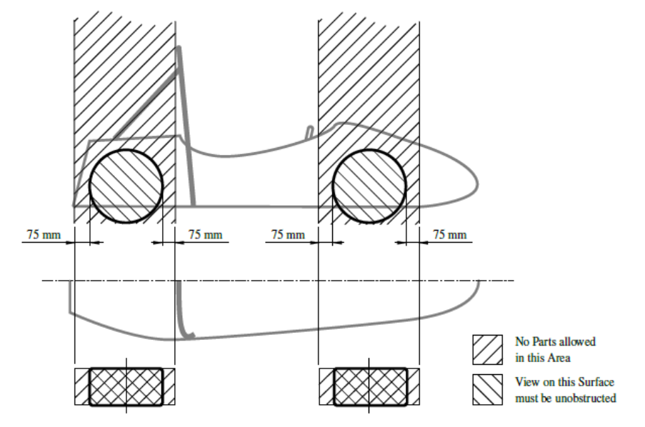

# General Design Requirements

### T2.1 Vehicle Configuration

##### T2.1.1

> The vehicle must be designed and fabricated in accordance with good engineering
> practices.

##### T2.1.2

> The vehicle must be open-wheeled, single seat and open cockpit (a formula style body)
> with four wheels that are not in a straight line.

##### T2.1.3

> Open wheel vehicles must satisfy the following (see also Figure 4):
> - The wheel/tyre assembly must be unobstructed when viewed from the side.
> - No part of the vehicle may enter a keep-out-zone defined by two lines extending
> vertically from positions 75 mm in front of and 75 mm behind the outer diameter of the
> front and rear tyres in the side view of the vehicle, with steering straight ahead. This
> keep-out zone extends laterally from the outside plane of the wheel/tyre to the inboard
> plane of the wheel/tyre assembly.

<small><em>Figure 4: Keep-out-zones for the definition of an open-wheeled vehicle</em></small>

### T2.2 Bodywork

##### T2.2.1

> There must be no openings through the bodywork into the driver compartment other than
> that required for the cockpit opening. Minimal openings around the front suspension and
> steering system components are allowed.

##### T2.2.2

> In any section view, parallel to the centre line of the car, in front of the cockpit opening and
> outside the area defined in [T8.2](./8-aerodynamic-devices.md/#t82-restrictions-for-aerodynamic-devices), all parts of the bodywork must have no external concave
> radii of curvature. Any gaps between bodywork and other parts must be reduced to a
> minimum.

##### T2.2.3

> Enclosed chassis structures and structures between the chassis and the ground must have
> two venting holes of at least 25 mm diameter in the lowest part of the structure to prevent
> accumulation of liquids. Additional holes are required when multiple local lowest parts
> exist in the structure.

##### T2.2.4

> All edges of the bodywork that could come into contact with a pedestrian must have a
> minimum radius of 3 mm.

##### T2.2.5

> The bodywork in front of the front wheels must have a radius of at least 38mm extending
> at least 45° relative to the forward direction, along the top, sides and bottom of all affected
> edges.

### T2.3 Suspension

##### T2.3.1

> The vehicle must be equipped with fully operational front and rear suspension systems
> including shock absorbers and a usable wheel travel of at least 50mm and a minimum
> jounce of 25 mm with driver seated.

##### T2.3.2

> The minimum static ground clearance of any portion of the vehicle, other than the tyres,
> including a driver, must be 30mm.

##### T2.3.3

> All suspension mounting points must be visible at technical inspection, either by direct view
> or by removing any covers.

### T2.4 Wheels

##### T2.4.1

> Any wheel mounting system that uses a single retaining nut must incorporate a device to
> retain the nut and the wheel in the event that the nut loosens. A second nut (“jam nut”)
> does not meet these requirements.

##### T2.4.2

> Standard wheel lug bolts and studs must be made of steel or titanium and are considered
> engineering fasteners. Teams using modified lug bolts, studs or custom designs will be
> required to provide proof that good engineering practices have been followed in their
> design. Wheel lug bolts and studs must not be hollow.

##### T2.4.3

> Aluminium wheel nuts may be used, but they must be hard anodized and in pristine
> condition.

##### T2.4.4

> At all extremes of suspension and steering travel, the static radial clearance between the
> wheel rim and any non-rotating component must be >=5mm.

##### T2.4.5

> Extended or composite wheel studs are prohibited.

##### T2.4.6

> Wheel spacers are permitted. Laminated or multiple spacers per wheel are not permitted.

##### T2.4.7

> The wheels for dry tyres and wet tyres may be different but must be the same for all dry
> tyres and all wet tyres.

### T2.5 Tyres

##### T2.5.1

> Vehicles must have two types of tyres as follows:
> 
> - Dry tyres - The tyres on the vehicle when it is presented for technical inspection are
> defined as its “dry tyres”.
> - Wet tyres - Wet tyres may be any size or type of treaded or grooved tyre provided:
> 
>       i. The tread pattern or grooves were moulded in by the tyre manufacturer or were
>   cut by the tyre manufacturer or their appointed agent. Any grooves that have
>   been cut must have documentary proof that it was done in accordance with these
>   rules.
>
>       ii. There is a minimum tread depth of 2.4 mm.

##### T2.5.2

> Tyres on the same axle must have the same manufacturer, size and compound.

##### T2.5.3

> Tyre warmers are not allowed.

##### T2.5.4

> Special agents that increase traction may not be added to the tyres or track surface.

##### T2.5.5

> Single-use plastic tyre covers, e.g. cling film, are prohibited.

### T2.6 Steering

##### T2.6.1

> Steering systems using cables or belts for actuation are prohibited. 
> 
> **[DV ONLY]** This does not apply for autonomous steering actuators.

##### T2.6.2

> The steering wheel must directly mechanically actuate the front wheels.

##### T2.6.3

> The steering system must have positive steering stops that prevent the steering linkages
> from locking up. The stops must be placed on the rack and must prevent the tyres and rims
> from contacting any other parts. Steering actuation must be possible during standstill.

##### T2.6.4

> Allowable steering system free play is limited to a total of 7° measured at the steering
> wheel.

##### T2.6.5

> The steering wheel must be attached to the column with a quick disconnect. The driver
> must be able to operate the quick disconnect while in the normal driving position with
> gloves on.

##### T2.6.6

> The steering wheel must be no more than 250mm rearward of the front hoop. This
> distance is measured horizontally, on the vehicle centreline, from the rear surface of the
> front hoop to the forward most surface of the steering wheel with the steering in any
> position.

##### T2.6.7

> The steering wheel must have a continuous perimeter that is near circular or near oval. The
> outer perimeter profile may have some straight sections, but no concave sections.

##### T2.6.8

> In any angular position, the top of the steering wheel must be no higher than the top-most
> surface of the front hoop.

##### T2.6.9

> The steering rack must be mechanically attached to the Primary Structure.

##### T2.6.10

> Joints between all components attaching the steering wheel to the steering rack must be
> mechanical and visible at technical inspection. Bonded joints without a mechanical backup
> are not permitted. The mechanical backup must be designed to solely uphold the
> functionality of the steering system.

##### T2.6.11

> Rear wheel steering, which can be electrically actuated, is permitted if mechanical stops
> limit the range of angular movement of the rear wheels to a maximum of 6°. This must be
> demonstrated with a driver in the vehicle and the team must provide the equipment for
> the steering angle range to be verified at technical inspection.

### T2.7 Wheelbase

##### T2.7.1

> The vehicle must have a wheelbase of at least 1525 mm.

### T2.8 Track and Rollover Stability

##### T2.8.1

> The smaller track of the vehicle (front or rear) must be no less than 75 % of the larger track.

##### T2.8.2

> The track and centre of gravity of the vehicle must combine to provide adequate rollover
> stability.
