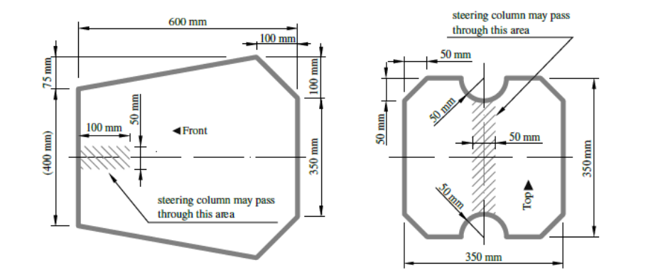
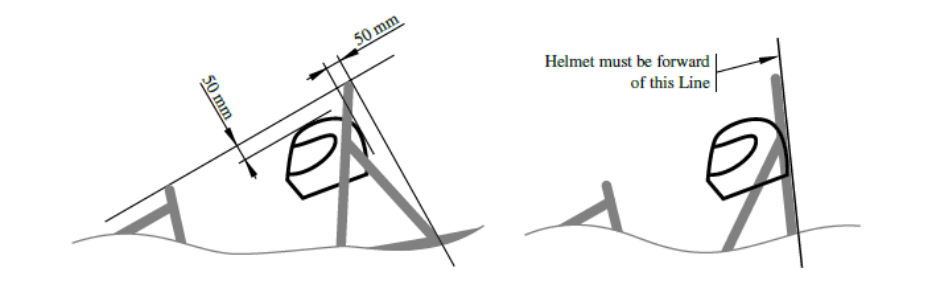
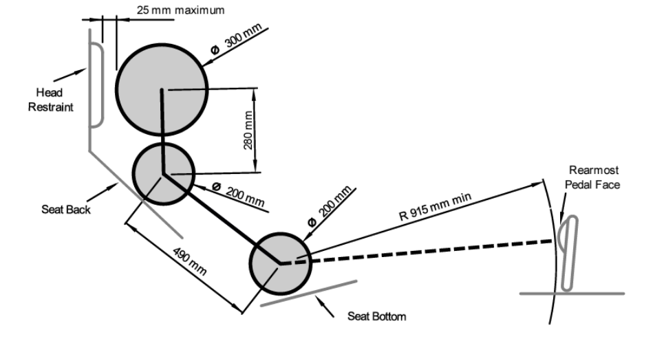

# Cockpit

### T4.1 Cockpit Opening

##### T4.1.1

> The size of the cockpit opening needs to be sufficient for the template shown on the left of
> Figure 12 to pass vertically from the cockpit opening to below the upper side impact
> member when held horizontally. The template may be moved fore and aft.

##### T4.1.2

> If the side impact structure is not made of tubes, the template must pass until it is 320mm
> above the lowest inside chassis point between the front and main hoop.

##### T4.1.3

> The steering wheel, seat and all padding may be removed for the template to fit. Any other
> parts may only be removed if they are integrated with the steering wheel.

### T4.2 Cockpit Internal Cross Section

##### T4.2.1

> The cockpit must provide a free internal cross section sufficient for the template shown on
> the right in Figure 12 to pass from the cockpit opening to a point 100mm rearwards of the
> face of the rearmost pedal in an inoperative position. The template may be moved up and
> down. Adjustable pedals must be in their most forward position.

##### T4.2.2

> The steering wheel and any padding that can be removed without the use of tools while
> the driver is seated may be removed for the template to fit.

##### T4.2.3

> The driver’s feet and legs must be completely contained within the Primary Structure when
> the driver is seated normally, and the driver’s feet are touching the pedals. In side and front
> views, any part of the driver’s feet or legs must not extend above or outside of this
> structure.

<small><em>Figure 12: Cockpit opening template (left) and cockpit internal cross section template (right)</em></small>

### T4.3 Percy (95th percentile male)

##### T4.3.1

> When seated normally and restrained by the driver’s restraint system, the helmet of a 95th
> percentile male and all the team’s drivers must, see Figure 13:
> 
> - Be a minimum of 50mm away from the straight line drawn from the top of the main
> hoop to the top of the front hoop,
> - Be a minimum of 50mm away from the straight line drawn from the top of the main
> hoop to the lower end of the main hoop bracing if the bracing extends rearwards,
> - Be no further rearwards than the rear surface of the main hoop if the main hoop bracing
> extends forwards.

<small><em>Figure 13: Minimum helmet clearance</em></small>

##### T4.3.2

> The 95th percentile male is represented by a two-dimensional figure consisting of two
> circles of 200mm diameter (one representing the hips and buttocks and one representing
> the shoulder region) and one circle of 300mm (representing the head with helmet).

##### T4.3.3

> The two 200mm circles are connected by a straight line measuring 490 mm. The 300mm
> circle is connected by a straight-line measuring 280mm with the upper 200mm circle.

##### T4.3.4

> The figure has to be positioned in the vehicle as follows, see Figure 14:
> 
> - The seat adjusted to the rearmost position,
> - The pedals adjusted to the front-most position,
> - The bottom 200mm circle placed on the seat bottom. The distance between the centre
> of the circle and the rearmost actuation face of the pedals must be minimum 915mm,
> - The middle circle positioned on the seat back,
> - The upper 300mm circle positioned no more than 25 mm away from the head restraint.

<small><em>Figure 14: Percy placement</em></small>

### T4.4 Side Tubes

##### T4.4.1

> If there is any chassis member alongside the driver at the height of the neck of any of the
> drivers in the team, a metal tube or piece of sheet metal must be attached to the chassis to
> prevent the driver’s shoulders from passing under that chassis member.

### T4.5 Driver’s Harness Attachment

##### T4.5.1

> Any harness attachment to a monocoque must use one 10mm metric grade 8.8 bolt or two
> 8 mm metric grade 8.8 bolts (or bolts of an equivalent standard) and steel backing plates
> with a minimum thickness of 2 mm.

##### T4.5.2

> Any harness that is fastened to the Primary Structure using brackets must use two 8 mm
> metric grade 8.8 or stronger fasteners.

##### T4.5.3

> It must be proven that the attachments for shoulder and lap belts can support a load of
> 13kN and the attachment points of the anti-submarine belts can support a load of 6.5kN.

##### T4.5.4

> If the lap belts and anti-submarine belts are attached less than 100mm apart, these must
> support a total load of 19.5kN.

##### T4.5.5

> If the belts are attached to a laminated structure or the mounting brackets and tabs are not
> made from steel at least 1.6mm thick, physical testing is required. The following
> requirements must be met:
> 
> - Load is applied to a test sample representing the tubular or laminated structure and
> must use the same brackets and/or tabs,
> - Edges of the test fixture supporting the sample must be a minimum of 125mm from the
> load application point,
> - The width of the shoulder harness test sample must not be any wider than the shoulder
> harness panel height used to show equivalency for the shoulder harness mounting bar,
> - Designs with attachments near a free edge may not support the free edge during the
> test,
> - Harness loads must be tested with the worst case for the range of the angles specified
> for the driver’s harness.

### T4.6 Driver’s Seat

##### T4.6.1

> The lowest point of the driver’s seat must, in side view, not extend below the upper face of
> the lowest side impact structure member or have a longitudinal tube (or tubes) that meets
> the material requirements for the side impact structure ([T3.2](./3-general-chassis-design.md/#t32-minimum-material-requirements)), passing underneath the
> lowest point of the seat.

##### T4.6.2

> Adequate heat insulation must be provided to ensure that the driver is not able to contact
> any parts of the vehicle with a surface temperature above 60°C. The insulation may be
> external to the cockpit or incorporated with the driver’s seat or firewall. The design must
> meet the following minimum requirements between the heat source and the part that the
> driver could contact:
> 
> - Convection insulation by a minimum air gap of 25mm
> - Radiation insulation by:
> 
>       i. A solid metal heat shield with a minimum thickness of 0.4mm, or,
> 
>       ii. Reflective foil or tape, combined with conduction isolation material with a
>   minimum thickness of 8 mm between the heat source and the panel the driver
>   could contact.

##### T4.6.3

> Any seat mounting bracket or other support structure must not punch through the seat
> when a load of 60kN is applied normal to the seat surface at the attachment location.

##### T4.6.4

> The driver’s seat and any covering applied to it, must be made of fire-retardant material.

### T4.7 Floor Closeout

##### T4.7.1

> All vehicles must have a floor closeout made of one or more panels, which separate the
> driver from the ground.

##### T4.7.2

> The closeout must extend from the front bulkhead to the firewall.

##### T4.7.3

> The panels must be made of a solid, non-brittle material.

##### T4.7.4

> If multiple panels are used, gaps between panels may not exceed 3mm.

### T4.8 Firewall

##### T4.8.1

> A firewall must separate the driver compartment from all components of:
> 
> - The fuel supply system,
> - The engine oil,
> - The liquid cooling systems,
> - The low voltage battery,
> - Any part of the air intake system forward of a vertical plane through the front face of the
> driver head restraint support, excluding any padding, set to its most rearward position,
> - Any TS component, see [EV1.1.1](../section-ev/1-definitions.md/#ev111).

##### T4.8.2

> The firewall must cover any line projected from any point on the parts mentioned in [T4.8.1](#t481)
> to any part of the tallest driver below a plane 100mm above the bottom of the helmet.

##### T4.8.3

> The firewall must be a non-permeable surface made from a rigid, fire-retardant material,
> see [T1.2.1](./1-definitions.md/#t121), which must be rigidly mounted to the vehicle’s structure.

##### T4.8.4

> The firewall must seal completely against the passage of fluids, especially at the sides and
> the floor of the cockpit.

##### T4.8.5

> Pass-throughs for wiring, cables, etc. are permitted if grommets, cable glands, or
> connectors are used to seal the pass- through.

##### T4.8.6

> Multiple panels may be used to form a firewall but must overlap at least 5mm and be
> sealed at the joints. Any sealing material must not be vital to the structural integrity of the
> firewall.

##### T4.8.7

> **[EV ONLY]** The tractive system firewall between driver and tractive system components
> must be composed of two layers:
> 
> - One solid layer, facing the tractive system side, must be made of aluminium with a
> thickness of at least 0.5mm. This part of the tractive system firewall must be grounded
> according to [EV3.1](../section-ev/3-general-requirements.md/#ev31-grounding),
> - The second layer, facing the driver, must be made of an electrically insulating and fire-
> retardant material, see [T1.2.1](./1-definitions.md/#t121). The second layer must not be made of CFRP,
> - The thickness of the second layer must be sufficient to prevent penetrating this layer
> with a 4mm wide screwdriver and 250N of force,
> - A sample of the tractive system firewall must be presented at technical inspection.

##### T4.8.8

> **[EV ONLY]** Conductive parts, except for the chassis and firewall mounting points, may not
> protrude through the TS firewall or must be properly insulated on the driver’s side. The
> driver must not be able to touch uninsulated firewall mounting points while operating the
> vehicle.

##### T4.8.9

> **[EV ONLY]** TS parts outside of the Rollover Protection Envelope that meet the requirements
> of [EV4.4.4](../section-ev/4-tractive-system.md/#ev444) do not need a firewall.

### T4.9 Accessibility of Controls

##### T4.9.1

> All vehicle controls must be operated from inside the cockpit without any part of the driver,
> e.g. hands, arms or elbows, being outside the vertical planes tangent to the outermost
> surface of the side impact structure.

### T4.10 Driver Visibility

##### T4.10.1

> The driver must have adequate visibility to the front and sides of the vehicle. Seated in a
> normal driving position, the driver must have a minimum field of vision of 100° to either
> side. The required visibility may be obtained by the driver turning their head and/or the use
> of mirrors.

##### T4.10.2

> If mirrors are required to meet [T4.10.1](#t4101), they must remain in place and be adjusted to
> enable the required visibility throughout all dynamic events.

### T4.11 Driver Egress

##### T4.11.1

> All drivers must be able to exit to the side of the vehicle in less than 5s with the driver in
> the fully seated position, hands in the driving position on the connected steering wheel (in
> all possible steering positions), wearing the required driver equipment as in [T13.3](./13-vehicle-and-driver-equipment.md/#t133-driver-equipment) and
> properly secured by the Driver Restrain System as in [T5](./5-driver-restraint-system.md). The egress time will stop when the
> driver has both feet on the ground.
