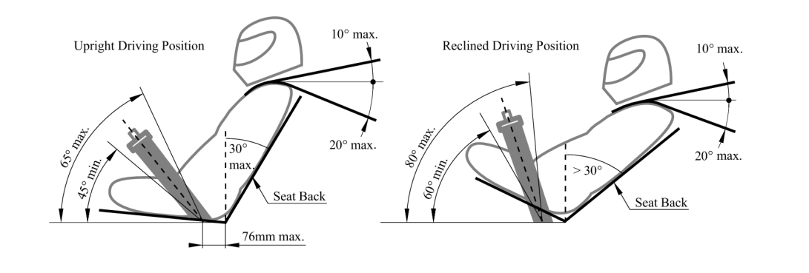
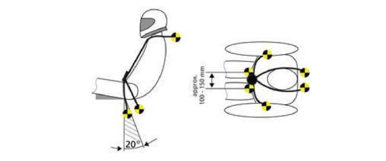
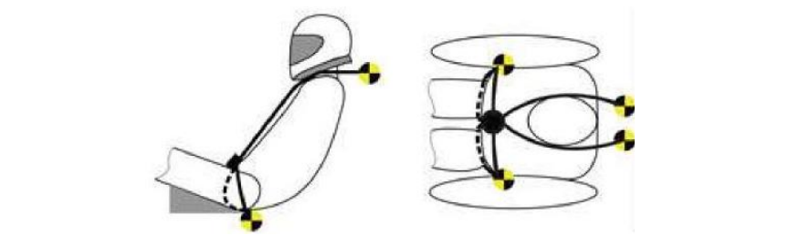

# Driver Restraint System

### T5.1 Definitions

##### T5.1.1

> 6-point system – Consists of a two-piece lap belt , two shoulder straps and two leg or anti-
> submarine straps.

##### T5.1.2

> 7-point system – Consists of two lap belts, two shoulder belts, two leg or anti-submarine
> Belts and a negative g or Z belt.

##### T5.1.3

> Upright driving position – Position with a seat back angled at 30° or less from the vertical as
> measured along the line joining the two 200mm circles of the 95th percentile male template
> as defined in [T4.3](./4-cockpit.md/#t43-percy-95th-percentile-male) and positioned per [T4.3.4](./4-cockpit.md/#t434).

##### T5.1.4

> Reclined driving position – Position with a seat back angled at more than 30° from the
> vertical as measured along the line joining the two 200mm circles of the 95th percentile
> male template as defined in [T4.3](./4-cockpit.md/#t43-percy-95th-percentile-male) and positioned per [T4.3.4](./4-cockpit.md/#t434).

### T5.2 Belts - General

##### T5.2.1

> All drivers must use a 6-point or 7-point restraint harness meeting the following
> specifications:
> 
> - All driver restraint systems must meet SFI Specification 16.1, SFI Specification 16.5, SFI
> Specification 16.6, FIA specification 8853/98 or FIA specification 8853/2016,
> - The belts must bear the appropriate dated labels,
> - The material of all straps must be in perfect condition,
> - There must be a single metal-to-metal latch type quick release for all straps,
> - All lap belts must incorporate a tilt lock adjuster (“quick adjuster”). A tilt lock adjuster in
> each portion of the lap belt is highly recommended. Lap belts with “pull-up” adjusters
> are recommended over “pull-down” adjusters,
> - Vehicles with a “reclined driving position” must have either anti-submarine belts with
> tilt lock adjusters (“quick adjusters”) or have two sets of anti-submarine belts installed,
> - The shoulder harness must be the “over-the-shoulder type”. Only separate shoulder
> straps are permitted (i.e. “Y”-type shoulder straps are not allowed). The “H”-type
> configuration is allowed,
> - The shoulder harness straps must be threaded through the three bar adjusters in
> accordance with the manufacturer’s instructions,
> - When a Frontal Head Restraint (FHR) is used by the driver, FIA certified 50mm wide
> shoulder harnesses are allowed.

##### T5.2.2

> SFI spec harnesses must be replaced following December 31st of the 2nd year after the date
> of manufacture as indicated by the label. FIA spec harnesses must be replaced following
> December 31st of the year marked on the label.

##### T5.2.3

> The restraint system must be worn tightly at all times.

### T5.3 Belt, Strap and Harness Installation - General

##### T5.3.1

> The lap belt, shoulder harness and anti-submarine strap(s) must be securely mounted to
> the Primary Structure. This structure and any guide or support for the belts must meet the
> minimum requirements of [T3.2](./3-general-chassis-design.md/#t32-minimum-material-requirements).

##### T5.3.2

> The tab or bracket to which any harness is attached must have:
> 
> - A minimum cross-sectional area of 60mm2 of steel, or equivalent alternative, to be
> sheared or failed in tension at any point of the tab, and,
>
> - A minimum thickness of 1.6mm (steel) or 4mm (aluminium).
>
> Where lap belts and anti-submarine belts use the same attachment point, a minimum
> cross-sectional area of 90mm2 of steel, or equivalent alternative, to be sheared, if failed in
> tension, at any point of the tab.

##### T5.3.3

> Harnesses, belts and straps must not pass through a firewall, i.e. all harness attachment
> points must be on the driver’s side of any firewall.

##### T5.3.4

> The attachment of the driver’s restraint system to a monocoque structure requires an
> approved SES per [T3.6](./3-general-chassis-design.md/#t36-structural-documentation). The lap belts and anti-submarine belts must not be routed over the
> sides of the seat. Where the belts or harness pass through a hole in the seat, the seat must
> be rolled or grommeted to prevent chafing of the belts.

### T5.4 Lap Belt Mounting

##### T5.4.1

> The lap belt must pass around the pelvic area below the anterior superior iliac spines (the
> hip bones).

##### T5.4.2

> The lap belts should come through the seat at the bottom of the sides of the seat to
> maximize the wrap of the pelvic surface and continue in a straight line to the anchorage
> point.

##### T5.4.3

> In side view, the lap belt must be capable of pivoting freely by using either a shouldered
> bolt or an eye bolt attachment.

##### T5.4.4

> If eye bolts are used, the Anti-Submarine Belt mounts must not share the Lap Belt
> Mounting.

##### T5.4.5

> With an “upright driving position”:
> 
> - In side view the lap belt must be at an angle of between 45° and 65° to the
>   horizontal.
> - The centreline of the lap belt at the seat bottom should be between 0mm to 76mm
>   forward of the seat back to seat bottom junction as in Figure 15.

##### T5.4.6

> With a “reclined driving position”:
> 
> - In side view the lap belt must be between an angle of 60° and 80° to the horizontal.
> - The centreline of the lap belt at the seat bottom may be forward or rearward of the
>   seat back to seat bottom junction as in Figure 15, provided all other requirements
>   of T5.4 are met.

### T5.5 Shoulder Harness

##### T5.5.1

> The shoulder harness must be mounted behind the driver to a structure that meets the
> requirements of the Primary Structure. However, it cannot be mounted to the main hoop
> bracing or attendant structure without additional bracing to prevent loads being
> transferred into the main hoop bracing.

##### T5.5.2

> If the harness is mounted to a tube that is not straight, the joints between this tube and the
> structure to which it is mounted must be reinforced in side view by triangulation tubes to
> prevent torsional rotation of the harness mounting tube. Supporting calculations are
> required.
>
> Analysis method: Use 7kN load per attachment and the range of angles in [T5.5.5](#t555), calculate
> that the bent shoulder harness bar triangulation stresses are less than as welded yield
> strength [T3.2.4](./3-general-chassis-design.md/#t324) for combined bending and shear and does not fail in column buckling. If the
> team chooses not to perform the strength analysis [T3.2.6](./3-general-chassis-design.md/#t326) will apply.

##### T5.5.3

> The strength of any shoulder harness bar and bracing tubes must be proved in the relevant
> tab of the team’s SES submission.

##### T5.5.4

> The shoulder harness mounting points must be between 180mm and 230mm apart,
> measured centre to centre.

##### T5.5.5

> From the driver’s shoulders rearwards to the mounting point or structural guide, the
> shoulder harness must be between 10° above the horizontal and 20° below the horizontal
> as in Figure 15.

<small><em>Figure 15: Lap belt and shoulder harness mounting</em></small>

##### T5.5.6

> Any bracket used to mount the shoulder harness must not be able to contact the driver in
> the event of an impact.

##### T5.5.7

> If a Forward Head Restraint (FHR) is to be used by any driver, the team must demonstrate
> compliance to the FHR manufacturer’s instructions, relevant FIA guidance pertaining to
> shoulder harness installation when using a FHR, and all other relevant FS rules.

##### T5.5.8

> Where [T5.5.7](#t557) applies, the shoulder harness installation must be rules legal for all drivers.

### T5.6 Anti-Submarine Belt Mounting

##### T5.6.1

> The anti-submarine belts of a 6-point or 7-point harness must be mounted either:
> 
> - With the belts going vertically down from the groin or angled up to twenty degrees (20°)
> rearwards, the anchorage points should be approximately 100mm (4 inches) apart, see
> Figure 16.

<small><em>Figure 16: Anti-submarine belt angled mounting arrangement</em></small>

> - With the anchorage points on the Primary Structure at or near the lap belt anchorages,
> the driver sitting on the anti-submarine belts, and the belts coming up around the groin
> to the release buckle, see Figure 17.

<small><em>Figure 17: Anti-submarine belt mounting arrangement - Primary Structure</em></small>

##### T5.6.2

> All anti-submarine belts must be installed so that they go in a straight line from the
> anchorage point(s) the first point where the belts touch the driver’s body for the 6-point or
> 7-point mounting, without touching any hole in the seat or any other intermediate
> structure.

### T5.7 Head Restraint

##### T5.7.1

> A head restraint must be provided on the vehicle to limit the rearward motion of the
> driver’s head.

##### T5.7.2

> The Head Restraint padding must:
> 
> - Be vertical or near vertical in side view,
> - Be an energy absorbing material that meets SFI Spec 45.2, or is listed in the FIA Technical
> List No. 17 as a “Type B Material for single seater cars”: CONFOR M foam CF-42 (pink) or
> CF-42M (pink). CF-42AC (pink) is acceptable,
> - Have a minimum thickness of 38mm,
> - Have a minimum width of 15cm and minimum height of 15cm,
> - Be covered with a thin, flexible material that contains a ~20mm diameter inspection hole
> in a surface other than the front surface.
>
> For all drivers, the Head Restraint must be located and adjusted so that:
>
> - The Head Restraint is no more than 25mm away from the back of the driver’s helmet,
> with the driver in their normal driving position,
> - The contact point of the back of the driver’s helmet on the Head Restraint is no less than
> 50mm from any edge of the Head Restraint,
> - All material and structure of the Head Restraint is within the Rollover Protection
> Envelope (see [T1.1.16](./1-definitions.md/#t1116)).

##### T5.7.3

> The head restraint and its mounting must withstand a force of 890N applied in the
> rearward direction at any point on its surface.

### T5.8 Roll Bar Padding

##### T5.8.1

> Any portion of the roll bar, roll bar bracing or chassis which might be contacted by the
> driver’s helmet must be covered with a minimum thickness of 12mm of padding which
> meets SFI spec 45.1 or FIA 8857-2001.

### T5.9 Driver Leg Protection

##### T5.9.1

> All moving suspension and steering components and other sharp edges inside the cockpit
> between the front hoop and a vertical plane 100mm rearward of the pedals, must be
> shielded with solid material.

##### T5.9.2

> Covers over suspension and steering components must be removable to allow inspection of
> the mounting points.

### T5.10 Driver Arm Protection

##### T5.10.1

> The combination of the Primary Structure, driver position and harness installation must be
> such that while the driver is in the fully seated position, hands in the driving position on the
> connected steering wheel (in all possible steering positions) and wearing the required
> driver equipment:
> 
> - Can turn the steering wheel lock to lock.
> - Cannot move their arms (while still holding onto the connected steering wheel) such that
> any part of the driver falls outside of the Rollover Protection Envelope. (e.g. the arm
> restraints or the chassis should prevent arms/elbows from falling outside of the
> Rollover Protection Envelope).
>
> Note: this will be checked for each driver prior to the Egress Test.
